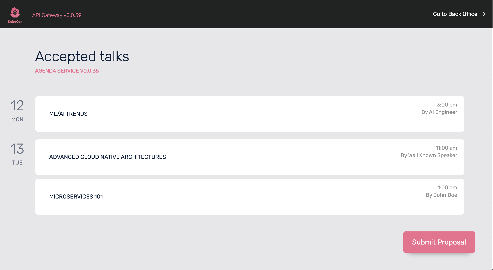
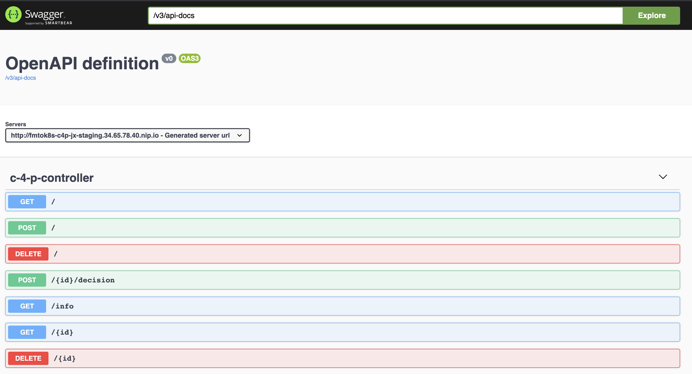

# From Monolith to K8s

Workshop-style guide for moving from a monolith application to a cloud-native architecture running in Kubernetes.

[**If you are looking for the updated 2hs workshop, you can find it here**](workshop.md)

This guide will take you through an example scenario to move from a Monolith application to a set of Cloud Native microservices running in a Kubernetes Cluster. This workshop highlights the use of certain tools to solve some particular challenges that you will face while going to the cloud. These tools are just suggestions and you should evaluate what fits better to your teams and practices. 

The application and the application flow can be used to test other projects and it was intended for educational and testing purposes. If you want to suggest other projects to be added, such as service meshes, severless platforms, etc. feel free to drop me a message.  

All the projects here are Open Source under the ASL 2.0 License and I welcome Pull Requests and [Issues](http://github.com/salaboy/from-monolith-to-k8s/issues) with more tools additions and suggestions to improve the workshop. 
I encourage people to follow the workshop in their own clusters to experience the usage of these tools, their issues and their strengths. 

This workshop is divided into the following sections: 
- [Installation and Getting Started](#installation-and-getting-started)
- [Running a Cloud-Native Conference Application](#running-a-cloud-native-conference-application)
- [Business Monitoring and Cloud-Native Orchestration](#business-monitoring-and-cloud-native-orchestration)
- [Sum up and links](#sum-up-and-links)

# Installation and Getting Started

This section covers:
 - [Prerequisites](#prerequisites)
 - [Tools](#tools)
 - [Installing Jenkins X](#installing-jenkins-x)
 - [Scenario](#scenario)
 - [CI/CD for our Monolith](#cicd-for-our-monolith)

## Prerequisites

- Kubernetes Cluster
  - Tested in GKE Cluster (3 nodes - n1-standard-2)
  - Do you want to test in a different cloud provider and add it to the list? Help is appreciated, please report issues if you found them while trying to run the workshop in other Cloud Providers. 
- `kubectl` configured to work against the cluster. 
- `helm` installed

## Tools
We are using the following projects/tools during this workshop:

- [Kubernetes](http://kubernetes.io)
- [Jenkins X](https://jenkins-x.io)
- [Helm](http://helm.sh)
- [Zeebe](https://helm.zeebe.io)
- Optional (if you want to change code examples and run them locally)
  - [JDK 11+](https://www.oracle.com/java/technologies/javase-jdk11-downloads.html)
  - [Maven](https://maven.apache.org/install.html)

## Installing the application - no Pipelines

If you want to install the application without using [Jenkins X](http://jenkinsx.io) (covered in the next section), you can just use the following [helm](http://helm.sh) charts.

First you need to add the following helm repository:
```
$ helm repo add fmtok8s http://chartmuseum-jx.35.222.17.41.nip.io
$ helm repo update
```
The application is using External Secrets in order to connect with a secrent manager (Cloud Provider specific or Hashicorp Vault). Here is how you install it:
```
$ helm repo add external-secrets https://godaddy.github.io/kubernetes-external-secrets/
$ helm install external-secrets/kubernetes-external-secrets
```

This requires you to create the following secrets in your cluster:

But before you need [Create a Camunda Cloud Account and Cluster](https://github.com/salaboy/from-monolith-to-k8s/blob/master/workshop.md#camunda-cloud-account)

Creating an object Secret with Camunda Secrets:

```
  apiVersion: v1
  kind: Secret
  metadata:
    name: camunda-cloud-secret
  stringData:
    ZEEBE_ADDRESS: <YOUR-ZEEBE-ADDRESS>
    ZEEBE_CLIENT_ID: <YOUR-ZEEBE-CLIENT-ID>
    ZEEBE_CLIENT_SECRET: <YOUT-CLIENT-SECRET>
    ZEEBE_AUTHORIZATION_SERVER_URL: https://login.cloud.camunda.io/oauth/token
```

Save as fmtok8s-secret.yaml and apply:

```
 $ kubectl apply -f ./fmtok8s-secret.yaml
```

Then you can install all the application services:
```
$ helm install frontend fmtok8s/fmtok8s-api-gateway
$ helm install agenda fmtok8s/fmtok8s-agenda --set "externalSecretForZeebe=true"
$ helm install c4p fmtok8s/fmtok8s-c4p --set "externalSecretForZeebe=true"
$ helm install email fmtok8s/fmtok8s-email --set "externalSecretForZeebe=true"
```

Once all the services are installed you can use `kubectl port-forward` to access the website:
```
$ kubectl port-forward svc/fmtok8s-api-gateway 8080:80
```

And then access the application pointing your browser to: http://localhost:8080


## Installing Jenkins X

First, we will install [Jenkins X](http://jenkins-x.io) in our Kubernetes Cluster. We will use this cluster to build, release and test our Cloud Native applications. 
Jenkins X is divided into a CLI tool `jx` and a set of server-side components. 

We begin by installing the CLI `jx`, if you are running in Mac OSX you can use `brew`

```
brew install jenkins-x/jx/jx
```

Once we have `jx` installed we can run `jx boot` to install the server-side components into the Kubernetes cluster. Remember that `jx` will use the currently configured `kubectl` context, so make sure that you are pointing to the right cluster before running `jx boot`. 

Follow the steps proposed by `jx boot`, for reference these are the options that I've selected in a GKE cluster.  

You can follow a detailed set of instructions from the [Jenkins X Docs page](https://jenkins-x.io/docs/getting-started/). 

> Notice that Jenkins X and this workshop can be executed in any Cloud Provider. Please report issues to this repository or to the specific projects if you find them.

## Scenario

During this workshop, we will be helping a company that is in charge of providing conference organizers their conference sites and back-office tools for their awesome events. 

Their current application is a Monolith and it looks like this: 


The source code for this application can be [found here](https://github.com/salaboy/fmtok8s-monolith)

The workshop aims to provide the tools, steps, and practices that can facilitate the migration from this application to a Cloud-Native architecture that runs on Kubernetes. In that Journey, we can enable teams to work independently and release their software in small increments while applying some of the principles outlined by the [Accelerate book](https://www.amazon.co.uk/Accelerate-Software-Performing-Technology-Organizations/dp/1942788339/ref=asc_df_1942788339/?tag=googshopuk-21&linkCode=df0&hvadid=311000051962&hvpos=&hvnetw=g&hvrand=13136118265667582563&hvpone=&hvptwo=&hvqmt=&hvdev=c&hvdvcmdl=&hvlocint=&hvlocphy=9072501&hvtargid=pla-446149606248&psc=1&th=1&psc=1). 


## CI/CD for our Monolith

When moving to Kubernetes it is quite common to **lift and shift** our monolith applications that are already running outside Kubernetes. This will require to containarize your application and then provide all Kubernetes Manifests to deploy your application into an existing cluster. 


This exercise pushes us to learn Kubernetes basics concepts such as Deployments, Services, and Ingresses, as well as Docker basics such as how to build and publish a Docker Image and which base Docker Image should we use for our applications. The following steps are usually required to just run our Monolith in Kubernetes:


> Notice that Helm Charts can be avoided, but it is becoming a standard way to package and distribute Kubernetes YAML manifest, providing also dependency management. For Java folks, this is Maven for Kubernetes applications.  

While these steps are needed for deploying our applications into a running cluster, once you have done these steps for a couple of services/applications, you don't want to do them for 100 services. This is where [Jenkins X](http://jenkins-x.io) comes to help us. 

You can find our [monolith application here](http://github.com/salaboy/fmtok8s-monolith). This application is a very basic Spring Boot application which can be started in your local environment (if you have the Java JDK and Maven) installed by running: `mvn spring-boot:run`

If you are running this workshop in your cluster, you can fork the [monolith application here](http://github.com/salaboy/fmtok8s-monolith) repository and then import it to Jenkins X by running:

```
jx import 
```

When we import an application to Jenkins X the following things will happen:
- Our application is decorated with a `Dockerfile` if it doesn't have one, a `jenkins-x.yml` pipeline definition, a `chart` directory containing a [Helm Chart](https://github.com/helm/helm) which contains all the Kubernetes manifests required to deploy our application. 
- Jenkins X will setup webhooks to monitor changes in the application repository. This is why it is required to fork the application code, so Jenkins X has enough rights to set-up webhooks to your repositories. 
- The pipeline defined in the `jenkins-x.yml` file is triggered for the first time in the server-side components. 
- Your application is built, released and promoted to the **Staging Environment**

Some useful commands to track progress are:
- `jx get build logs` -> select your application + ENTER
- `kubectl get pods -n jx-staging` lists all the Pods running in Jenkins X's staging environment

Once the pipeline finishes running you can access your application by running:
`jx get applications` and accessing the URL associated with your application. 

I recommend [watching at my webinar for @Linode here](https://salaboy.com/2020/08/17/jenkins-x-on-linode-lke-webinar/), where I go into the details of what happens when you import an application using Jenkins X.

### Challenges 
In the real world, applications are not that simple. These are some challenges that you might face while doing shift and lift for your Monolith applications:

- **Infrastructure**: if your application has a lot of infrastructure dependencies, such as databases, message brokers, other services, you will need to move them all or find a way to route traffic from your Kubernetes Cluster to this existing infrastructure. If your Kubernetes Cluster is remote, you will introduce latency and security risks which can be mitigated by creating a tunnel (VPN) back to your services. This experience might vary or might be impossible if the latency between the cluster and the services is to high. 

- **More than one process**: your monolith was more than just one application, and that is pushing you to create multiple containers that will have strong dependencies between them. This can be done and most of the time these containers can run inside a Kubernetes Pod if sharing the same context is required.

- **Scaling the application is hard**: if the application hold any kind of state, having multiple replicas becomes complicated and it might require a big refactorings to make it work with multiple replicas of the same running at the same time. 


# Running a Cloud-Native Conference Application

This section covers the following topics: 

- [Splitting our Monolith into a set of Microservices](#splitting-our-monolith-into-a-set-of-microservices)
  - [Introducing an API Gateway](#introducing-an-api-gateway)
  - [Adding a new User Interface](#adding-a-new-user-interface)
  - [Adding more services](#adding-more-services)
    - [Call for Proposals Service](#call-for-proposals-service)
    - [Agenda Service](#agenda-service)
    - [Email Service](#email-service)
  - [Development Flow](#development-flow)
  - [Dealing with infrastructure](#dealing-with-infrastructure)


## Splitting our Monolith into a set of Microservices

Now that we have our Monolith application running in Kubernetes it is time to start splitting it into a set of Microservices. The main reasons to do this are: 
- Enable different teams to work on different parts of this large application
- Enable different services to evolve independently
- Enable different services to be released and deployed independently
- Independently scale services as needed
- Build resiliency into your application, if one service fails not all the application goes down


In order, to achieve all these benefits we need to start simple. The first thing that we will do is add a reverse-proxy which will serve as the main entry point for all our new services. 

## Introducing an API Gateway

If we are going to have a set of services instead of a Monolith application, we will need to deal with routing traffic to each of these new components. In most situations, exposing each of these services outside of our cluster will not be a wise decision. Most of the time, you have a component that is used to provide a single point of entry for people to access our services from outside the cluster.  

This new component will act as a router between the outside world and our services and you can choose from a set of popular options such as: 
- Solo.io Gloo
- 3Scale
- Apigee
- Kong
- Cloud Provider Specific

For this workshop, I've chosen to use [Spring Cloud Gateway](https://spring.io/projects/spring-cloud-gateway), as it gives us the power to tune the routes to our services by coding them in Java or writing these routes in configuration files. 

The source code for our API Gateway can be [found here](http://github.com/salaboy/fmtok8s-api-gateway/)


### Routing HTTP request to other services

With [Spring Cloud Gateway](https://spring.io/projects/spring-cloud-gateway) we can finetune how the traffic is going to be routed to other services. The API Gateway doesn't do any advanced routing for this example, but it opens the door for experimentation of more advanced features such as throttling and filtering.

For this project the following routes are defined inside the [application.yaml](https://github.com/salaboy/fmtok8s-api-gateway/blob/master/src/main/resources/application.yaml) file:
```
spring:
  cloud:
    gateway:
      routes:
      - id: c4p
        uri: ${C4P_SERVICE:http://fmtok8s-c4p}
        predicates:
        - Path=/c4p/**
        filters:
          - RewritePath=/c4p/(?<id>.*), /$\{id}
      - id: email
        uri: ${EMAIL_SERVICE:http://fmtok8s-email}
        predicates:
        - Path=/email/**
        filters:
          - RewritePath=/email/(?<id>.*), /$\{id}
      - id: speakers
        uri: ${SPEAKERS_SERVICE:http://fmtok8s-speakers}
        predicates:
          - Path=/speakers/**
        filters:
          - RewritePath=/speakers/(?<id>.*), /$\{id}
```

These routes define where traffic is going to be routed based on different paths. If your request hits any path under `/c4p/` it will be automatically redirected to a service called `fmtok8s-c4p`. This means that the request will be rewritten and forwarded to that service. 

Notice that `URI` for the target services are defined with a default value, for example `http://fmtok8s-c4p` and an environment variable that can override that default value if it is set (`C4P_SERVICE`). This allows you to point to different services if for some reason your services have different names in your environment. 

For developers that are used to work in Kubernetes, it is quite normal to refer to other services using the service name, such as `fmtok8s-c4p`. Outside Kubernetes you will be using the service IP and Port. This is Kubernetes Service Discovery in action. In the following sections you learn how these services are configured. 

Notice that the latest version of this service now includes Circuit Breakers, which allows us to deal with failures in other services:


If you want to add the Circuit Breakers to your routes you just need to add an extra filter and the following maven dependency to your project: 
```
 <dependency>
   <groupId>org.springframework.cloud</groupId>
   <artifactId>spring-cloud-starter-circuitbreaker-reactor-resilience4j</artifactId>
 </dependency>
```

The Circuit Breakers will react if the downstream service returns something different from 2xx HTTP code. 

```
routes:
- id: agenda
  uri: ${AGENDA_SERVICE:http://fmtok8s-agenda}
  predicates:
  - Path=/agenda/**
  filters:
  - RewritePath=/agenda/(?<id>.*), /$\{id}
  - name: CircuitBreaker
    args:
     name: agendaCircuitBreaker
     fallbackUri: forward:/api/agendaNotAvailable
```

For this example, this means that if the `AGENDA_SERVICE` is failing for any reason, the request will be forwarded to `/api/agendaNotAvailable` allowing you to define how the application will react in such situations. 

### Importing the API Gateway / User Interface to Jenkins X

You can **fork** and clone this repository and import it to Jenkins X as we did before for the Monolith application.

```
git clone http://github.com/<YOUR USER>/fmtok8s-api-gateway/
cd fmtok8s-api-gateway/
jx import
```

You can monitor the pipelines, when the pipeline finish you should be able to see the new application URL by running:
```
jx get applications
```

Wait for the application and environment pipeline to finish to access the application. 

Try to access the API Gateway URL with your browser and see if you can see the new User Interface hosted in this application:

Conference Main Page: 



New Proposal Modal: 


Back Office Page:


Send Email Modal:


Because we are in the edge, close to our users and outside traffic, the API Gateway serves as the perfect point to host HTML and CSS files that will compose our User Interface.


### Adding a new User Interface

The new user interface will be in charge of consuming REST endpoints which are located now in different services to provide the user the available data. 

We are going to host the new User Interface at the Gateway level as most of these files will reference the API Gateway URL when downloaded to the Client Browser and API Gateways usually provide caching for static files, so the closer these static files are to the user the better. 

The new User Interface look exactly the same as the old one, but in this case to make it more interesting, we will use different colors to the application section to highlight which backend service is in charge of providing data for that section. The User Interface is divided into two main screens, the public **main site** and the **backoffice** which is used by the conference organizers to approve/reject proposals and also to send email reminders to people involved in the conference. 

We will also decorate each section with the **version** of the backend service that is serving the requests. 

You can find the logic for the User Interface and the static files inside the [API Gateway source code](https://github.com/salaboy/fmtok8s-api-gateway/blob/master/src/main/java/com/salaboy/conferences/site/ApiGatewayService.java). 


### Changes from default import
- [Memory and CPU resource limits and requests](https://github.com/salaboy/fmtok8s-api-gateway/blob/master/charts/fmtok8s-api-gateway/values.yaml#L55)  
- Version Environment Variable, [to link a release (github, docker image, helm chart) to the application runtime](https://github.com/salaboy/fmtok8s-api-gateway/blob/master/charts/fmtok8s-api-gateway/templates/deployment.yaml#L33)


### Challenges
- **Choose the best tool for your team**: in this example using the Spring Cloud Gateway made sense as the team already had some Java Knowledge in house, but other reverse proxies provide the same functionality. There are also more advanced API management tools that will help you with more enterprise-grade requirements, such as easy integration with Security Mechanisms and cross-cutting concerns. 
- **Running behind a reverse proxy**: depending on how flexible your applications, running web applications behind web proxies might require more advanced configurations such as Headers forwarding, tokens forwarding and sometimes path rewrites.
- **Security (Authentication & Authorization)**: When we start talking about user interfaces we need to think about authorization and authentication and probably identity management or social logins. This topic is on purpose left out of the workshop as solutions might vary depending on the actual requirements and integrations required by your Cloud Native applications. For OpenID connect with OAuth 2.0 support [Dex is becoming quite popular, you can check it out here](https://github.com/dexidp/dex). 


## Adding more services

In real-life, we start by splitting some peripheral services into microservices to make sure that the core of our application still works. In general, the User Interface can be left untouched when most of the refactorings might happen in the backend. 

Depending on the conference stage, we can start by refactoring out of the Monolith the C4P (Call for Proposals) service, which is in charge of accepting new presentation proposals when the conference is still being organized, while leaving the Agenda untouched still serving users requests. 

It is always recommended to analyze which features and use cases can be used to experiment while thinking about splitting a big Monolith. For the purpose of this workshop we will focus on the **Call for Proposals** flow, hence starting with the Call for Proposals Service. 


## Call for Proposals Service (c4p)

You can find the source code for [this service here](https://github.com/salaboy/fmtok8s-c4p)

This service is in charge of handling the logic and the flow for receiving, reviewing and accepting or denying proposals for the conference. Due its responsibility it will be in charge of interacting with the Agenda and Email service.
The happy path, or expected flow for this service will be as depicted in the following diagram: 


1) Potential Speaker decides to submit a Proposal via the conference site
2) Conference Committee review the proposal and accept or reject it
3) If the proposal is accepted it gets published to the Agenda
4) An email with the result is sent back to the Potential Speaker, informing the decision (approval or rejection)


This service expose the following REST endpoints: 
- **GET /info**: provide the name and version of the service
- **POST /**: submit a Proposal
- **GET /**: get all proposals
- **DELETE /**: delete all proposals for testing purposes
- **GET /{id}**: get a Proposal by Id
- **DELETE /{id}**: delete proposal by Id
- **POST /{id}/decision**: decide (approve/reject) a Pending Proposal

You can find the Open API documentation by pointing your browser to: http://fmtok8s-c4p-jx-staging.X.X.X.X.nip.io/swagger-ui.html if you are running in Jenkins X or just start the service locally and point your browser to http://localhost:8080/swagger-ui.html




### Importing C4P project to Jenkins X

There are two branches for this project
1) `no-workflow` branch which contains all the service interactions via REST
2) `master` which contains integration with Zeebe for Service Orchestration

Depending on which version you want to use, you can merge the `no-workflow` branch to master if you prefer REST service communications instead of Pub/Sub mechanism and Service Orchestration with Zeebe. 

You should **fork**, clone and **jx import** this service as we did with the API Gateway project.


### Challenges

- **Core/Critical Services For the Domain**: This service is core for the use case that we are trying to cover, as the Call for Papers flow is critical to make sure that we receive, review and make decisions on the proposals sent by potential speakers. This service must work correctly to avoid potential frustration by people submitting valuable proposals. 

- **Build with Failure in mind**: For this example, our services are interacting via REST and our services need to take into considerations that these calls might fail eventually. Retry mechanisms and making sure that our services are idempotent might help to solve these problems. We need to consider also, that if the service interactions fail (due network or services being down) we might end up in an inconsistent state, such as a Potential speaker being approved but not notified. More about this in [Refactoring and improving our applications](#refactoring-and-improving-our-application)


## Agenda Service

The Agenda Service is in charge of hosting the accepted talks for our conference, this service is heavily used by the conference attendees while the conference is on going to check rooms and times for each talk. This service present an interesting usage pattern, as it not going to receive too many writes (adding new agenda items) as the amount of reads (attendees checking for talks, times and rooms).  

> You should **fork** and **jx import** this service as we did with the API Gateway project. 

This service expose the following REST endpoints: 
- **GET /info**: provide the name and version of the service
- **POST /**: Submit an Agenda Item
- **GET /**: get all agenda items

### Challenges
- **Different Data Storage**:In real-life, a service like this one might justify a separate data store optimized for search and reads. 
- **Consider different requirements for different phases of your application**: During conference time, we might want to provision more instances (replicas) for this service to serve more traffic
- **Use Flags to limit functionality**:We might want to consider restricting the POST endpoint when the conference start


## Email Service
The Email Service is an abstraction of a legacy system that you cannot change. Instead of sending emails from the previous services, we encapsulated in this case an Email Server behind a REST API. Because we are defining a new API, we can add some domain-specific methods to it, such as sending a Conference Notification Email. 

> You should **fork** and **jx import** this service as we did with the API Gateway project. 

This service expose the following REST endpoints: 
- **GET /info**: provide the name and version of the service
- **POST /notification**: send a conference notification email (for Proposals rejections or approvals)
- **POST /**: send a regular email to an email with Title and Body


## Development Flow

If you access the application via the API Gateway service you should see the User Interface connecting to all the backend services and displaying each service version number. If you click on the version numbers, you will be taken to Github site for the release that was used to build this service. In other words, you have tracebility from source to the actual service that is running in your cluster. Using the version number you can fetch the docker image which was tagged with that version and also the Helm Chart that was created for deploying this application into the staging environment. 


If you were using Jenkins X, these services are running in the Staging Environment, where you can manually promote these services to the Production Environment when you feel that your application is working smoothly. 


## Dealing with infrastructure

When dealing with infrastructural components such as databases, message brokers, identity management, etc, several considerations will influence your decisions:
- Are you running in a Cloud Provider? If so, they probably already offer some managed solutions that you can just use. 
- Do you want to run your own Database instance or Message Broker? If so, look for Helm packages or Kubernetes Operators that help you with managing these components. Scaling a database or a message broker is hard and when you decide to run it yourself (instead of using a managed solution) you add that complexity to managing your applications. 


# Business Monitoring and Cloud-Native Orchestration

No matter how our services are communicating between each other, (REST, Messaging, Using a Service Mesh), it is always hard to make our applications understood by non-technical people. In other words, using tracing (such as open tracing) to understand the sequence of interaction and the data that is exchanged between services can give us an idea about what is going on, but it is usually low-level information that non-technical people cannot use to understand what is going on. 

In this section, we cover some tools that help you to tackle some of the challenges of exposing valuable and real-time data to the business. Having this data at the right time can be a real differentiator between your company and the competition. As this data can be use to influence critical-decision about how resources are being used and where bottlenecks can be avoided. 

The following sections cover different challenges that you will find when working with distributed architectures. All these challenges affect the business in some way or another, but it is important to recognize that at the end of the day fixing the problem technically is not enough. 


## Avoiding inconsistent states

If you have an architecture like the one described for this example, where multiple services hold the state for different domain objects, you might end up having inconsistent states. If communications are done via REST, you will need to take care of making sure that every call works, as there are no transaction boundaries between the services, if something fails, you have an inconsistent state. 

In our example, this might happen if the `Agenda Service` is down. You might accept or reject a proposal but if the service is down, publish the proposal in the agenda will fail. Depending on the sequence that you define, it might be the case that you already notified the speaker about his/her being accepted, but their proposal will never reach the conference agenda. 

 

1) Potential Speaker submits a proposal
2) Board review the proposal and approves it
3) Publish to Agenda fail, if we don't deal with the failure
4) Send an email notifying the speaker that his/her proposal was accepted

That is quite a terrible situation to end up with and there are a few solutions to this challenge.


1) Making sure that request happens, using retries with exponential back-off and circuit breakers. This can be done with a libraries like Ribbon and Hystrix from the client-side. In our example this require the `Call For Proposal Service` to include these libraries and configurations
2) Using Pub/Sub mechanisms (usually using messaging) such as JMS, RabbitMQ, Kafka, etc. This is quite a popular solution when you want to build robust and distributed system. As these transports provide some form  delivery guarantees and Dead Letter Queues. 
3) Using a Service Mesh, such as Istio or LinkerD, that use a proxy to decorate our services with monitoring and retry functionalities in case of request failures. This requires our Kubernetes Cluster to be extended with Istio or LinkerD. 

While `1` helps you to get the request actually executed, it doesn't solve the problem if the request keeps failing. You need more tools to actually solve the problems that are being reported, probably in your logs. 

Option `2` gives you an industry-standard way of communicating large systems in a robust way. These frameworks are supposed to provide tools to look and inspect into messages that are failing and enable administrators with retries. But in reality you might need to end up building your own domain-specific tools to deal issues when they happen. 

Option `3` gives you more tools to understand where the problem is, centralized logging and reporting tools that helps you to clearly pin point where the problem is and give you hints about the solution, but once again, you are in charge of actually fixing the problem. Service Meshes are young and quite complicated beasts to fully understand if you are starting with Kubernetes, but are a viable option to analyze if your scenario requires advanced features such as Mutual TLS between services. 

You need to ask yourself, are retries enough? 

Neither of these options provide a view for non-technical people to understand what is going on. All the tools are aiming to low level administrators that needs to understand the full scope of the domain in order to fix problems. Solving such problems usually involve releasing new version of services or changing data into different databases, which again might push us into inconsistent states. 


## Make it easy to update the flow (visibile.. understandable)

The whole point of having a distributed system were services are owned by different teams is to enable each team to move fast. Depending on your business context, requirements to change the flow of action can come often and the sooner that these changes are applied the sooner the company can start leveraging these changes. 

Identifying where these changes needs to happen is a tricky exersice as it might involve multiple teams and coordination between them. Let's use a basic but concrete example from our scenario. 


Currently the flow is owned and handled by the `Call for Proposal Service` and it [can be found here](https://github.com/salaboy/fmtok8s-c4p/blob/no-workflow/src/main/java/com/salaboy/conferences/c4p/C4PController.java#L60):
```java
@PostMapping(value = "/{id}/decision")
public void decide(@PathVariable("id") String id, @RequestBody ProposalDecision decision) {
    emitEvent("> Proposal Approved Event ( " + ((decision.isApproved()) ? "Approved" : "Rejected") + ")");
    Optional<Proposal> proposalOptional = proposalStorageService.getProposalById(id);
    if (proposalOptional.isPresent()) {
        Proposal proposal = proposalOptional.get();

        // Apply Decision to Proposal
        proposal.setApproved(decision.isApproved());
        proposal.setStatus(ProposalStatus.DECIDED);
        proposalStorageService.add(proposal);

        // Only if it is Approved create a new Agenda Item into the Agenda Service
        if (decision.isApproved()) {
            agendaService.createAgendaItem(proposal);
        }

        // Notify Potential Speaker By Email
        emailService.notifySpeakerByEmail(decision, proposal);
    } else {
      emitEvent(" Proposal Not Found Event (" + id + ")");
    }

}
``` 


As you can see, the code is readable and it can be easily understood by a Software Developer. Once again, it is not enough to share with non-technical people how things are working and how are they going to change if we want to include new steps in the flow. 

Let's say that you want to add some extra steps in the flow for accepted speakers to confirm their interest in speaking at your conference. 


For this example, the steps can go like this:
- `1`: The potential speaker submits a new proposal
- `2`: The Committee review the proposal and approve or reject it
- `3` **(different order)**: If approved an email is sent for the speaker to confirm his/her interest in participating of the event
- `4` **(new)**: The potential speaker confirms his/her participation by clicking in a link provided in the previous email
- `5` **(different order)**: The proposal is added to the confernce agenda

When changes like this are made in code, from the business perspective, you don't know how things were working yesterday and how things are working today.


## Deal with edge case explicitly 

In the previous section, you saw how the flow is being handled by the `Call for Proposal Service`. You can clearly read the code because it is a very simple use case with limited functionality, but most importantly it is only covering what is usually called a **"happy path"**. When complexity grows by adding more code for edge cases, libraries, checks and error-handling code, even a software developer will struggle to understand what is going on by just reading the code. 

There is not much that you can do about this besides making sure that you follow clean code practices and keep refactoring your code. Depending on the use case, you can consider splitting some of that logic into separate microservices or at least into separate modules inside the same service. 

Edge cases are extremely important from the business side. As there should be clear guidelines on how to deal with these exceptional situations.

For this use case, a perfect example might be what to do when a speaker that was accepted to the conference cannot be longer contected and is not answering emails. This is very valid situation and it needs to have clear ways to resolve it to make sure that if a spekaer cannot longer participate and cannot be contacted is removed from the conference agenda. 

This can be a separate flow to deal with specific situation, but it is usually triggered as a follow up of the Call for Proposals normal flow. 


For this example, the steps can go like this:
- `1`: The Committee identifies that a speaker is not answering emails for the conference deadlines
- `2`: A final email is sent notifying the speaker that his/her presentation will be removed from the agenda
- `3`: The proposal is removed from the agenda if the board doesn't heard back from the speaker

## Time based constrains

In my experience, 99% of real use cases require in some way or another keeping track of time and scheduling actions in the future. For developer this is tedious and when you enter into the realm of distributed applications it becomes an architectural challenge. 

 For this use case, this might mean that you want to send reminders to the committee if they haven't reviewed a proposal after 3 days of receiving it, only if they haven't approved or rejected the proposal yet. 


For this example, the steps can go like this:
- `1`: The potential speaker submits a new proposal
- `2`: The Committee receives the proposal
  - `2a`: If the proposal hasn't been reviewed in the next 3 days, the system should send an email reminder to the Committee.


From a technical perspective, this is a complicated requirement, as it requires to deal with timers (also known as Cron Jobs). Because we are in a distributed system, this cannot be done as part of the service itself, as we don't want to loose these timers if our services goes down. This requirement push is to think about a distributed Scheduler that you will need to configure to be highly available. 

When you have that Scheduler, you need to make your service, in the scenario, the `Call for Proposal Service` to create and cancel reminders when needed. 

Once again, providing Business Visibility for such timers and reminders is key for the company to understand how often they are not meeting certain requirements or service agreements (in the scenario, not reviewing proposals in the first 3 days after they arrive) and in some way mitigating and reducing these situations. 

Building and providing visibility around scheduling logic is complicated and involve big architectural decisions which needs to be done in advance before each service start implementing their own solution. 


## Search and Reporting

In distributed systems, querying and aggregating data from different Services is a common requirement, and a challenging one. 

In the proposed scenario, the `Agenda Service` and the `Call for Proposals Service` store data. These services can choose their own storage depending the data that they need to operate. T

Let's imagine that you want to provide a search capability across data of both services, for such scenarios it might be a bad idea to add such querying capabilities to one of these services, as it will increase the service complexity and it will blur the responsibilities between the teams.


## Understanding Process State

When working with distributed applications, finding what is the current state for our flows becomes an interesting challenge to solve.

Finding the answers to questions like the following:
- In which stage is this proposal right now? 
- How many proposals have we received this week so far?
- How many proposals were accepted?
- How many proposals have you rejected so far? 
Becomes a full time job, as you might need to pull information from different services to give presice answers. 

From a business perspective this is very valuable, as it provides real time information and visibility about how our flows are being executed, that can help us to identify bottlenecks or resourcing problems. 

And this is a perfect segway to jump to the next section: [Using Zeebe for Service Orchestration](#using-zeebe-for-aervice-orchestration).


## Using Zeebe for Service Orchestration

Zeebe is a Cloud Native Service Orchestrator (Workflow Engine) that provides business visibility and service orchestration about how your services are actually doing the work. 

Zeebe is provided as a hosted managed solution that you can try for free: [Camunda Cloud](https://camunda.com/products/cloud/).


Zeebe, as shown before can be part of your infrastructural components or consumed as a service. By default it keeps and audit trail and provide tools such as Camunda Operate to gain real time visibility about how your workflows are running. Architecturally speaking, it is comparable to add Kafka to your infrastructure (in your kubernetes cluster), as you deploy a Zeebe Cluster which deals with all the workflows executions. Your application architecture now looks like this:


This section covers how Zeebe help us to tackle the previous challenges:

- **Understanding Process State**: Zeebe, as a workflow engine, helps you to track and drive your flows. It does it by executing a model of your flow that can be shared with non-technical users and without pushing your developers to build a custom solution for each flow. Zeebe can also tap into events that your services are emitting to move workflows forward. A model for this use case looks pretty much like the diagrams shared in this document so far, but using a standard notation defined by the Object Management Group (OMG). 

- **Make it easy to update the flow when needed**: Because now we have a model, you can update and version the model everytime that your business change. For our scenario, the `Call for Proposals Team` will still own this flow and it will be their responsability to maintain it. 


- **Dealing Edge cases**: Dealing with edge case explicitily in a well documented way is key to make sure that when something out of the ordinary happens, you are covered. Using a workflow engine helps you with that by having these edge cases as workflows themselves. When an edge case is detected the workflow to deal with that situation can be triggered. Because workflows can be linked together the relationship can be explicit and the workflow can be triggered automatically. 
 


- **Avoiding inconsistent states**: A Pub/Sub mechanism will be used behind the covers to coordinate the service interactions, allowing Zeebe to report incendents when things go wrong, providing visibility and tools to fix problems when they appear. Here we can see a flow reporting two incidents in one of the steps.

And a deeper look at these incidents highlight the problem:


Which allows you understand, fix the problem and retry the operations right from Camunda Operate. 

- **Time based constraints**: Zeebe provides out of the box support for scheduling timers to trigger actions in High Availability setups. You can define these timers declaratively in your workflow models. These timers will be automatically cancelled if they are not needed anymore, for example, if the decision is made in time. 


# Sum up and links

The tools used in this workshop are all Open Source and can be used for real life projects. 
Here are some useful links to the source code of the different services and to the conferences where I've presented this demo. 


- [Monolith Application](https://github.com/salaboy/fmtok8s-monolith)
- [API Gateway](https://github.com/salaboy/fmtok8s-api-gateway)
- [C4P Service](https://github.com/salaboy/fmtok8s-c4p)
- [Agenda Service](https://github.com/salaboy/fmtok8s-c4p)
- [Email Service](https://github.com/salaboy/fmtok8s-email)

Conferences:
- [Spring One 2020](https://www.slideshare.net/salaboy/from-monolith-to-k8s-spring-one-2020)
- [JNation 2020](https://salaboy.com/2020/06/02/jnation-2020-from-monolith-to-k8s/)
- [KubeCon EU Virtual 2020](https://kccnceu20.sched.com/event/Zen3/how-we-migrated-our-monolith-to-k8s-and-became-a-high-performing-team-mauricio-salatino-camundalearnk8s-tracy-miranda-cloudbees)
- [SouJava Meetup 2019](https://salaboy.com/2019/11/07/from-monolith-to-k8s-soujava/)
