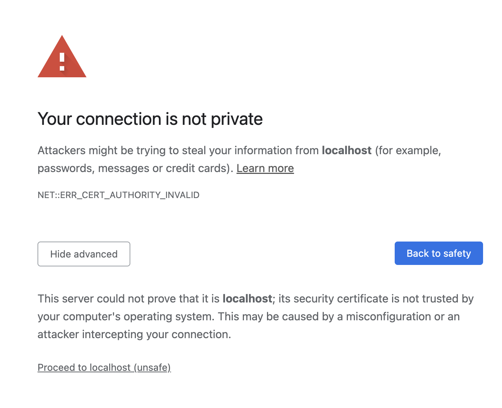
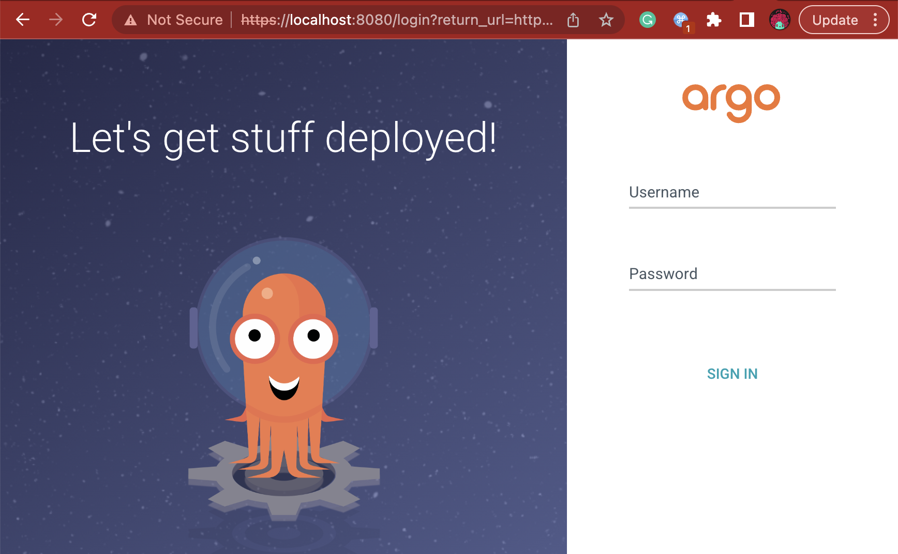
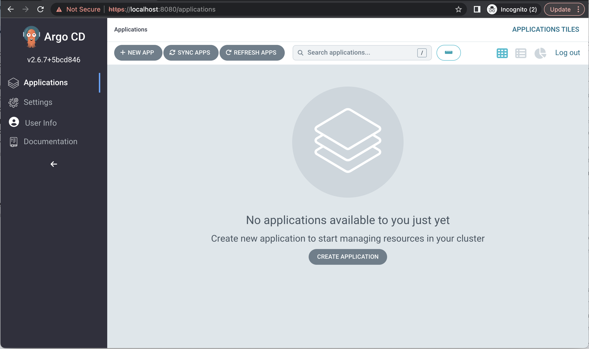
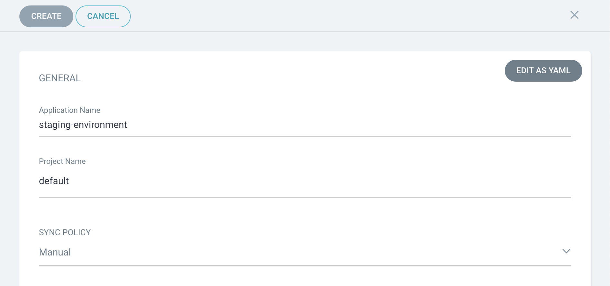
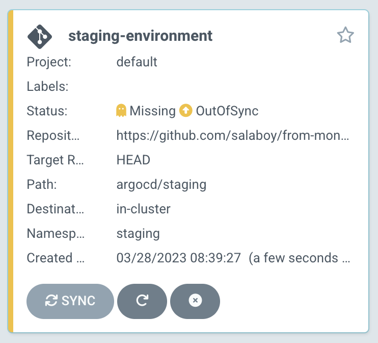
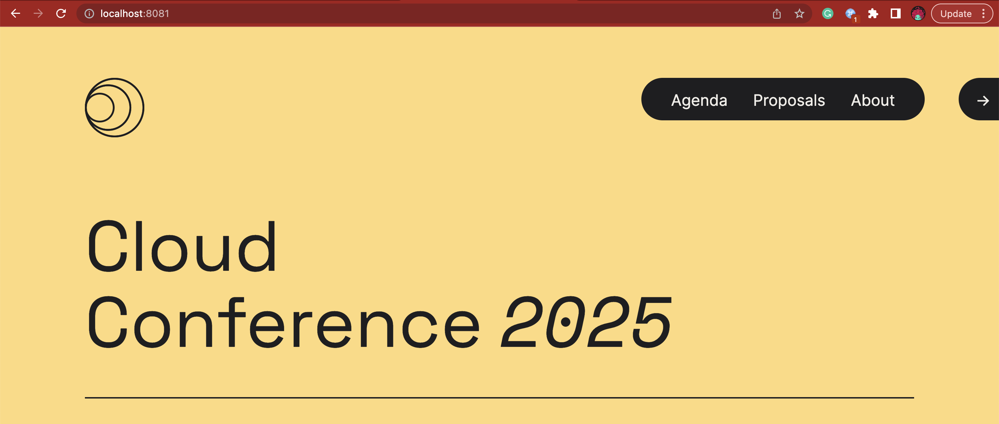
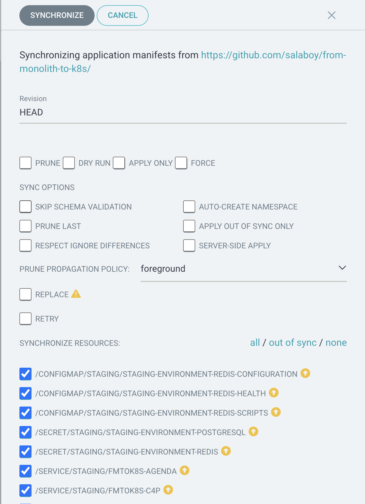
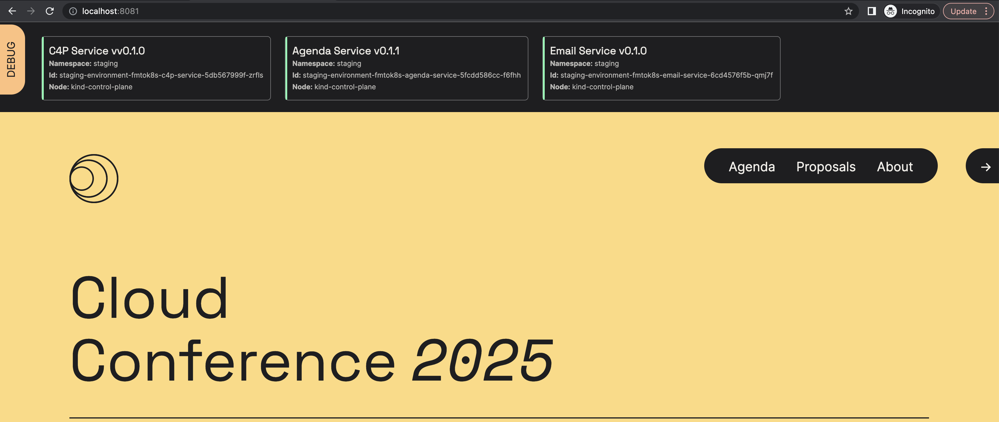

# GitOps with ArgoCD

In this short tutorial we will set up the Conference application into our Staging Environment using [ArgoCD](https://argo-cd.readthedocs.io/en/stable/).

We will define the configuration of Staging environment using a Git repository. The [`staging` directory](staging/)  contains the definition of a Helm chart that can be synced to multiple Kubernetes Clusters. 


# Prerequisites and installation

- We need a Kubernetes Cluster, we will use Kubernetes [KinD](https://kind.sigs.k8s.io/) in this tutorial
- Install ArgoCD in your cluster, [follow this instructions](https://argo-cd.readthedocs.io/en/stable/getting_started/) and optionallyu install the argocd CLI 
- You can fork/copy [this repository](http://github.com/salaboy/from-monolith-to-k8s/) as if you want to change the configuration for the application you will need to have write access to the repository. We will be using the directory `argocd/staging/`

Let's create a new KinD Cluster:

```
kind create cluster
```

You should see something like this: 
```
> kind create cluster
Creating cluster "kind" ...
 ✓ Ensuring node image (kindest/node:v1.25.3) 🖼 
 ✓ Preparing nodes 📦  
 ✓ Writing configuration 📜 
 ✓ Starting control-plane 🕹️ 
 ✓ Installing CNI 🔌 
 ✓ Installing StorageClass 💾 
Set kubectl context to "kind-kind"
You can now use your cluster with:

kubectl cluster-info --context kind-kind

Thanks for using kind! 😊
```

Let's install ArgoCD in the cluster: 

```
kubectl create namespace argocd
kubectl apply -n argocd -f https://raw.githubusercontent.com/argoproj/argo-cd/stable/manifests/install.yaml
```

You should see something like this: 

```
> kubectl create namespace argocd
kubectl apply -n argocd -f https://raw.githubusercontent.com/argoproj/argo-cd/stable/manifests/install.yaml
namespace/argocd created
customresourcedefinition.apiextensions.k8s.io/applications.argoproj.io created
customresourcedefinition.apiextensions.k8s.io/applicationsets.argoproj.io created
customresourcedefinition.apiextensions.k8s.io/appprojects.argoproj.io created
serviceaccount/argocd-application-controller created
serviceaccount/argocd-applicationset-controller created
serviceaccount/argocd-dex-server created
serviceaccount/argocd-notifications-controller created
serviceaccount/argocd-redis created
serviceaccount/argocd-repo-server created
serviceaccount/argocd-server created
role.rbac.authorization.k8s.io/argocd-application-controller created
role.rbac.authorization.k8s.io/argocd-applicationset-controller created
role.rbac.authorization.k8s.io/argocd-dex-server created
role.rbac.authorization.k8s.io/argocd-notifications-controller created
role.rbac.authorization.k8s.io/argocd-server created
clusterrole.rbac.authorization.k8s.io/argocd-application-controller created
clusterrole.rbac.authorization.k8s.io/argocd-server created
rolebinding.rbac.authorization.k8s.io/argocd-application-controller created
rolebinding.rbac.authorization.k8s.io/argocd-applicationset-controller created
rolebinding.rbac.authorization.k8s.io/argocd-dex-server created
rolebinding.rbac.authorization.k8s.io/argocd-notifications-controller created
rolebinding.rbac.authorization.k8s.io/argocd-redis created
rolebinding.rbac.authorization.k8s.io/argocd-server created
clusterrolebinding.rbac.authorization.k8s.io/argocd-application-controller created
clusterrolebinding.rbac.authorization.k8s.io/argocd-server created
configmap/argocd-cm created
configmap/argocd-cmd-params-cm created
configmap/argocd-gpg-keys-cm created
configmap/argocd-notifications-cm created
configmap/argocd-rbac-cm created
configmap/argocd-ssh-known-hosts-cm created
configmap/argocd-tls-certs-cm created
secret/argocd-notifications-secret created
secret/argocd-secret created
service/argocd-applicationset-controller created
service/argocd-dex-server created
service/argocd-metrics created
service/argocd-notifications-controller-metrics created
service/argocd-redis created
service/argocd-repo-server created
service/argocd-server created
service/argocd-server-metrics created
deployment.apps/argocd-applicationset-controller created
deployment.apps/argocd-dex-server created
deployment.apps/argocd-notifications-controller created
deployment.apps/argocd-redis created
deployment.apps/argocd-repo-server created
deployment.apps/argocd-server created
statefulset.apps/argocd-application-controller created
networkpolicy.networking.k8s.io/argocd-application-controller-network-policy created
networkpolicy.networking.k8s.io/argocd-applicationset-controller-network-policy created
networkpolicy.networking.k8s.io/argocd-dex-server-network-policy created
networkpolicy.networking.k8s.io/argocd-notifications-controller-network-policy created
networkpolicy.networking.k8s.io/argocd-redis-network-policy created
networkpolicy.networking.k8s.io/argocd-repo-server-network-policy created
networkpolicy.networking.k8s.io/argocd-server-network-policy created
```

You can access the ArgoCD User Interface by using port-forward, in a **new terminal** run:

```
kubectl port-forward svc/argocd-server -n argocd 8080:443
```

**Note**: you need to wait for the ArgoCD pods to be started, the first time you do this it will take more time, because it needs to fetch the container images from the internet.

You can access the user interface by pointing your browser to [http://localhost:8080](http://localhost:8080)

**Note**: by default the installation works using HTTP and not HTTPS, hence you need to accept the warning (hit the "Advanced Button" on Chrome) and proceed (Process to localhost unsafe). 



That should take you to the Login Page:



The user is `admin`, and to get the password for the ArgoCD Dashboard by running: 

```
kubectl -n argocd get secret argocd-initial-admin-secret -o jsonpath="{.data.password}" | base64 -d; echo
```

Once in, you should see the empty home screen: 



Let's now set up our Staging Environment.


# Setting up our application for the Staging Environment

For this tutorial we will use a single namespace to represent our Staging Environment. With ArgoCD there are no limits, and our Staging enviornment could be a completely different Kubernetes Cluster. 

First let's create a namespace for our Staging Environment:

```
kubectl create ns staging
```

You should see something like this: 

```
> kubectl create ns staging
namespace/staging created
```

Note: Alternatively, you can use the "Auto Create Namespace" option in the ArgoCD application creation. 

Once you have ArgoCD installed you can access to the user interface to set up the project. 


Hit the **"+ New App"** button and use the following details to configure your project: 

Here are the Create Application inputs that I've used: 
- Application Name: "staging-environment"
- Project: "default"
- Sync Policy: "Manual"
- Source Repository: [https://github.com/salaboy/from-monolith-to-k8s](https://github.com/salaboy/from-monolith-to-k8s) (here you can point to your fork)
- Revision: "HEAD"
- Path: "argocd/staging/"
- Cluster: "https://kubernetes.default.svc" 
- Namespace: "staging"



And left the other values to their default ones, hit **Create** on the top 

Once the App is created, you need to manually syncronize the changes, hit the **Sync** button on the Application box. We selected this option (`Sync Policy: Manual`), so we can manually decide when to apply the changes.



In the side panel hit **Synchronize**.


If you are running in a local environment, you can always access the application using `port-forward`, in a **new terminal** run:

```
kubectl port-forward svc/fmtok8s-frontend -n staging 8081:80
```

Wait for the applicatons pod to be up and running and then you can access the application pointing your browser to [http://localhost:8081](http://localhost:8081).




As usual, you can monitor the status of the pods and services using `kubectl`. To check if the application pods are ready you can run: 

```
kubectl get pods -n staging
```

You should see something like this: 

```
> kubectl get pods -n staging
NAME                                                          READY   STATUS    RESTARTS        AGE
staging-environment-fmtok8s-agenda-service-5fcdd586cc-xqxgw   1/1     Running   1 (62s ago)     3m6s
staging-environment-fmtok8s-c4p-service-5db567999f-lzv49      1/1     Running   1 (2m42s ago)   3m6s
staging-environment-fmtok8s-email-service-6cd4576f5b-7568c    1/1     Running   0               3m6s
staging-environment-fmtok8s-frontend-55dd7f7b67-wflr7         1/1     Running   0               3m6s
staging-environment-postgresql-0                              1/1     Running   0               3m5s
staging-environment-redis-master-0                            1/1     Running   0               3m5s
```

**Note**: a few restarts are OK (RESTARTS column), as some services needs to wait for the databases (Redis and PostgreSQL) to be up before them being healthy.

## Changing the Application's configuration in the Staging Environment

To update version of configurations of your services, you can update the files located in the [Chart.yaml](staging/Chart.yaml) file or [values.yaml](staging/values.yaml) file located inside the [staging](staging/) directory.

For the sake of this example, you can change the application configuration by updating the ArgoCD application details and its parameters. 

While you will not do this for your applications, here we are simulating a change in the GitHub repository where the staging environment is defined. 

Go ahead and edit the Application Details / Parameters and select `values-debug-enabled.yaml` for the values file that we want to use for this application. This file sets the debug flag into the frontend service and it simulates us changing the original `values.yaml` file that was used for the first installation.


Save and then Sync the application. 



Because we were using port-forwarding, you might need to run this command again: 

```
kubectl port-forward svc/fmtok8s-frontend -n staging 8081:80
```

This is due, the Frontend Service Pod is going to be replaced by the newly configured version, hence the port-forwarding needs to be restarted to target the new pod. 

Once the application is up and running you should see the new version of the up showing the Debug Banner on top: 



# Recap

In this tutorial we created our **Staging Environment** using an Argo CD application. This allowed us to sync the configuration located inside a GitHub repository to our running Kubernetes Cluster in KinD. If you make changes to the content of the GitHub repository and refresh the ArgoCD application, ArgoCD will notice that our Environment is out of sync. If we use an automated sync strategy, ArgoCD will run the sync step automatically for us everytime it notices that there has been changes in the configuration. For more information check the [project website](https://argo-cd.readthedocs.io/en/stable/) or [my blog](https://www.salaboy.com). 

Do you want to improve this tutorial? Create an issue, drop me a message on [Twitter](https://twitter.com/salaboy) or send a Pull Request.