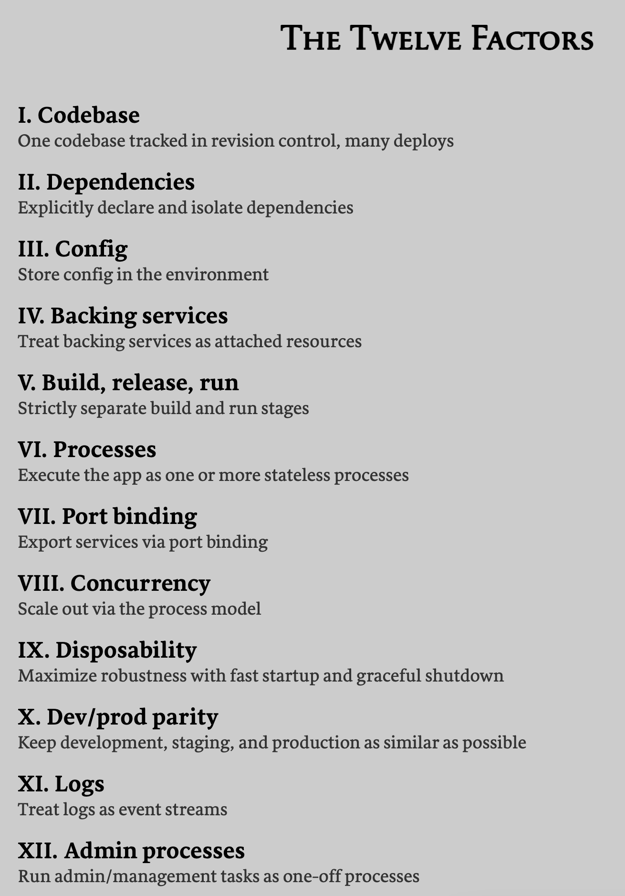
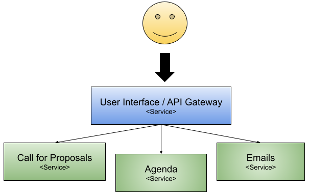
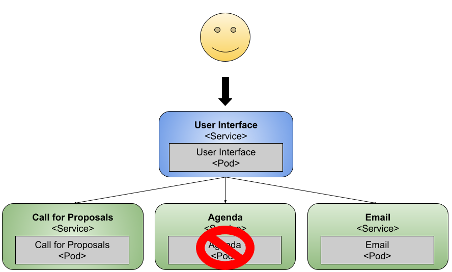
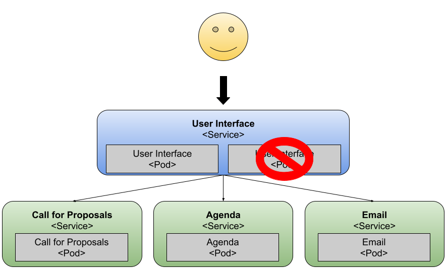

# Continuous Delivery for Kubernetes (Manning)

The contents of this repository had been used to write the [Continuous Delivery for Kubernetes book for Manning](http://mng.bz/jjKP)


This page contains some notes about the chapters and how they link to the tutorials included in this repository.

If you have questions, comments or feedback of any kind please create an issue here, or drop me a message in [Twitter @salaboy](http://twitter.com/salaboy). 
If you like the content please give it a Github star!

# Table of Content

- [Chapter 1: Cloud-Native Continuous Delivery](#chapter-1-cloud-native-continuous-delivery)
- [Chapter 2: Cloud-Native applicaiton challenges](#chapter-2-cloud-native-applicaiton-challenges)
- [Chapter 3: Service and Environment Pipelines](#chapter-3-service-and-environment-pipelines)
- [Chapter 4: Multi-Cloud Infrastructure](#chapter-4-multi-cloud-infrastructure)
- [Chapter 5: Release Strategies](#chapter-5-release-strategies)
- [Chapter 6: Events for Cloud-Native integrations](#chapter-6-events-for-cloud-native-integrations)
- [Chapter 7: Serverless for Kubernetes](#chapter-7-serverless-for-kubernetes)
- [Chapter 8: Building a Platform for CD](#chapter-8-building-a-platform-for-cd)
- [Chapter 9: The road to Continuous and Progress Delivery](#chapter-9-the-road-to-continuous-and-progress-delivery)

## Chapter 1: Cloud-Native Continuous Delivery

The first chapter introduce the approach of the book and cover the most important concepts that will be later expanded in the remaining of the book. 
There are two main definitions worth highlighting: What does Cloud-Native means in the context of Kubernetes and Continuous Delivery Goals. 


**Cloud-Native in the context of Kubernetes**: 

A good definition of the term can be found in VMWare site by Joe Beda (Co-Founder, Kubernetes and Principal Engineer, VMware) https://tanzu.vmware.com/cloud-native
“Cloud-Native is structuring teams, culture, and technology to utilise automation and architectures to manage complexity and unlock velocity.”

Where https://12factor.net is a key ingredient of what we understand for Cloud-Native, in Kubernetes we get most of the tools to adhere to these factors, but we need to be aware of them to make sure that we don't design our applications against them. 




**Continuous Delivery Goals**: 
 
“Deliver useful, working software to users as quickly as possible by organising teams to build and deploy in an automated way Cloud-Native applications that run in cloud-agnostic setup.” 

Highly recommended: [Grokking Continuous Delivery - By Christie Wilson - Manning](https://www.manning.com/books/grokking-continuous-delivery)


This chapter also introduce the concept of a walking skeleton, which describes the application linked in the tutorials of this repository. The scenario is a Conference Platform that you can use to organize any kind of conference event with speakers, call for proposals, agenda, notifications, etc.



## Chapter 2: Cloud-Native applicaiton challenges

While looking at the walking skeleton application introduced in chapter 1, chapter 2 focus on describing the challenges that you will face to run this application on top of Kubernetes. 

Starting with defining which Kubernetes flavour you choose and looking into package managers like Helm, this chapter explores the basic Kubernetes resources that you will be using to get the walking skeleton application and up and running. 

This chapter makes reference to the step by step tutorials that can be found [here: https://github.com/salaboy/from-monolith-to-k8s/tree/master/kind](https://github.com/salaboy/from-monolith-to-k8s/tree/master/kind)

Once you get the applicaiton up and running and we review the basics around Kubernetes Deployments, Services, and Ingresses, the chapter goes on describing the most common challenges that developers will face when building this kind of applications.

- **Downtime is not allowed**: If you are building and running a Cloud-Native application on top of Kubernetes and you are still suffering from application downtime, then you are not capitalizing on the advantages of the technology stack that you are using. 
- **Service’s built-in resiliency**: downstream services will go down and you need to make sure that your services are prepared for that. Kubernetes helps with dynamic Service Discovery, but that is not enough for your application to be resilient. 
Dealing with the application state is not trivial: we have to understand each service infrastructural requirements to efficiently allow Kubernetes to scale up and down our services. 
- **Data inconsistent data**: a common problem of working with distributed applications is that data is not stored in a single place and tends to be distributed. The application will need to be ready to deal with cases where different services have different views of the state of the world.
- **Understanding how the application is working (monitoring, tracing and telemetry)**: having a clear understanding on how the application is performing and that it is doing what it is supposed to be doing is essential to quickly find problems when things go wrong. 
- **Application Security and Identity Management**: dealing with users and security is always an after-thought. For distributed applications, having these aspects clearly documented and implemented early on will help you to refine the application requirements by defining “who can do what and when”.  

**Service’s built-in resiliency**:


**Application User-facing services resilience by replication**:



While following the 12-factor.net principles we will mitigate some of these challenges, we need to consiously design and tackle these challenges to avoid a large number of headaches. 


## Chapter 3: Service and Environment Pipelines

Chapter 3 is about builing Cloud Native application, but going to the next step, of not just building a single service for your applications, but all of them and in an iterative and continuous manner. Automating everything is key for being able to deliver a large amount of services without suffering in the process, hence tools like pipeline engines can help us to automate all the process of building and delivering our services and every new version of them to different environments. 

There are two main concepts covered in this chapter: 
- **Service Pipelines**: the mechanisms to build your services from source until you have everything you need to deploy a runnable version of the service. You will end up having a pipeline definition per service in your application. 
- **Environment Pipelines**: following the GitOps approach, we will have pipelines which their only purpose is to deploy our services to our defined environments. You will end up having one Environment Pipeline per environment that you want to have and these pipelines will take a source of truth as input, such as a git repository which will contain all the information required to set up the environment. When we use this approach, we don't interact with our clusters directly anymore, so no more `kubectl`, we let the Environment Pipeline to promote services and new version from these services to environments.
 
@TODO: Pipelines diagrams
 
To show how these pipelines can look like I used Tekton, which brings the right constructs to build Cloud-Native pipelines on top of Kubernetes. You can find a tutorial with Tekton which builds on of the services and one environment. 

https://github.com/salaboy/from-monolith-to-k8s/tree/master/tekton


## Chapter 4: Multi-Cloud Infrastructure

When working with Kubernetes, your applications will depend on infrastructure such as Databases, Message Brokers, Load Balancers, API Gateways, Identity Management solutions, etc. All this infrastructure needs to be managed, secured and maintained. Depending on your operation teams, running and managing all this infrastructure is complex and out of the scope for delopment teams. This chapter covers some options to work with infrastructural components inside and outside Kubernetes and how using tools like Crossplane you can manage your Cloud-Provider specific infrastructure by using Kubernetes Resources. 

A tutorial on how to setup the application to use two different databases inside Google Cloud can be found here: https://github.com/salaboy/from-monolith-to-k8s/blob/master/crossplane/config-pkg/README.md

Interesting enough, this example can also be ported to work on any other major Cloud Provider such as Azure AKS or Amazon EKS without changing anything on the application, just Crossplane configuration resources. 


## Chapter 5: Release Strategies

Being able to release software continuosly require us to have the right tools at hand. When working with Kubernetes, dealing with multiple versions of our services concurrently running at the same time is a big challenge. When you are dealing with high-demand scenarios Kubernetes built-in mechanisms might not be enough or are not optimal to manage multiple versions of our services running at the same time. This chapter goes over using tools like Knative Serving which allows us to implement different release strategies: 

- Rolling Updates
- Canary Releases
- Blue/Green Deployments
- A/B Testing

@TODO: Diagrams

By using Knative Serving Services, we reduce the amount of YAML used to describe our Services, but also can have fine grain control on how the traffic is routed to different versions of our services. This is very useful for implementing Canary Releases, Blue Green Deployments and A/B Testing strategies.
```
apiVersion: serving.knative.dev/v1
kind: Service
metadata:
  name: email-service 
spec:
  template:
    spec:
      containers:
        - image: salaboy/fmtok8s-email-rest:0.1.0-improved
  traffic:
  - percent: 80
    revisionName: email-service-00001
  - latestRevision: true
    percent: 20

```

Knative Serving does also bring an autoscaler that enable our services to behave more like Serverless applications, as they can be downscaled to zero automatically if they are not receiving any request. 

## Chapter 6: Events for Cloud-Native integrations

Kubernetes built-in resources doesn't deal with producers and consumers of events. So if you are building Event-Driven applications, or if you want to extend your applications to emit and consume events, from the Kubernetes perspective we will not have any visibility about how the events are flowing or how they are routed between different services. 

In this chapter we will be looking at how Knative Eventing builds on top of Kubernetes Resources the concepts of Event Producers, Event Routers, Events Subscriptions and Event Concumers.

@TODO: add diagram here

The chapter also introduce [CloudEvents](http://cloudevents.io) as a standard format to exchange events across different tech stacks. I wrote a blog post and a tutorial about building applications both in Java and Go which consume and emit CloudEvents with domain specific payloads. You can find a [step-by-step tutorial here](https://github.com/salaboy/from-monolith-to-k8s/tree/master/cloudevents) and the [blog post here](https://salaboy.com/2022/01/29/event-driven-applications-with-cloudevents-on-kubernetes/). 


## Chapter 7: Serverless for Kubernetes

In this chapter we talk about developer experience, and how we can use the tools that we have seen so far to provide the right abstractions for user to work with. This chapter is focused on a serverless approach which uses functions as the main constructs to build functionality that can be integrated together using events. 

This chapter goes over a Knative community project called `func`. This project allows developers to focus on building their functions and their busienss logic instead of worrying about how to build, package and deploy their applications. 

The examples for this chapter are going to be published soon. 


## Chapter 8: Building a Platform for CD

(To be written)

## Chapter 9: The road to Continuous and Progress Delivery

(To be written)


