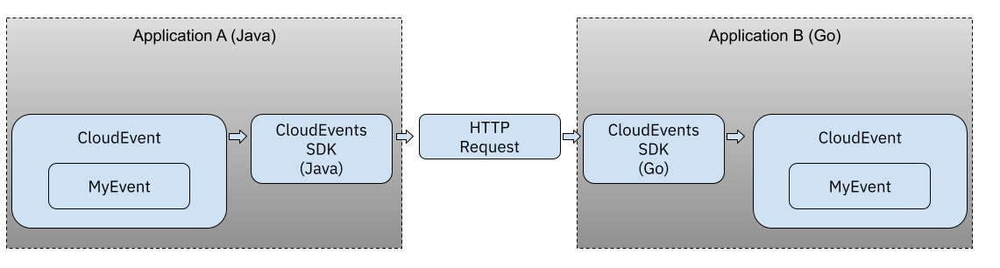

# Polyglot CloudEvents consumer/producer Tutorial

In this short tutorial we are going to create two applications that produce and consume CloudEvents. These applications uses different technology stacks: 
- Application A ([`fmtok8s-java-cloudevents`](https://github.com/salaboy/fmtok8s-java-cloudevents)) uses Java and Spring Boot and it adds the CloudEvents Java SDK to write and read CloudEvents. 
- Application B ([`fmtok8s-go-cloudevents`](https://github.com/salaboy/fmtok8s-go-cloudevents)) uses Go and adds the CloudEvents Go SDK to read and write CloudEvents. 



If you want to build and run the applications you will need to hava Java, Maven and Go installed. Alternatively you can run the available Docker containers, in which case you only need Docker to run this examples. 

To consume CloudEvents via HTTP both applications expose a REST endpoint where the events can be received.

## Running the applications in your local environment
You can find the source code of each application in the following repositories:

- Application A ([`fmtok8s-java-cloudevents`](https://github.com/salaboy/fmtok8s-java-cloudevents)) uses Java and Spring Boot and it adds the CloudEvents Java SDK to write and read CloudEvents. 
- Application B ([`fmtok8s-go-cloudevents`](https://github.com/salaboy/fmtok8s-go-cloudevents))

You can build the application from source using Java and Go tooling (as explained in each repository), but if you want to get things up and running fast I recommend just using the available docker containers. 

Because containers will be talking to each other, you need to make sure that they are in the same docker network, for that reason, we will create a custom network (`cloudevents-net`) and make sure that both containers are attached to it: 

```
docker network create --driver bridge cloudevents-net
```

If you have docker installed in your environment run the following commands in two separate terminals: 

Application A (Java):
```
docker run --name application-a --network cloudevents-net -e SINK=http://application-b:8081 -p 8080:8080 salaboy/fmtok8s-java-cloudevents
```

Application B (Go):
```
docker run --name application-b --network cloudevents-net -e SINK=http://application-a:8080 -p 8081:8081 salaboy/fmtok8s-go-cloudevents.go
```

Notice that it is pretty mucht the same command for both applications, just changing the SINK for the produced event and the application name. It is important to notice here that we are setting the container's name so they can call each other using a fixed name instead of an IP address. 

From a third terminal you can ask Application A to produce a CloudEvent which will be sent to Application B (as the SINK is configured to point to Application B port on localhost 8081)

You can use `curl` to send a POST request to the `/produce` endpoint of Application A (localhost:8080)
```
curl -X POST http://localhost:8080/produce
```

Check the logs from both containers by looking into the tabs where you run the previous commands. 

This POST request will hit Application A which will produce a new CloudEvent, this CloudEvent will be sent to Application B `/` endpoint which is ready to consume a CloudEvent and print it's contants after parsing the body into a Go struct. 

Feel free to test the other way around, by calling the `/produce` endpoint in Application B. 

```
curl -X POST http://localhost:8081/produce
```

# On Kubernetes
(TBD)
# With Knative Eventing
(TBD)
