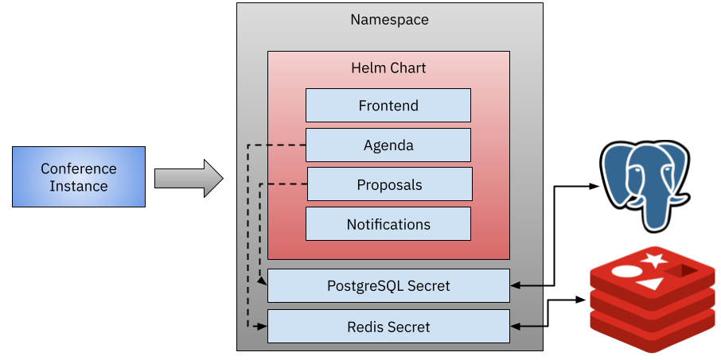

# ConferenceInstance Crossplane Composition

In this example, we create a Crossplane Composition to install:
- Conference Platform Services using Helm Provider
- PostgreSQL using CloudSQLInstance for GCP
- Redis using CloudMemorystoreInstance for GCP

You need to have installed the GCP and Helm provider for this composition to work. 



In order to build and package this configuration package you need to run, inside this directory: 

Build Configuration:

```
kubectl crossplane build configuration
```

Push the OCI package to a registry

```
kubectl crossplane push configuration <USER>/fmtok8s-conference:0.1.0
```

Then install the configuration package into Crossplane: 

```
kubectl crossplane install configuration <USER>/fmtok8s-conference:0.1.0
```

Notice that you can use the composition that I've already built with: 

```
kubectl crossplane install configuration salaboy/fmtok8s-conference:0.1.5
```

Now you can provision conference platforms + their application infrastructure by applying the following yaml file:

```
apiVersion: conferences.fmtok8s.salaboy.com/v1alpha1
kind: ConferenceInstance
metadata:
  name: my-conference
spec:
  parameters: 
    storagePostgresqlGB: 10
    storageRedisGB: 10

```