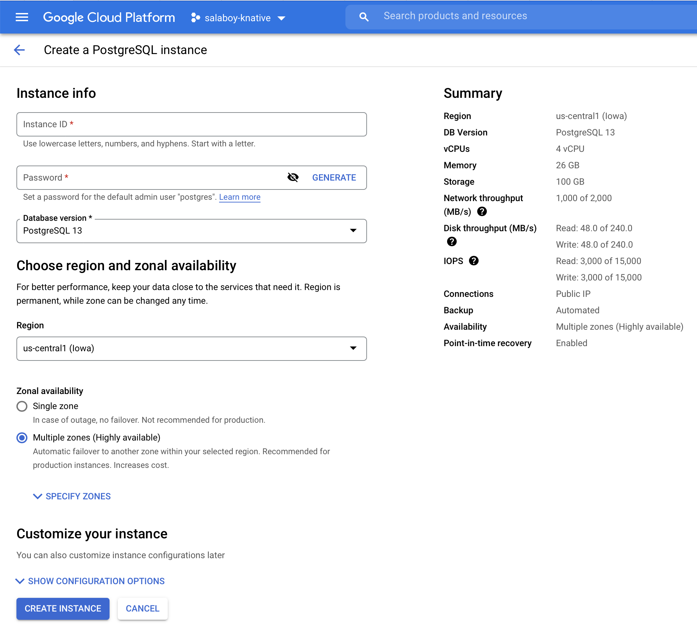
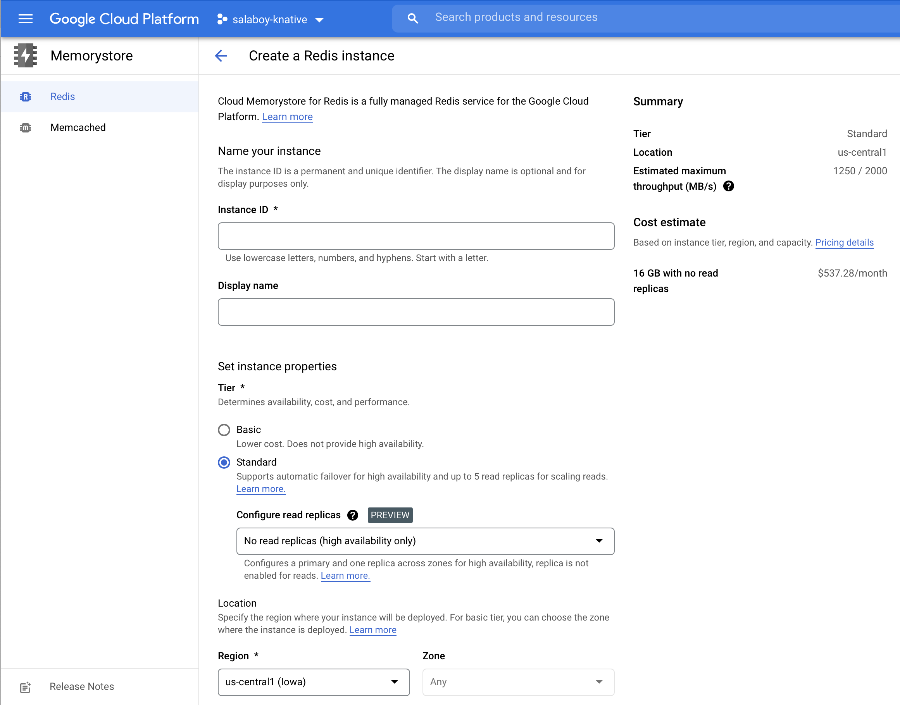
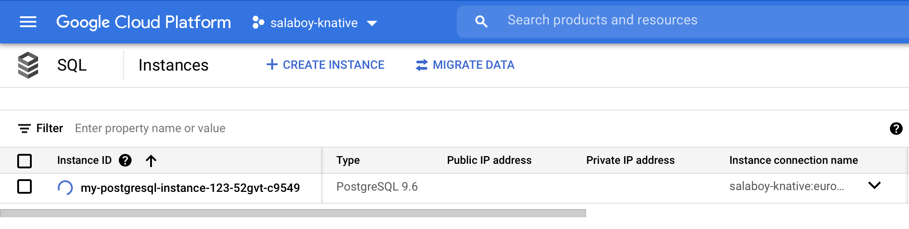

# Creating a Crossplane Configuration package with Application Infrastructure

In this tutorial we will be creating a configuration package that contains basic abstractions for PostgreSQL and Redis databases. These databases are needed by two of the Conference Platform application services, meaning that we need to provision (create an instance inside the Cloud Provider) and then connect this newly created instance to the application service. 

While creating a database instance and connecting to it sounds like an easy task, this might be challenging as more configurations might be needed to make sure that your application can connect. Sometimes, network configurations, access control rules and other resources might be needed to enable your application services to connect with newly provisioned infrastrucutre. For this reason, Crossplane allow us to group resources that needs to provision behind simple abstractions. 

If you go back to the installation instructions in the official documentation you will see that you already installed a Configuration Package for GCP called: `configuration.pkg.crossplane.io/xp-getting-started-with-gcp`. This configuration package allows the documentation to show how easy is to provision infrastructure, but in normal situations you will want to create your own abstractions for the resources that you want to provision and this is exactly what we are going to do here. 


## Understanding what a Configuration Package is in Crossplane


Inside this directory (`config-pkg`) directory you will find 3 files, and that is all you need to create a Crossplane configuration package: 
- [crossplane.yaml](crossplane.yaml): This file defines the metadata for our configuration package, as name version and which Crossplane version is required for this package to work. The name for this package `fmtok8s-db-gcp` makes reference to the fact that it contains database related configurations for GCP in the context of the Conference Platform (fmtok8s).
- [composition.yaml](composition.yaml): this file defines which and how to configure GCP resources together to be able to provision databases that we can access from our applications. Notice that there are two compositions defined in the same file, one for PostgreSQL using `apiVersion: database.gcp.crossplane.io/v1beta1 -> /kind: CloudSQLInstance` and another for Redis using `apiVersion: cache.gcp.crossplane.io/v1beta1 -> kind: CloudMemorystoreInstance`. This composition set very opinionated configurations for these resources, for example default regions and versions for the databases. These compositions provide a more simplistic interface for application developers who don't care where the database is provisioned or the version that the Platform team has chosen. 
- [definition.yaml](definition.yaml): the `definition.yaml` file materialize the simplifications configured by the `composition.yaml` file. In other words, the `definition.yaml` file contains CRDs definitions of the simple interfaces that we are going to expose to our users. This example includes two CRDs that will be installed in the cluster when we install this package: `PostgreSQLInstance` and `RedisInstance`.


In a way, what we are abstracting here with Crossplane are the following screens in GCP that allows us to configure our CloudSQL and MemoryStore instances: 




In other words, when we install this configuration package in Crossplane our users will be able to define a resource that allows them to create instances in a very similar way as when they use the GCP cloud console or the GCP CLI (`gcloud`). 

## Creating and Publishing our Configuration Package

Let's create and publish our custom configuration package. From inside the `config-pkg` directory run:

```
kubectl crossplane build configuration
```

This creates a tar file with `.xpkg` extension that contains the configuration package files. 

You can now push the generated package as an OCI image to any Container Registry of your choice, for example [DockerHub](hub.docker.com)

```
# Set this to the Docker Hub username or OCI registry you wish to use.
REG=salaboy
kubectl crossplane push configuration ${REG}/fmtok8s-db-gcp:0.1.0
```

I've pushed mine here: [https://hub.docker.com/repository/docker/salaboy/fmtok8s-db-gcp](https://hub.docker.com/repository/docker/salaboy/fmtok8s-db-gcp)

Now you can distribute this package and install it in any Crossplane installation. 

To install this package in your Crossplane installation you need to run: 

```
salaboy> kubectl crossplane install configuration salaboy/fmtok8s-db-gcp:0.1.0
configuration.pkg.crossplane.io/salaboy-fmtok8s-db-gcp created
```

You can check all the configuration packages installed by running: 

```
salaboy> kubectl get configurations.pkg.crossplane.io 
NAME                             INSTALLED   HEALTHY   PACKAGE                                                  AGE
salaboy-fmtok8s-db-gcp   True        True      salaboy/fmtok8s-db-gcp:0.1.0                     55s
xp-getting-started-with-gcp      True        True      registry.upbound.io/xp/getting-started-with-gcp:v1.5.0   20h
```

Once you have this running you can create a PostgreSQL database instance by running:

```
kubectl apply -f ../resources/postgresql.yaml
postgresqlinstance.db.fmtok8s.salaboy.com/my-postgresql-instance-123 created
```

The PostgreSQLInstance resource looks as follows: 

```
apiVersion: db.fmtok8s.salaboy.com/v1alpha1
kind: PostgreSQLInstance
metadata:
  name: my-postgresql-instance-123
  namespace: default
spec:
  parameters:
    storageGB: 20
  compositionSelector:
    matchLabels:
      provider: gcp
  writeConnectionSecretToRef:
    name: db-conn
```


If you take a look at CloudSQL inside your GCP console you should see that a new PostgreSQL instance is being created. You can check the status by listing the PostgreSQLInstance resource that we have defined in the configuration package with: 

```
salaboy> kubectl get postgresqlinstance.db.fmtok8s.salaboy.com
NAME                         READY   CONNECTION-SECRET   AGE
my-postgresql-instance-123   False   db-conn             21s
```



You can now delete the database by removing the resource by running: 
```
kubectl delete postgresqlinstance.db.fmtok8s.salaboy.com
```

The process provisioning a Redis instance is pretty much the same: 

```
apiVersion: cache.fmtok8s.salaboy.com/v1alpha1
kind: RedisInstance
metadata:
  name: my-redis-instance-123
  namespace: default
spec:
  parameters:
    memorySizeGb: 1
  compositionSelector:
    matchLabels:
      provider: gcp
  writeConnectionSecretToRef:
    name: redis-conn
```

Apply this resource and a new Redis instance will be provisioned: 

```
kubectl apply -f ../resources/redis.yaml
```

In contrast with other tools, Crossplane is constantly reconciling these resources. This means that if you go the GCP console and manaully delete the previously created Database, Crossplane will try to create it again if the resource is still present. 

## Conference Platform services connecting to the provisioned infrastructure

If you installed the application using [Helm as explained here](../helm/README.md), you can now connect the C4P Service to PostgreSQL and the Agenda Service to Redis. But you might be wondering "which user should I use? to which IP should I connect?"

If you look closely to the `postgresql.yaml` and `redis.yaml` file you will notice that both define a property under `spec` called `writeConnectionSecretToRef:`. Crossplane automatically create a Kubernetes Secret containing the URL and credentails to connect to the provisioned instances. Hence we can configure our services to just use the values inside this secret to connect. 

Let's update some Environment Variables from the C4P Service to connect to the newly created `PostgreSQLInstance`:


```
        - name: SPRING_DATASOURCE_DRIVERCLASSNAME
          value: org.postgresql.Driver 
        - name: SPRING_DATASOURCE_PLATFORM
          value: postgres
        - name: SPRING_DATASOURCE_URL
          value: jdbc:postgresql://${DB_ENDPOINT}:${DB_PORT}/postgres
        - name: SPRING_DATASOURCE_USERNAME
          valueFrom:
            secretKeyRef:
              name: db-conn
              key: username
        - name: SPRING_DATASOURCE_PASSWORD
          valueFrom:
            secretKeyRef:
              name: db-conn
              key: password
        - name: DB_ENDPOINT
          valueFrom:
            secretKeyRef:
              name: db-conn
              key: endpoint
        - name: DB_PORT
          valueFrom:
            secretKeyRef:
              name: db-conn
              key: port
```

You can do the same for the Agenda Service and Redis: 

```
- name: SPRING_REDIS_IN_MEMORY
  value: "false"
- name: SPRING_REDIS_HOST
  valueFrom: 
    secretKeRef:
      key: endpoint
      name: redis-conn
```


Now that the state of the services is handled by PostgreSQL and Redis you can scale up the number of replicas for the services to handle more load. 