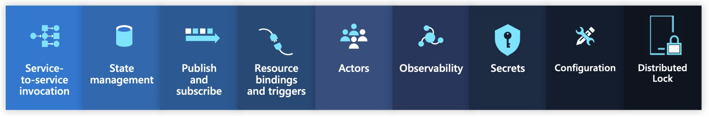
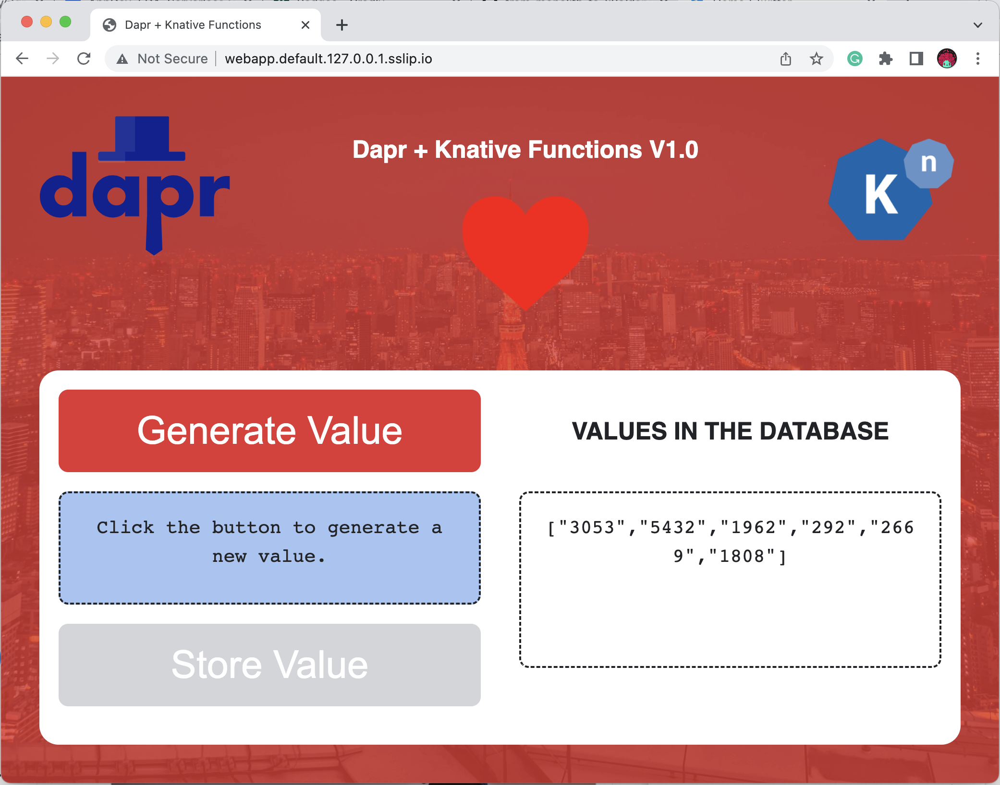
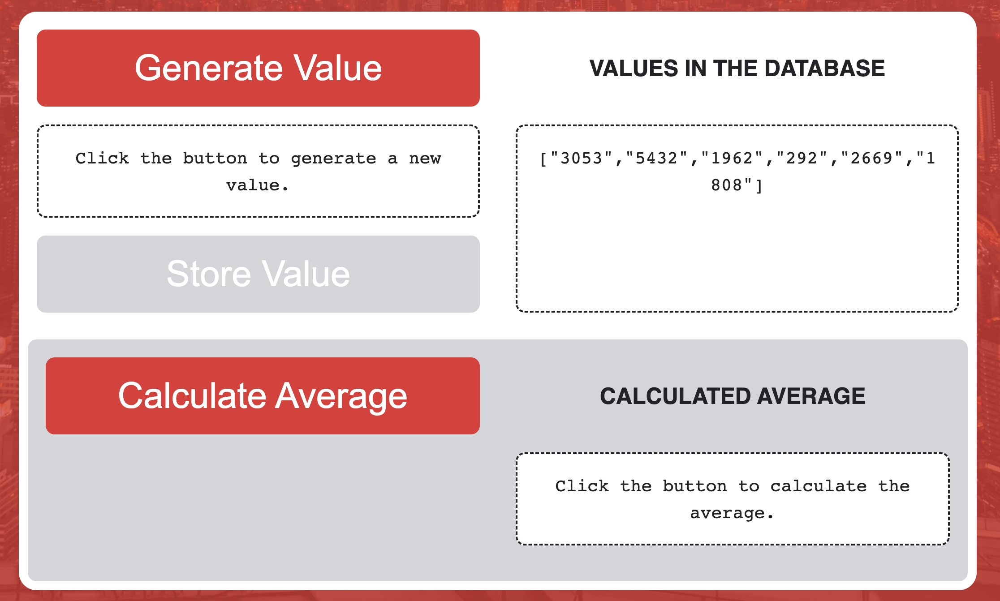
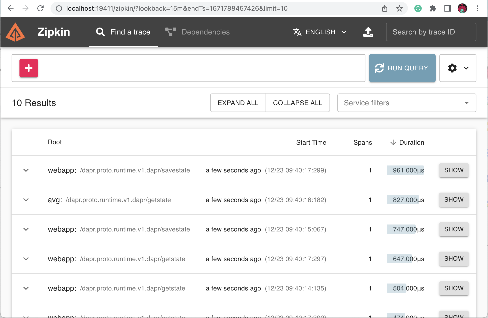
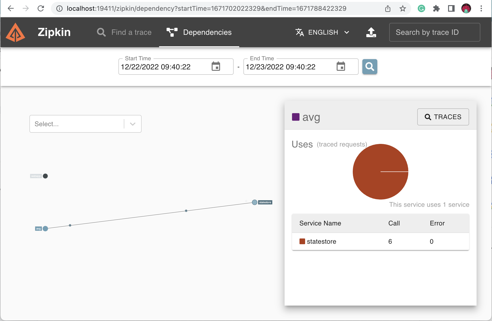

# Using Dapr to build Cloud Native Apps

In this tutorial we will build stateful Functions that leverage the [dapr.io](https://dapr.io) stateful memory store. 

We will use Dapr in conjuction with [Knative Functions](https://knative.dev) to leverage scaling to zero and autoscaling provided by [Knative Serving](https://knative.dev).

## Pre-requisites & installation


We will be creating a local KinD cluster where we will install Knative Serving and Dapr.

For this you will need to install the following CLIs:

- [Install `kubectl`](https://kubernetes.io/docs/tasks/tools/)
- [Install `kind`](https://kind.sigs.k8s.io/docs/user/quick-start/#installation)
- [Install `helm`](https://helm.sh/docs/intro/install/) 
- [Install `docker`](https://docs.docker.com/engine/install/)
- [Install the Knative Functions `func` CLI](https://knative.dev/docs/functions/install-func/)
- [Install the `dapr` CLI](https://docs.dapr.io/getting-started/install-dapr-cli/)

Let's create a cluster: 

```
cat <<EOF | kind create cluster --config=-
kind: Cluster
apiVersion: kind.x-k8s.io/v1alpha4
nodes:
- role: control-plane
  extraPortMappings:
  - containerPort: 31080 # expose port 31380 of the node to port 80 on the host, later to be use by kourier or contour ingress
    listenAddress: 127.0.0.1
    hostPort: 80
EOF
```

Let's now install Knative Serving into the cluster: 

[Check this link for full instructions from the official docs](https://knative.dev/docs/install/yaml-install/serving/install-serving-with-yaml/#prerequisites)

```
kubectl apply -f https://github.com/knative/serving/releases/download/knative-v1.8.0/serving-crds.yaml
kubectl apply -f https://github.com/knative/serving/releases/download/knative-v1.8.0/serving-core.yaml

```

Installing the networking stack to support advanced traffic management: 

```
kubectl apply -f https://github.com/knative/net-kourier/releases/download/knative-v1.8.0/kourier.yaml

```

```
kubectl patch configmap/config-network \
  --namespace knative-serving \
  --type merge \
  --patch '{"data":{"ingress-class":"kourier.ingress.networking.knative.dev"}}'

```

Configuring domain mappings: 

```
kubectl apply -f https://github.com/knative/serving/releases/download/knative-v1.8.0/serving-default-domain.yaml

```

**Only for Knative on KinD** 

For Knative Magic DNS to work in KinD you need to patch the following ConfigMap:

```
kubectl patch configmap -n knative-serving config-domain -p "{\"data\": {\"127.0.0.1.sslip.io\": \"\"}}"
```

and if you installed the `kourier` networking layer you need to create an ingress:

```
cat <<EOF | kubectl apply -f -
apiVersion: v1
kind: Service
metadata:
  name: kourier-ingress
  namespace: kourier-system
  labels:
    networking.knative.dev/ingress-provider: kourier
spec:
  type: NodePort
  selector:
    app: 3scale-kourier-gateway
  ports:
    - name: http2
      nodePort: 31080
      port: 80
      targetPort: 8080
EOF
```

Finally let's use install Dapr using Helm. Notice that you can also install Dapr using the `dapr` CLI.

```
helm repo add dapr https://dapr.github.io/helm-charts/
helm repo update
helm upgrade --install dapr dapr/dapr \
--version=1.9 \
--namespace dapr-system \
--create-namespace \
--wait
```

# Let's code!

We will be using some of the Dapr building blocks to enchance our Knative Functions and build an awesome application. 



We will start by creating a function using the Go programming language that store state into a Redis database by using the State Management building block. 

## Using the Dapr State Store 

To use the Dapr state store abstraction, first we need to define a Dapr component. For this example I've chosen Redis to be the implementation used to store state, but the idea here is that you can swap it to another state store if you need to without changing the code that is storing state.

Before applying this resource to our cluster, we need to install Redis, and we will do this using Helm:

```
helm repo add bitnami https://charts.bitnami.com/bitnami
helm repo update
helm install redis bitnami/redis --set image.tag=6.2 --set architecture=standalone
```

Then we can apply the `statestore.yaml` resource: 

```statestore.yaml
apiVersion: dapr.io/v1alpha1
kind: Component
metadata:
  name: statestore
spec:
  type: state.redis
  version: v1
  metadata:
  - name: keyPrefix
    value: name
  # These settings will work out of the box if you use `helm install
  # bitnami/redis`.  If you have your own setup, replace
  # `redis-master:6379` with your own Redis master address, and the
  # Redis password with your own Secret's name. For more information,
  # see https://docs.dapr.io/operations/components/component-secrets .
  - name: redisHost
    value: redis-master:6379
  - name: redisPassword
    secretKeyRef:
      name: redis
      key: redis-password
auth:
  secretStore: kubernetes
```


Now we have a redis instance and a secret called `redis` which contains a key called `redis-password` that our `statestore` component will use to connect to it. Now you can go ahead and apply our `statestore` component into our cluster: 

```
kubectl apply -f statestore.yaml
```

## Let's deploy our monolith first

I've create a simple application to extend using functions. You can deploy this application by running:

```
kubectl apply -f webapp.yaml
```

You can access the application by pointing your browser at: [http://webapp.default.127.0.0.1.sslip.io/](http://webapp.default.127.0.0.1.sslip.io/) 



Let's now extend our application by creating a function that calculates the average of all the values stored in the database.

## A function to calcualte the avergage 

First we need to create an empty directory, let's call it `avg`

```
mkdir avg && cd avg
```

Then we use the `func` CLI to create a new function from a template called `dapr` (`-t dapr`) coming from my templates repository (`-r https://github.com/salaboy/func`) using the Go language (`-l go`).

```
func create -l go -r https://github.com/salaboy/func -t dapr
```

You can go ahead and edit your function now with your favourite editor or IDE. 

You will see that the template already includes the Dapr client go library `dapr "github.com/dapr/go-sdk/client"`. This is optional and if you don't want to include any libraries you can perform plain HTTP or GRPC calls to the Dapr APIs.

The average calculation logic is commented out in the template, so feel free to uncomment and save the changes.

Using the Dapr client you can connect to the state store component and get the values to calculate the avergage: 

```
 result, err := daprClient.GetState(ctx, STATE_STORE_NAME, "values", nil)
	if err != nil {
		panic(err)
	}
	myValues := MyValues{}
	json.Unmarshal(result.Value, &myValues)
```


In order to let Dapr know about our function, we need to make sure that the Knative Service generated by `func` include some Dapr annotations. For that reason we need to tweak the `func.yaml` file: 

```
...
deploy:
  namespace: default
  annotations:
    dapr.io/app-id: avg
    dapr.io/app-port: "8080"
    dapr.io/enabled: "true"
    dapr.io/metrics-port: "9099"
...

```

Notice that I needed to change the `metrics-port` for Dapr, because the Knative `queue-proxy` uses the same port for metrics.


```
func deploy -v -r docker.io/<username>
```

Now that the function is deployed you can interact with it by sending a `HTTP` request using `curl`:

```
curl http://avg.default.127.0.0.1.sslip.io
```

This should return the avergage of all the values stored in the database. Go to the application user interface, generate more values and then hit that endpoint again to see the changes. 

Finally, if we want to make the User interface to interact with the function, we can deploy version 2 of the webapp which includes the average section calling the function that we just created.

```
kubectl apply -f webapp-v2.yaml
```

If you refresh your browser you should see the new Average section.




## Check the data stored in redis


First we need to obtain the REDIS_PASSWORD for the redis instance that we installed in our cluster:

```
export REDIS_PASSWORD=$(kubectl get secret --namespace default redis -o jsonpath="{.data.redis-password}" | base64 -d)
```

To check this, we can connect to the redis instance and run some queries:
First we port-forward the Redis Service port: 

```
kubectl port-forward svc/redis-master 6379:6379
```

Then we create a pod to be a redis client by running: 

```
kubectl run --namespace default redis-client --restart='Never'  --env REDIS_PASSWORD=$REDIS_PASSWORD  --image docker.io/bitnami/redis:6.2.5-debian-10-r63 --command -- sleep infinity
```

Then we attach to this pod

```
kubectl exec --tty -i redis-client --namespace default -- bash
```

Once we are in the pod, we can use the `redis-cli` to connect and send some queries:

```
redis-cli -h redis-master -a $REDIS_PASSWORD
```

You can run the following query to see which keys were stored: 

```
keys *
```

And then review the values by selecting a key with:

```
hgetall "statestore||values"
```

You should see an output like this: 

```
redis-master:6379> hgetall "statestore||values"
1) "data"
2) "{\"Values\":[\"3053\",\"5432\",\"1962\",\"292\",\"2669\",\"1808\",\"6254\",\"5964\"]}"
3) "version"
4) "8"
```


## Let's add tracing


Once again we need to choose an implementation, for this example we will install and use Zipkin, but you can change the underlaying implementation without the need to change any application code. 

```
kubectl create deployment zipkin --image openzipkin/zipkin
```

```
kubectl expose deployment zipkin --type ClusterIP --port 9411
```

Now you can apply the Dapr COonfiguration for tracing by running: 

```tracing.yaml
apiVersion: dapr.io/v1alpha1
kind: Configuration
metadata:
  name: tracing
  namespace: default
spec:
  tracing:
    samplingRate: "1"
    zipkin:
      endpointAddress: "http://zipkin.default.svc.cluster.local:9411/api/v2/spans"

```

By running: 

```
kubectl apply -f tracing.yaml
```


```
kubectl port-forward svc/zipkin 19411:9411
```


Now in order to make tracing to work, we need to add one more annotation to our function:

```
deploy:
  namespace: default
  annotations:
    ...
    dapr.io/config: tracing
    ...
```

Where `tracing` is the name of our Dapr Configuration resource that we created before.
Now you can open the Zipkin dashboard and check which traces are being observed: [http://localhost:19411]





## Let's enable and check metrics

```
kubectl create namespace dapr-monitoring
```

```
helm repo add prometheus-community https://prometheus-community.github.io/helm-charts
helm repo update
helm install dapr-prom prometheus-community/prometheus -n dapr-monitoring --set alertmanager.persistentVolume.enable=false --set pushgateway.persistentVolume.enabled=false --set server.persistentVolume.enabled=false

```
Notice that we are disabling all the `persistentVolume` configs for local development.

Check that all pods are up
```
kubectl get pods -n dapr-monitoring
```

We need to modify the configurations by default from prometheus to scrape from port `9099` which we changed in our `func.yaml` configuration.

To do this we can add some more annotations for Prometheus to scrape metrics in a special port: 

```
deploy:
  namespace: default
  annotations:
    ...
    dapr.io/enable-metrics: "true"
    dapr.io/metrics-port: "9099"
    prometheus.io/path: /metrics
    prometheus.io/port: "9099"
    prometheus.io/scrape: "true"
    ...
```


Next we will install grafana: 

```
helm repo add grafana https://grafana.github.io/helm-charts
helm repo update
helm install grafana grafana/grafana -n dapr-monitoring --set persistence.enabled=false

```

Get the grafana password
```
kubectl get secret --namespace dapr-monitoring grafana -o jsonpath="{.data.admin-password}" | base64 --decode ; echo

```

Now we can port-forward to access the grafana dashboard:

```
kubectl port-forward svc/grafana 8080:80 -n dapr-monitoring
```

Now you need to Configure the prometheus [data source in grafana as explained here](https://docs.dapr.io/operations/monitoring/metrics/grafana/#configure-prometheus-as-data-source). Then import the Dapr dashboards that can be found within the files of your Dapr release here: [https://github.com/dapr/dapr/releases](https://github.com/dapr/dapr/releases). Look for the `-dashboard.json` files. 

The problem with functions is that they might be downscaled to zero, so promethues might not be able to query them to get the metrics. We might need to look for another approach for collecting metrics (for example using the prometheus push gateway).


## Let's configure distributed logging with FluentD

https://docs.dapr.io/operations/monitoring/logging/fluentd/


```
helm repo add elastic https://helm.elastic.co
helm repo update
```

```
helm install elasticsearch elastic/elasticsearch --version 7.17.3 -n dapr-monitoring --set persistence.enabled=false,replicas=1

```


Install Kibana

```
helm install kibana elastic/kibana --version 7.17.3 -n dapr-monitoring

```

Then install FluentD

```
kubectl apply -f fluentd-config-map.yaml
kubectl apply -f fluentd-dapr-with-rbac.yaml

```

Then port-forward to kibana:

```
kubectl port-forward svc/kibana-kibana 5601 -n dapr-monitoring
```

On Kibana, after setting it up, you can create a filter: 

```
kubernetes.container_image_id : "generate-values" 
```

To filter all the logs coming from our function.


## Let's add some timer based actions


## Load test our function for autoscaling

spec.template.metadata.annotations

```
autoscaling.knative.dev/target: "10"
```

```
hey -z 10s -c 50 \                 
  "http://avg.default.127.0.0.1.sslip.io" \
  && kubectl get pods
```


```
hey -z 10s -c 50 "http://avg.default.34.132.150.167.sslip.io" \
  && kubectl get pods
```