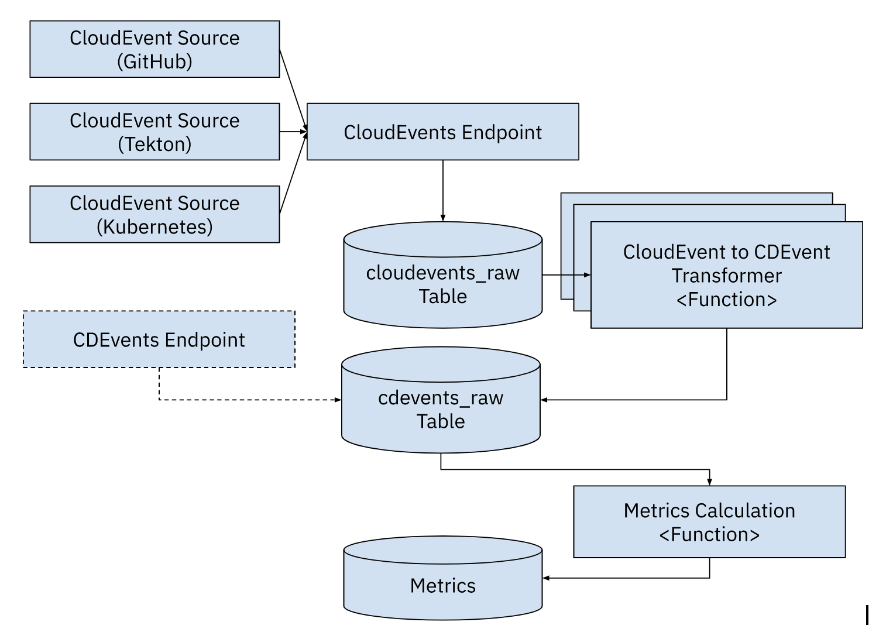
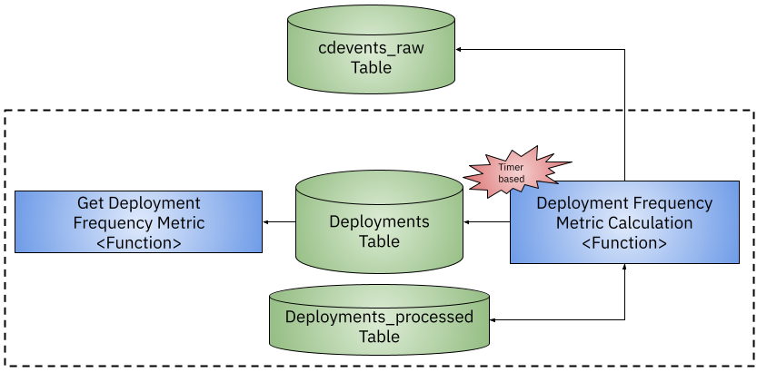

# Four Keys + CDEvents for Kubernetes

Based on https://github.com/GoogleCloudPlatform/fourkeys and https://cloud.google.com/blog/products/devops-sre/using-the-four-keys-to-measure-your-devops-performance

This project was designed to consume Cloud Events from multiple sources and allow you to track the Four Keys from the DORA report all based on Kubernetes making it portable accross cloud providers. 

## Components

- **CloudEvents Endpoint**: endpoint to send all CloudEvents, these CloudEvents will be stored in the SQL database to the `cloudevents-raw` table. 

- **CloudEvents Router**: this component, using a routing table, know where to route events to be transformed to `CDEvents`. This mechanism allows the same event type to be transformed into multiple `CDevents` if needed. This component reads from `cloudevents-raw` table and process events. This component is triggerd on a configurable fixed period of time. 

- **CDEvents tranformers**: These functions receive events from the `CloudEvents Router`  and tranform the CloudEvents to CDEvents, the result is sent to the `CDEvents Endpoint`. 


- **CDEvents Endpoint**`: endpoint to send [`CDEvents`](https://cdevents.dev), these CloudEvents will be stored in the SQL database to the `cdevents-raw` table, as they do not need any transformation. This endpoint validates that the CloudEvent received is a CD CloudEvent. 


- **Metrics functions**: These functions are in charge of calculating different metrics and store them into special tables, probably one per table. To calculate metrics these functions read from `cdevents-raw`. An example on how to calculate the **Deployment Frequency** metric is explained below. 

- (Optional) **Metrics Endpoint**: allows you to query the metrics by name and add some filters. This is an optional component, as you can build a dashboard from the metrics tables without using these endpoints.




## Installation

This project was created to consume any CloudEvent available and store it into a SQL database for further processing. Once the CloudEvents are into the system a function based approach can be used to translate to CDEvents which will be used to calculate the "four keys".


We will install the following components in an existing Kubernetes Cluster (you can use KinD): 
- Create Cluster: 
```
cat <<EOF | kind create cluster --name platform --config=-
kind: Cluster
apiVersion: kind.x-k8s.io/v1alpha4
nodes:
- role: control-plane
  extraPortMappings:
  - containerPort: 31080 # expose port 31380 of the node to port 80 on the host, later to be use by kourier or contour ingress
    listenAddress: 127.0.0.1
    hostPort: 80
EOF
```
- [Install Knative Serving](https://knative.dev/docs/install/yaml-install/serving/install-serving-with-yaml/) 
  - `kubectl apply -f https://github.com/knative/serving/releases/download/knative-v1.8.0/serving-crds.yaml`
  - `kubectl apply -f https://github.com/knative/serving/releases/download/knative-v1.8.0/serving-core.yaml`
  - `kubectl apply -f https://github.com/knative/net-kourier/releases/download/knative-v1.8.0/kourier.yaml`
```
kubectl patch configmap/config-network \
--namespace knative-serving \
--type merge \
--patch '{"data":{"ingress-class":"kourier.ingress.networking.knative.dev"}}'
```
  - `kubectl apply -f https://github.com/knative/serving/releases/download/knative-v1.8.0/serving-default-domain.yaml`

  - `kubectl patch configmap -n knative-serving config-domain -p "{\"data\": {\"127.0.0.1.sslip.io\": \"\"}}"`

```
cat <<EOF | kubectl apply -f -
apiVersion: v1
kind: Service
metadata:
  name: kourier-ingress
  namespace: kourier-system
  labels:
    networking.knative.dev/ingress-provider: kourier
spec:
  type: NodePort
  selector:
    app: 3scale-kourier-gateway
  ports:
    - name: http2
      nodePort: 31080
      port: 80
      targetPort: 8080
EOF
```

- [Install Knative Eventing](https://knative.dev/docs/install/yaml-install/eventing/install-eventing-with-yaml/)
  - `kubectl apply -f https://github.com/knative/eventing/releases/download/knative-v1.8.1/eventing-crds.yaml`
  - `kubectl apply -f https://github.com/knative/eventing/releases/download/knative-v1.8.1/eventing-core.yaml`
- `kubectl create ns four-keys`
- PostgreSQL: 
  - `helm install postgresql bitnami/postgresql --namespace four-keys`
  - In a separate terminal: `kubectl port-forward --namespace four-keys svc/postgresql 5432:5432`
  - In another terminal: `export POSTGRES_PASSWORD=$(kubectl get secret --namespace four-keys postgresql -o jsonpath="{.data.postgres-password}" | base64 -d)`
  - To connect from outside the cluster: `PGPASSWORD="$POSTGRES_PASSWORD" psql --host 127.0.0.1 -U postgres -d postgres -p 5432`
  - Create Tables (on default database `postgres`): 
    
    - `CREATE TABLE IF NOT EXISTS cloudevents_raw ( event_id serial NOT NULL PRIMARY KEY, content json NOT NULL, event_timestamp TIMESTAMP NOT NULL);`

    - `CREATE TABLE IF NOT EXISTS cdevents_raw ( cd_source varchar(255) NOT NULL, cd_id varchar(255) NOT NULL, cd_timestamp TIMESTAMP NOT NULL, cd_type varchar(255) NOT NULL, cd_subject_id varchar(255) NOT NULL, cd_subject_source varchar(255), content json NOT NULL, PRIMARY KEY (cd_source, cd_id));`

    - `CREATE TABLE IF NOT EXISTS deployments ( deploy_id varchar(255) NOT NULL, time_created TIMESTAMP NOT NULL, deploy_name varchar(255) NOT NULL, PRIMARY KEY (deploy_id, time_created, deploy_name));`

- Sockeye: `kubectl apply -f https://github.com/n3wscott/sockeye/releases/download/v0.7.0/release.yaml`

Cloud Event Sources: 

- Kubernetes API Server Source: https://knative.dev/docs/eventing/sources/apiserversource/getting-started/#create-an-apiserversource-object
  - Apply the APIServerSource resource with: `kubectl apply -f api-serversource-deployments.yaml`


## Development 

Deploy the `four-keys` components using `ko` for development:

```
cd four-keys/
ko apply -f config/
```


Create a new Deployment in the `default` namespace to test that your configuration is working.

```
kubectl apply -f test/example-deployment.yaml
```

If the Deployment Frequency functions (transformation and calculation) are installed you should be able to query the deployment frequency endpoint and see the metric: 

```
curl http://fourkeys-frequency-endpoint.four-keys.127.0.0.1.sslip.io/deploy-frequency/day
```
And see something like this: 

```
[{"DeployName":"nginx-deployment-3","Deployments":1,"Time":"2022-11-28T00:00:00Z"}]
```

Try modifying the deployment or creating new ones.


# Metrics

From [https://github.com/GoogleCloudPlatform/fourkeys/blob/main/METRICS.md](https://github.com/GoogleCloudPlatform/fourkeys/blob/main/METRICS.md)

## Deployment Frequency



We look for new or updated deployment resources. This us done by using the `APIServerSource` configured before. 

The flow should look like: 

API Server Source -> CloudEvent Endpoint (cloudevents_raw) -> CloudEvents Router -> CDEvent Transformation Function -> CDEvents Endpoint (cdevents_raw) -> Deployment Frequency Function (writes to `deployments` table) -> Metrics Endpoint (reads from `deployments` table)


Calculate buckets: Daily, Weekly, Monthly, Yearly.


This counts the number of deployments per day: 

```
SELECT
distinct deploy_name AS NAME,
DATE_TRUNC('day', time_created) AS day,
COUNT(distinct deploy_id) AS deployments
FROM
deployments
GROUP BY deploy_name, day;
```


## TODOs and extensions

- Add processed events mechanism for `cloudevents_raw` and `cdevents_raw` tables. This should avoid the `CloudEvents Router` and the `Metrics Calculation Functions` to recalculate already processed events. This can be achieved by having a table that keeps track of which was the last processed event and then making sure that the `CloudEvents Router` and the `Metrics Calculation Functions` join against the new tables. 
- Add queries to calculate buckets for Deployment Frequency Metric: Weekly, Monthly, Yearly to the `deployment-frequency-endpoint.go`. Check blog post to calculate frequency and not volume: https://codefresh.io/learn/software-deployment/dora-metrics-4-key-metrics-for-improving-devops-performance/
- Create Helm Chart for generic components (CloudEvents Endpoint, CDEvents Endpoint, CloudEvents Router)
- Automate table creation for PostgreSQL helm chart (https://stackoverflow.com/questions/66333474/postgresql-helm-chart-with-initdbscripts)
- Create functions for **Lead Time for Change**


## Other sources and extensions

- [Install Tekton](https://github.com/cdfoundation/sig-events/tree/main/poc/tekton)
  - Tekton dashboard: `k port-forward svc/tekton-dashboard 9097:9097 -n tekton-pipelines`
  - Cloud Events Controller: `kubectl apply -f https://storage.cloud.google.com/tekton-releases-nightly/cloudevents/latest/release.yaml`
  - ConfigMap: `config-defaults` for <SINK URL>
  
- Github Source: https://github.com/knative/docs/tree/main/code-samples/eventing/github-source
