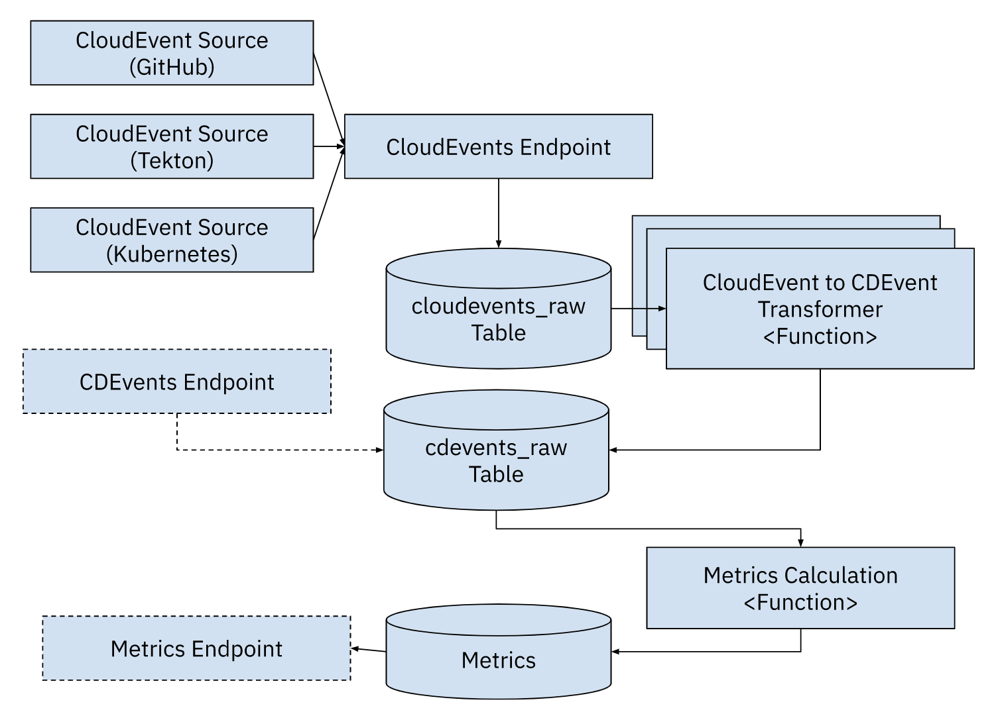

# Four Keys + CDEvents for Kubernetes

> This repo is based on [GCP fourkeys](https://github.com/GoogleCloudPlatform/fourkeys) and [Using the four keys to measure DevOps performance](https://cloud.google.com/blog/products/devops-sre/using-the-four-keys-to-measure-your-devops-performance).

This project was designed to consume Cloud Events and allow you to track the Four Keys from the DORA report all based on Kubernetes making it portable accross cloud providers.

## Components

- `CloudEvents Endpoint`: endpoint to send all CloudEvents, these CloudEvents will be stored in the SQL database to the `cloudevents-raw` table. 

- (Optional) `CDEvents Endpoint`: endpoint to send CDEvents, these CloudEvents will be stored in the SQL database to the `cdevents-raw` table, as they do not need any transformation. This endpoint validates that the CloudEvent received is a CD CloudEvent. 

- `CDEvents tranformers`: These functions will read from the `cloudevents-raw` table and tranform the CloudEvents to CDEvents only when apply based on the function's mapping. The results needs to be stored into the `cdevents-raw` table for further processing.

- `Metrics functions`: These functions are in charge of calculating different metrics and store them into special tables, probably one per table. To calculate metrics these functions read from `cdevents-raw`.

- (Optional) `Metrics Endpoint`: allows you to query the metrics by name and add some filters. This is an optional component, as you can build a dashboard from the metrics tables without using the endpoints.




## Installation

This project was created to consume any CloudEvent available and store it into a SQL database for further processing. Once the CloudEvents are into the system a function based approach can be used to translate to CDEvents which will be used to calculate the "four keys".

We will install the following components in an existing Kubernetes Cluster (you can use KinD): 

1. [Install Knative Serving](https://knative.dev/docs/install/yaml-install/serving/install-serving-with-yaml/) 
2. [Install Knative Eventing](https://knative.dev/docs/install/yaml-install/eventing/install-eventing-with-yaml/)

3. Install PostgreSQL: 

    We use [Helm](https://helm.sh/) to install postgresql on Kubernetes cluster.

    After, install `Helm` add Bitnami helm repo:

    ```sh
        helm repo add bitnami https://charts.bitnami.com/bitnami
    ```

    Create a namespace in your cluster called `four-keys`:
    ```sh
        kubectl create namespace four-keys
    ```

    Install `bitnami/postgresql` helm chart on namespace `four-keys`.
    ```sh
        helm install postgresql bitnami/postgresql --namespace four-keys
    ```

    Use a port forwarding to access the application:
    ```sh
        kubectl port-forward --namespace four-keys svc/postgresql 5432:5432
    ```

    By default, the `bitnami/postgresql` chart creates a password, run this command to get it:

    ```sh
        export POSTGRES_PASSWORD=$(kubectl get secret --namespace four-keys postgresql -o jsonpath="{.data.postgres-password}" | base64 -d)
    ```

    To connect from outside the cluster: 
    ```sh
        PGPASSWORD="$POSTGRES_PASSWORD" psql --host 127.0.0.1 -U postgres -d postgres -p 5432
    ```

    Creating all necessary tables (on default database `postgres`):

    `cloudevents_raw`:
    ```sql
        CREATE TABLE IF NOT EXISTS cloudevents_raw ( event_id serial NOT NULL PRIMARY KEY, content json NOT NULL, event_timestamp TIMESTAMP NOT NULL);
    ```

    `cdevents_raw`:
    ```sql
        CREATE TABLE IF NOT EXISTS cdevents_raw ( cd_source varchar(255) NOT NULL, cd_id varchar(255) NOT NULL, cd_timestamp TIMESTAMP NOT NULL, cd_type varchar(255) NOT NULL, cd_subject_id varchar(255) NOT NULL, cd_subject_source varchar(255), content json NOT NULL, PRIMARY KEY (cd_source, cd_id));
    ```

    `deployments`
    ```sql
        CREATE TABLE IF NOT EXISTS deployments ( deploy_id varchar(255) NOT NULL, time_created TIMESTAMP NOT NULL, deploy_name varchar(255) NOT NULL, PRIMARY KEY (deploy_id, time_created, deploy_name));
    ```

4. Install [Sockeye](https://github.com/n3wscott/sockeye):

    > Sockeye is a "Websocket based CloudEvents viewer."

    ```sh
        kubectl apply -f https://github.com/n3wscott/sockeye/releases/download/v0.7.0/release.yaml
    ```

5. Add Cloud Event Sources with [Kubernetes API Server Source](https://knative.dev/docs/eventing/sources/apiserversource/getting-started/#create-an-apiserversource-object):

    ```sh
    kubectl apply -f api-serversource-deployments.yaml
    ```

## Metrics

To get more info about metrics see [GCP fourkeys metrics](https://github.com/GoogleCloudPlatform/fourkeys/blob/main/METRICS.md).

## Deployment Frequency

We look for new or updated deployment resources. This us done by using the APIServerSource. The flow should look like: 

<!-- TODO: add a image tha represents this flow -->
`API Server Source` -> `CloudEvent Endpoint (cloudevents_raw)` -> `CDEvent Transformation (cdevents_raw)` -> `Deployment Frequency Function (writes to `deployments` table)`

**Deployment Frequency Function**: looks at the cdevents_raw table and counts Deployment CDEvents from different services. 

Calculate buckets: **Daily**, **Weekly**, **Monthly**, **Yearly**.

This counts the number of deployments per day: 

```sql
    SELECT
distinct deploy_name AS NAME,
DATE_TRUNC('day', time_created) AS day,
COUNT(distinct deploy_id) AS deployments
FROM
deployments
GROUP BY deploy_name, day;
```

<!-- @TODO: we should filter by "deployment name", as this is currently all deployments -->

Deploy the `four-keys` components using [ko](https://ko.build/install/) for development:

```bash
cd four-keys/
ko apply -f config/
```


Create a new Deployment in the `default` namespace to test that your configuration is working.

To do it, you can use [knative func](https://knative.dev/docs/getting-started/install-func/) plugin:

```sh
    func create -l go fourkeys-func
    cd fourkeys-func
    func deploy --registry <registry>
```

## Other sources and extensions

- [Install Tekton](https://github.com/cdfoundation/sig-events/tree/main/poc/tekton)

- Accessing Tekton dashboard: 
```sh
    kubernetes port-forward svc/tekton-dashboard 9097:9097 -n tekton-pipelines
```

- Creating Cloud Events Controller: 
```sh
    kubectl apply -f https://storage.cloud.google.com/tekton-releases-nightly/cloudevents/latest/release.yaml
```

- ConfigMap: `config-defaults` for <SINK URL>
  
- Github Source: [https://github.com/knative/docs/tree/main/code-samples/eventing/github-source](https://github.com/knative/docs/tree/main/code-samples/eventing/github-source)