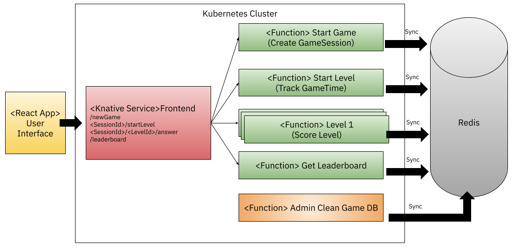

# Knative Functions Game 

This tutorial shows you how to deploy an instance of the Knative Functions quiz game. 
This game is built using different functions to evaluate and score the answers provided by the players. 
There is also a function to obtain a leaderboard based on the data recorded from each game session.

## Architecture

This application is based on functions, but it relies on a `frontend` component that serves as an API Gateway to connect the User Interface to the functions, so functions are not exposed outside the cluster. 


  
Each Game level is a different function that evaluates the submitted answers and score the results. 
All the state is kept into a Redis database and each function access Redis by creating a connection to it.
  
  

## Prerequisites

- Kubernetes Cluster
- Install Knative Serving
- (Optional for the second part) Install Knative Eventing
- Install Knative `func` CLI
- A Redis database (local, remote, managed)

## Installing the game functions and components
  
Once you have Knative Serving installed you can installing the FrontEnd Service
  
```
apiVersion: serving.knative.dev/v1
kind: Service
metadata:
  name: game-frontend
spec:
  template:
    metadata:
      annotations:
        autoscaling.knative.dev/minScale: "1"
    spec:
      containers:
        - image: salaboy/fmtok8s-game-frontend:0.1.0
          imagePullPolicy: Always
          livenessProbe:
            httpGet:
              path: /actuator/health
          ports:
            - containerPort: 8080
              name: http1
              protocol: TCP
          readinessProbe:
            httpGet:
              path: /actuator/health
```

If you run `kubectl get ksvc` you should see the URL for the service, where we can access the User Interface. 

For the application to work we need to install the functions that perform operations and store state in Redis. 
For this is recommend to have installed the `func` CLI. 

You can build your own levels or deploy the provided ones. 
Let's start by the `Start-Game` Function which source code is located [here](https://github.com/salaboy/start-game)
If you clone the source code of this function you can build and deploy this function to your cluster by running the following commands: 

```
func build
```
Before deploying the function you need to update an environment variable (`REDIS_HOST`) to allow the function to connect with a Redis instance. 
You can do this by editing the `func.yaml` file and under `envs` add the entry `REDIS_HOST` with the IP for where the Redis server is running: 

```
envs:
- name: REDIS_HOST
  value: X.X.X.X
```

Then you can run:  
```
func deploy
```


## Source code and Projects

- [FrontEnd application (Spring Boot + React Application)](https://github.com/salaboy/fmtok8s-game-frontend): This contains the frontend project, you can run the client side from your environment to hit the remote backend services by following the instructions in the project README.md file. 
- [Redis Function Template]() If you want to create functions that will connect to Redis you can create a function using this template, that already includes the Redis Go dependency and an environment variable that allows you to configure where the Redis instance is. 
- [Start-Game Function](https://github.com/salaboy/start-game)
- [Start-Level Function](https://github.com/salaboy/start-level)
- **Level Functions**
  - [Level-1](https://github.com/salaboy/level-1) 
  - [Level-2](https://github.com/salaboy/level-2) 
- [Get-Leaderbaord Function](https://github.com/salaboy/get-leaderboard)
- [Clean-DB](https://github.com/salaboy/clean-db)


