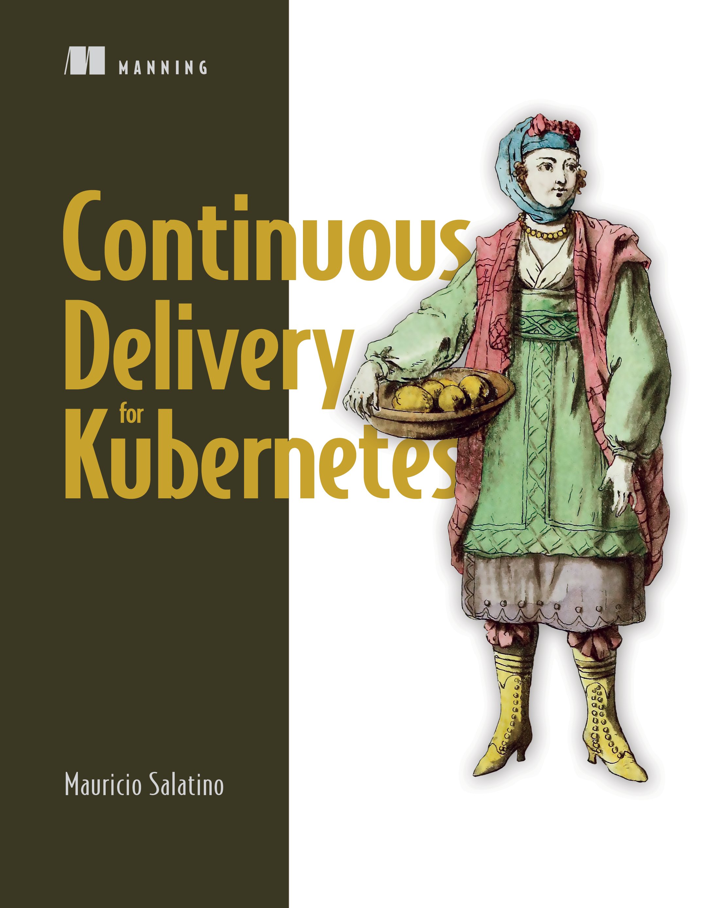
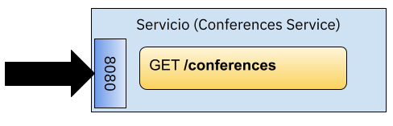
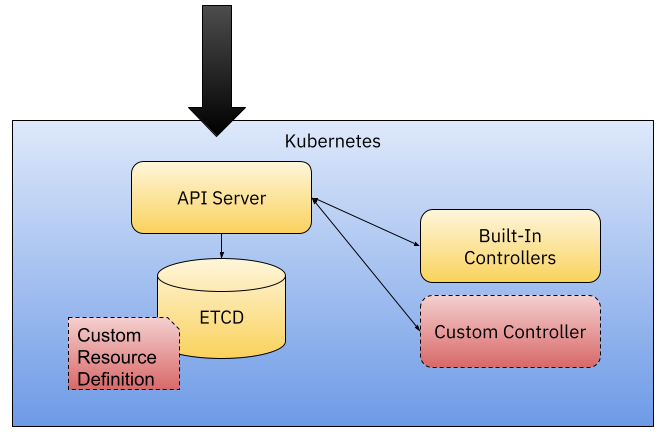
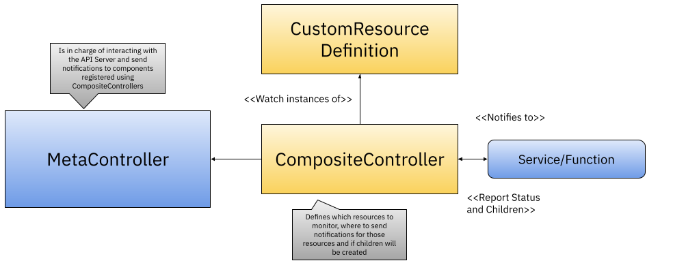
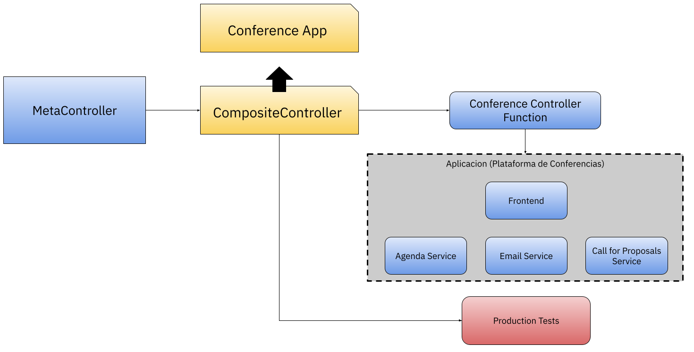
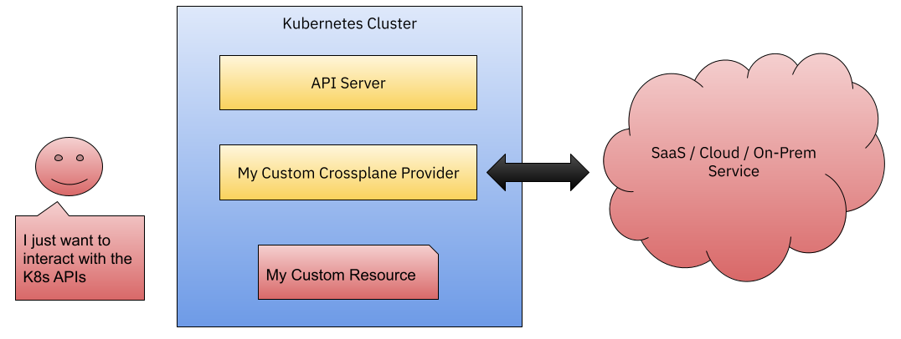

# JBCNConf 2022 

# Go vs Java en el contexto de Kubernetes!

Barcelona, Spain

Mauricio Salatino - [@Salaboy](https://twitter.com/salaboy)
[https://github.com/salaboy/from-monolith-to-k8s](https://github.com/salaboy/from-monolith-to-k8s)

---

# Agenda

- [Intro / Background](#intro--background)
- [IDEs, Lenguajes y Frameworks](#ides-lenguajes-y-frameworks)
- [Hablemos de Containers y Kubernetes](#hablemos-de-containers-y-kubernetes)
- [Extendiendo Kubernetes](#extendiendo-kubernetes)
- [Alternativas más saludables](#alternativas-más-saludables)

---

# Intro 

[@Salaboy](https://twitter.com/salaboy)

[http://mng.bz/jjKP](http://mng.bz/jjKP)

---

# Background

- Java / J2EE / Java EE 5
- [JBoss](https://jboss.org)
  -  Java EE / Wildfly
  -  Kubernetes
- Mi primer Kubernetes Controller con Fabric8.io
- [Jenkins X](https://jenkins-x.io)
- Spring Boot y [Spring Cloud]() 
  - [Spring Cloud Kubernetes]()
  - Kubernetes Controllers con Spring Cloud Kubernetes
- Go
  - Kubernetes Controllers con KubeBuilder
  - [Knative](https://knative.dev) Eventing && [Knative Functions WG co-lead](https://github.com/knative-sandbox/kn-plugin-func)
---

# IDEs, Lenguajes y Frameworks

Vamos crear un servicio que expone un endpoint REST

- Goland and Intellij Idea  
  - [Spring Boot](spring-boot/conference-service/) & [Quarkus](quarkus/conference-service/)
  - [Go](go/conference-service/)

---

# Resumen Go 

- Ventajas
  - Administracion de dependencias (Go Modules) integrada
  - Unit Testing integrado
  - Marshalling de YAML y JSON integrado
- Desventajas  
  -  No hay frameworks defacto como Spring Boot, cada uno elige e integra  
  - Go crea binarios que dependenden de la plataform donde hacemos el build. Similar a los problemas que vamos a tener con GraalVM

--- 

# Hablemos de Containers y Kubernetes

Creando containers y YAMLs: 

- [Spring Boot](spring-boot/conference-service/)
  - [Eclipse JKube Maven Plugin](https://faun.pub/deploying-spring-boot-application-on-kubernetes-using-kubernetes-maven-plugin-46caf22b03a5) (ex-Fabric8 Maven Plugin)
    - `mvn k8s:push` / `mvn k8s:resource` / `mvn k8s:apply`
- [Quarkus](quarkus/conference-service/)
  - [Quarkus Kubernetes Extension](https://quarkus.io/guides/deploying-to-kubernetes) 
- [Go](go/conference-service/)
  - [`google/ko`](https://github.com/google/ko)
  - `ko build main.go` / `ko resolve` / `ko apply`

Issue for Spring Boot: https://github.com/spring-projects/spring-boot/issues/31662  

--- 

# Resumen Go

- Spring Boot y Quarkus proveen integraciones con Jib y [**Buildpacks**](https://buildpacks.io/) para contruir containers sin Dockerfiles
  - Ambas integraciones usan la version definida en Maven para taggear el container
- En Go podemos usar Ko para construir y publicar estos containers a nuestro registry preferido
- `ko` construye y publica containers usando un SHA. Nos permite correr containers siempre los ultimos cambios
  - `ko` no crea YAMLs pero `ko resolve -f` reemplaza las referencias 
  - `ko apply -f` construye, publica y despliega nueva versiones

Issue for Spring Boot: https://github.com/spring-projects/spring-boot/issues/31662 

---

# Kubernetes APIs

Tarde o temprano vamos a querer interactuar con las APIs de Kubernetes: 
- [Fabric8.io Kubernetes APIs](https://github.com/fabric8io/kubernetes-client)
  - [Ejemplo](https://github.com/fabric8io/kubernetes-client/blob/master/kubernetes-examples/src/main/java/io/fabric8/kubernetes/examples/DeploymentExamples.java#L46)
- [Kubernetes Client Java](https://github.com/kubernetes-client/java/)
  - [Ejemplo](https://github.com/kubernetes-client/java/wiki/3.-Code-Examples)
- [Go Client](https://github.com/kubernetes/client-go)  
  - [Ejemplo](https://github.com/kubernetes/client-go/blob/master/examples/create-update-delete-deployment/main.go#L66)

--- 

# Extendiendo Kubernetes

Creamos nuevos Custom Resource Definitions y Kubernetes Controllers

Recomendado [Understanding Kubernetes tools/cache package Blog](https://lairdnelson.wordpress.com/2018/01/07/understanding-kubernetes-tools-cache-package-part-1/)

---

# Cuando extender Kubernetes

- Automatizacion de tareas manipulando recursos de Kubernetes (Controlladores que instalan, configuran o monitorean componentes)
- Necesitamos conceptos de mas alto nivel que Kubernetes no provee
- Integraciones entre distintos proyectos o con servicios externos a Kubernetes

---

# Caso de uso de ejemplo 

Monitorear y correr test de producción

---

# Veamos algunas herramientas 

- [KubeBuilder Go](https://github.com/salaboy/from-monolith-to-k8s/tree/main/kubernetes-controllers/kubebuilder/conference-controller) 
- [Java Operator SDK](https://github.com/salaboy/from-monolith-to-k8s/tree/main/kubernetes-controllers/java-operator-sdk/conference-controller)
  - [Bug/Edge Case - FIXED](https://github.com/java-operator-sdk/java-operator-sdk/issues/1337)
  - [Spring Documentation updated](https://github.com/java-operator-sdk/java-operator-sdk/pull/1313)

---

# Menciones especiales

- [Knative Sample Controller](https://github.com/knative-sandbox/sample-controller): Este Sample Controller usa los mismos mecanismos que usan los controllers de Knative. Estos controllers estan probados en escenarios de alta demanda y han madurado por mas de 4 años. Estos controllers pueden correr multiple replicas concurrentes mirando [distintos `buckets` de recursos](https://github.com/knative-sandbox/sample-controller/blob/main/config/config-leader-election.yaml#L51).
- [Kubernetes Client Java](https://kubernetes.io/blog/2019/11/26/develop-a-kubernetes-controller-in-java/): El cliente oficial de Kubernetes Java contiene hoy en dia una version de Controller Runtime, con objetos como Controllers y Reconcilers. 
- [Go Operators SDK](https://sdk.operatorframework.io/) Usa Kubebuilder y provee integraciones con Helm

--- 

# Porque no construir K8s Controllers

Pero en 2022 deberiamos escribir controllers? 

=> **K8sControllers == EdgeCaseFactories**
- Requiren permisos especiales para acceder a las APIs de K8s
- Son componentes complejos en un mundo de aplicaciones distribuidas
- Tienen que poder co-existir otros controlladores
- Tienen que escalar siguiendo los lineamientos de Kubernetes / buenos ciudadanos (leader election , alta disponibilidad)

--- 

# Alternativas más saludables

- [MetaController](https://metacontroller.github.io/metacontroller/)
- [CloudEvents para intregraciones](https://knative.dev/docs/eventing/sources/apiserversource/)
- [Crossplane Providers](https://blog.crossplane.io/providers-101-ordering-pizza-with-kubernetes-and-crossplane/)

---

# [MetaController](https://metacontroller.github.io/metacontroller/)

Para no crear y mantener codigo complejo

[Spring Boot PR](https://github.com/metacontroller/metacontroller/pull/565)

---

# [MetaController Ejemplo](https://metacontroller.github.io/metacontroller/)

---

# [CloudEvents para intregraciones](https://knative.dev/docs/eventing/sources/apiserversource/)

Para escenarios de integracion donde no queremos que todos los componentes tengan accesso a las APIs de Kubernetes

[https://knative.dev/docs/eventing/sources/apiserversource/](https://knative.dev/docs/eventing/sources/apiserversource/)

---

# [Crossplane.io Providers](https://blog.crossplane.io/providers-101-ordering-pizza-with-kubernetes-and-crossplane/)

Para situaciones donde queremos integrar servicios externos a Kubernetes

[https://crossplane.io](https://crossplane.io)

--- 

# Gracias!
Espero haberlos bombardeado con información util! 
[@Salaboy](https://twitter.com/salaboy)
[Knative](https://knative.dev)