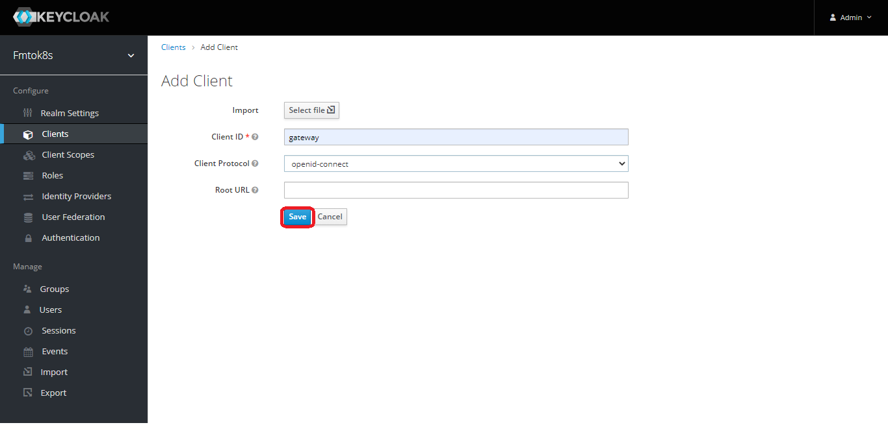
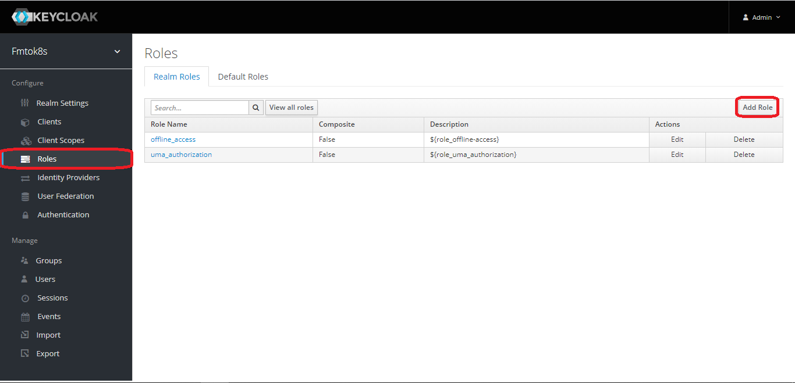
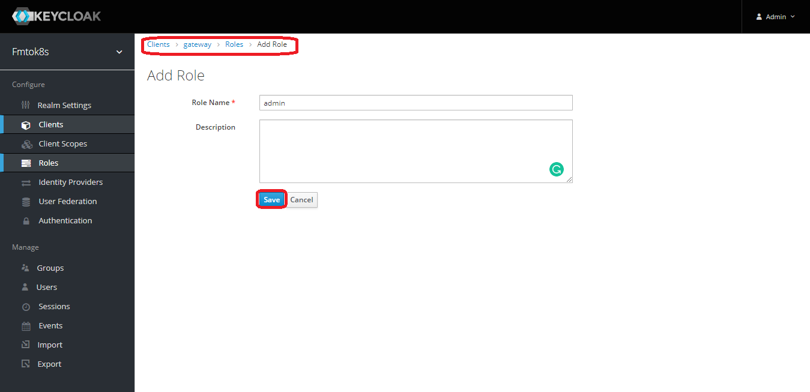

# From Monolith to K8s - Workshop 


# Installing and Configuring Keycloak

During this step-by-step you will be using **Kubernetes Cluster** and a Keycloak as SSO to secure our API Gateway and Microservices. 

### Creating a Kubernetes Cluster with KIND

```
$ kind create cluster --name keycloak
```

Don't forget to set current cluster/context

```
$ kubectl cluster-info --context kind-keycloak
```

In this example we'll not create a namespace (It is not a best practice )

### Adding Keycloak on Cluster Kubernetes

```
kubectl cretate -f https://raw.githubusercontent.com/keycloak/keycloak-quickstarts/latest/kubernetes-examples/keycloak.yaml
```

Let's see the keycloak pod

```
$ kubectl get pods
```

## Configuring Keycloak
1 - Let's access Administration Console:


2 - We'll access using our credentials passed through configurations


3 - Let's create our realm (fmtok8s)

`// TODO: explaine what is Keycloak's Realm`


4 - Creating a client

`// TODO: explaine what is client on keycloak`


5 - Creating a Client



`// It can be resumed` 

6 - Creating a Realm's Role




7 - Creating a Role Mapper


8 - Creating an user to Realm


... 


Adding an user



Setting user's password


Adding user's roles


## Changing API Gateway to secure our hidden microservices

[API Gateway](https://github.com/mcruzdev/fmtok8s-api-gateway) was created with Spring Cloud Gateway. The Spring Cloud Gateway uses Spring Webflux working with reactive stack.

There is a great lib called
`org.keycloak:keycloak-spring-boot-starter` that help us to configure our application using keycloak and it runs better with Servlet applications. [See](https://keycloak.discourse.group/t/webflux-support-for-spring-boot-and-spring-security-adapters/2936)

In this workshop, you will use Spring Security OAuth2. Let's go to use it.

### Adding Spring OAuth2 dependecies in API Gateway

```
<dependency>
    <groupId>org.springframework.boot</groupId>
    <artifactId>spring-boot-starter-oauth2-client</artifactId>
</dependency>
<dependency>
    <groupId>org.springframework.cloud</groupId>
    <artifactId>spring-cloud-starter-security</artifactId>
</dependency>
```

### Configuring 