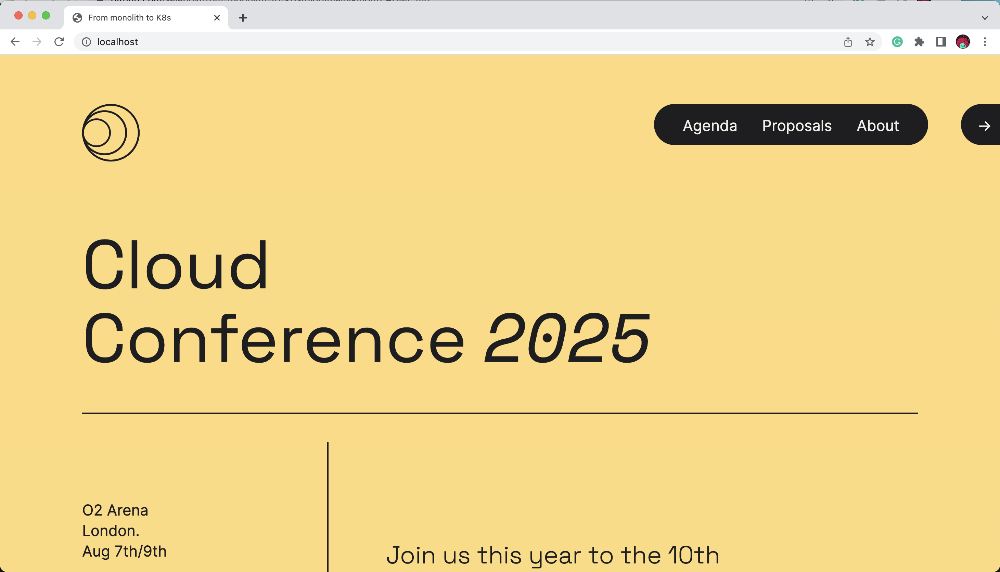

# Creating a Kubernetes Cluster and installing a Cloud-Native Application

In this short tutorial we will be installing the Conference Application using [Helm](https://helm.sh/) into a Kubernetes Cluster provisioned using [KinD](https://kind.sigs.k8s.io/). This Kubernetes Cluster will run in our local machine, using our Docker Deamon and its configurations (CPUs and RAM allocations). 

## Pre Requisites
- [Install Docker](https://docs.docker.com/get-docker/): **check docker configurations for CPU and RAM allowences**
- [Install KinD](https://kind.sigs.k8s.io/docs/user/quick-start/#installation)
- [Install Helm](https://helm.sh/docs/helm/helm_install/)

## Creating our Kubernetes (KinD) Cluster

Create a KinD Cluster with 3 worker nodes and 1 Control Plane

```
cat <<EOF | kind create cluster --name dev --config=-
kind: Cluster
apiVersion: kind.x-k8s.io/v1alpha4
nodes:
- role: control-plane
  kubeadmConfigPatches:
  - |
    kind: InitConfiguration
    nodeRegistration:
      kubeletExtraArgs:
        node-labels: "ingress-ready=true"
  extraPortMappings:
  - containerPort: 80
    hostPort: 80
    protocol: TCP
  - containerPort: 443
    hostPort: 443
    protocol: TCP
- role: worker
- role: worker
- role: worker
EOF

```

You should see something like this: 
```
Creating cluster "dev" ...
 ✓ Ensuring node image (kindest/node:v1.25.3) 🖼 
 ✓ Preparing nodes 📦 📦 📦 📦  
 ✓ Writing configuration 📜 
 ✓ Starting control-plane 🕹️ 
 ✓ Installing CNI 🔌 
 ✓ Installing StorageClass 💾 
 ✓ Joining worker nodes 🚜 
Set kubectl context to "kind-dev"
You can now use your cluster with:

kubectl cluster-info --context kind-dev

Not sure what to do next? 😅  Check out https://kind.sigs.k8s.io/docs/user/quick-start/
```

You just created a Kubernetes cluster called "dev".

Run the following command to check that you can see the nodes of your freshly created cluster:
```
kubectl get nodes
```
You should see an output like this: 

```
NAME                STATUS   ROLES           AGE     VERSION
dev-control-plane   Ready    control-plane   4m5s    v1.25.3
dev-worker          Ready    <none>          3m45s   v1.25.3
dev-worker2         Ready    <none>          3m45s   v1.25.3
dev-worker3         Ready    <none>          3m45s   v1.25.3
```

## Installing NGINX Ingress Controller

We need NGINGX Ingress Controller to route traffic from our laptop to the services that are running inside the cluster. NGINX Ingress Controller act as a router that is running inside the cluster, but exposed to the outside world. 

```
kubectl apply -f https://raw.githubusercontent.com/kubernetes/ingress-nginx/master/deploy/static/provider/kind/deploy.yaml
```

This allows you to route traffic from http://localhost to services running inside the cluster. Notice that for KinD to work in this way, when we created the cluster we provided extra parameters and labels for the control plane node:
```
nodes:
- role: control-plane
  kubeadmConfigPatches:
  - |
    kind: InitConfiguration
    nodeRegistration:
      kubeletExtraArgs:
        node-labels: "ingress-ready=true" #This allow the ingress controller to be installed in the control plane node
  extraPortMappings:
  - containerPort: 80 # This allows us to bind port 80 in local host to the ingress controller, so it can route traffic to services running inside the cluster.
    hostPort: 80
    protocol: TCP
  - containerPort: 443
    hostPort: 443
    protocol: TCP
```

Once we have our cluster and our Ingress Controller installed and configured we can move ahead and install our application.

## Installing the Application using Helm
Finally, we can install the application by adding a Helm chart repository. To achieve this, first we need to add a custom (for the book) Helm Chart Repository for this application: 

```
helm repo add fmtok8s https://salaboy.github.io/helm/
helm repo update
```

Then run `helm install`: 

```
helm install conference fmtok8s/fmtok8s-conference-chart
```

You should see the following output: 

```
NAME: conference
LAST DEPLOYED: Tue Dec 27 10:36:46 2022
NAMESPACE: default
STATUS: deployed
REVISION: 1
TEST SUITE: None
NOTES:
Cloud-Native Conference Platform V1

Chart Deployed: fmtok8s-conference-chart - v0.1.1
Release Name: conference

```

By running `helm install` we created a Helm Release called `conference` that you can list by running `helm list`. You can also uninstall the app by running `helm delete conference`

Notice that the first time that you run this command in your cluster, all the container images for the application services needs to be downloaded for the first time, hence the amount of time required to have all the services up and running will depend on your internet connection.

Now you can check that the pods of the application are being created correctly with: 
```
kubectl get pods
```

The output should look like this: 
```
NAME                                                 READY   STATUS    RESTARTS      AGE
conference-fmtok8s-agenda-service-57576cb65c-mnv4r   1/1     Running   0             38s
conference-fmtok8s-c4p-service-6c6f9449b5-w9wpf      1/1     Running   1 (24s ago)   38s
conference-fmtok8s-email-service-6fdf958bdd-zg6wb    1/1     Running   0             38s
conference-fmtok8s-frontend-5bf68cf65-8rm55          1/1     Running   0             38s
conference-postgresql-0                              1/1     Running   0             38s
conference-redis-master-0                            1/1     Running   0             38s
conference-redis-replicas-0                          1/1     Running   0             38s
```

When you  get all the pods up and running, you should be able to access the application pointing your browser to: http://localhost

You should be able to see and interact with the Conference Application:



I recommend you to check the [Conference Application introduction](../conference-application.md) to understand how the application works. Feel free to explore around and try to break the application.  


## Other options

If you don't want to create a Helm release, which gets created when you run `helm install` you can use Helm to produce the all YAML files of your application's services by running `helm template`. Run the following command to check all the Kubernetes resources applied to our cluster: 

```
helm template fmtok8s/fmtok8s-conference-chart
```

Check the output and notice that this also produce all the resources to deploy PostgreSQL and Redis into our cluster.

Using `helm template` is very useful for when we want to modify what gets generated and we don't own the chart so we cannot change it. 