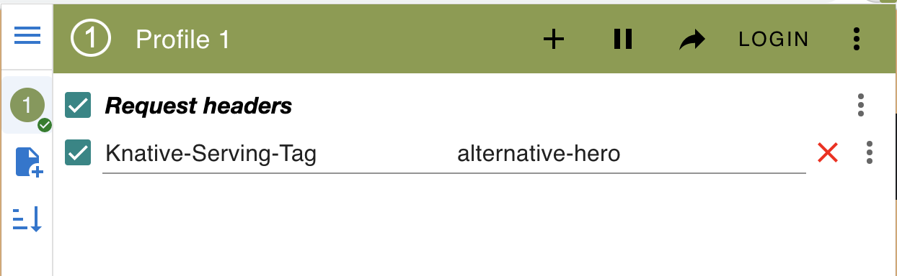

# Deploying the Conference Platform with Knative

This short tutorial explain how to use Knative Serving and Eventing in the context of our Conference Platform application. 

First we will look into using Knative Services instead of Kubernetes Deployments/Services/Ingresses and then we will look at how we can use Knative Eventing to route events between different services. 

Naturaly, this tutorial is split into two separate sections: 
- [Knative Serving for advanced traffic management](#knative-serving-for-advanced-traffic-management)
  - [Installing Knative Serving](#install-knative-serving)
  - [Installing the application using Helm](#install-the-application-using-knative-services)
  - [Traffic Splitting Using Percentages](#traffic-splitting-using-percentages)
  - [Traffic Splitting Using Headers](#traffic-splitting-using-headers)
- [Knative Eventing]()
  - [Installing Knative Eventing]()
  - [Creating a Knative Eventing Broker]()
  - [Subscribing to Events using Knative Eventing Triggers]()


# Knative Serving for advanced traffic management

Knative Serving is a Kubernetes add on that is commonly associated with Serverless. This association comes from the fact that Knative Serving simplify the way that we deploy our containerized applications to Kubernetes and that out of the box it support scaling our containers down to zero. Knative Serving also provides advanced traffic management features by providing abstractions on top of different gateways implementations.

In the following sections we will se these features in action. 

## Install Knative Serving

You can follow the instructions provided in the [Knative.dev](https://knative.dev) site for installing Knative Serving latest release: [https://knative.dev/docs/install/serving/install-serving-with-yaml/](https://knative.dev/docs/install/serving/install-serving-with-yaml/). Follow this instructions if you are intalling Knative in a Cloud Provider or in an on-prem Kubernetes installation. 


If you are using KinD or Minikube check the [quickstart installation](https://knative.dev/docs/getting-started/quickstart-install/#install-the-knative-quickstart-plugin).
If you are using KinD or Minikube, this tutorial assumes that you used this quickstart to install Knative. 

Once installed, apply the following patch to support traffic splitting with Headers (explained here: https://knative.dev/docs/serving/feature-flags/#kubernetes-fieldref and  https://knative.dev/docs/serving/samples/tag-header-based-routing/) and Downward API (explained here: https://knative.dev/docs/serving/feature-flags/#kubernetes-fieldref):

```
kubectl patch cm config-features -n knative-serving -p '{"data":{"tag-header-based-routing":"Enabled", "kubernetes.podspec-fieldref": "Enabled"}}'
```

It is also recommended to install [`ModHeader`](https://chrome.google.com/webstore/detail/modheader/idgpnmonknjnojddfkpgkljpfnnfcklj?hl=en) to modify the request headers in your browser.

### Install the application using Knative Services

We will be using the same Helm charts that we used in the KinD and Helm tutorials, but we will enable the Knative Services deployments. 

```
cat <<EOF | helm install conference-knative fmtok8s/fmtok8s-conference-chart --values=-
fmtok8s-frontend:
  knative:
    enabled: true
  env:
    KNATIVE_ENABLED: "true"
    FRONTEND_AGENDA_SERVICE: http://fmtok8s-agenda.default.svc.cluster.local
    FRONTEND_C4P_SERVICE: http://fmtok8s-c4p.default.svc.cluster.local
    FRONTEND_EMAIL_SERVICE: http://fmtok8s-email.default.svc.cluster.local  
fmtok8s-email-service:
  knative:
    enabled: true
fmtok8s-c4p-service:
  knative:
    enabled: true
  env:
    C4P_AGENDA_SERVICE: http://fmtok8s-agenda.default.svc.cluster.local
    C4P_EMAIL_SERVICE: http://fmtok8s-email.default.svc.cluster.local  
fmtok8s-agenda-service:
  knative:
    enabled: true 
EOF
```

You can list the Knative Services by running: 

```
kubectl get ksvc 
```
You should see something like: 
```
NAME               URL                                                  LATESTCREATED            LATESTREADY              READY   REASON
fmtok8s-agenda     http://fmtok8s-agenda.default.127.0.0.1.sslip.io     fmtok8s-agenda-00001     fmtok8s-agenda-00001     True    
fmtok8s-c4p        http://fmtok8s-c4p.default.127.0.0.1.sslip.io        fmtok8s-c4p-00001        fmtok8s-c4p-00001        True    
fmtok8s-email      http://fmtok8s-email.default.127.0.0.1.sslip.io      fmtok8s-email-00001      fmtok8s-email-00001      True    
fmtok8s-frontend   http://fmtok8s-frontend.default.127.0.0.1.sslip.io   fmtok8s-frontend-00001   fmtok8s-frontend-00001   True    
 

```
Where instead of `X`s you should see your public IP address or `127.0.0.1` if you are using KinD or minikube.

You can access the application by pointing your browser to: http://fmtok8s-frontend.default.X.X.X.X.sslip.io

You can send the following POST request to generate some talks proposals in the application: 
```
curl -X POST http://fmtok8s-frontend.default.X.X.X.X.sslip.io/api/test
```
Then go to the Back office section of the application and approve all the proposals. You should see them in the Agenda section listed in different days. 


### Traffic Splitting Using Percentages

In this section we will be testing Knative Serving traffic splitting capabilities, but we will not use the Frontend to test, we will use the Email Service. The only reason to do this is the simple fact that when you are hosting an application frontend we are not dealing with a single request (one request for getting html, another for getting Javascript files, another for CSS, one per each image that we want to render, etc) and for this example we want to see where each request is going.

Before changing the service configuration you can hit the `info` endpoint of the email service: 

```
curl http://fmtok8s-email.default.127.0.0.1.sslip.io/info
```

You should see something like this: 

```json
{"name":"Email Service","version":"v0.1.0","source":"https://github.com/salaboy/fmtok8s-email-service/releases/tag/v0.1.0","podId":"fmtok8s-email-00001-deployment-c59948bd4-q828k","podNamepsace":"default","podNodeName":"dev-control-plane"}
```

You can edit the Knative Service (ksvc) of the Email Service and create a new revision by changing the container image that the service is using or any other configuration parameter such as environment variables: 

```
kubectl edit ksvc fmtok8s-email
```

Any configuration change of our service will create a new revision. For this example we will change the `VERSION` Environment Variable and the container `image` that the service is using: 

From:
```
spec:
  template:
    metadata:
      annotations:
        autoscaling.knative.dev/minScale: "1"
    spec:
      containerConcurrency: 0
      containers:
      - env:
        ...
        - name: VERSION
          value: v0.1.0
        ...  
      image: ghcr.io/salaboy/fmtok8s-email-service:v0.1.0-native    
      ...
```
To:
```
spec:
  template:
    metadata:
      annotations:
        autoscaling.knative.dev/minScale: "1"
    spec:
      containerConcurrency: 0
      containers:
      - env:
        ...
        - name: VERSION
          value: v0.2.0
        ...  
      image: ghcr.io/salaboy/fmtok8s-email-service:v0.2.0-native    
      ... 
```
Notice that we are updating the container `image` and also an environment variable. This enironment variable is commonly updated automatically when we update the service Helm chart, for this example we are manually editing the service. 

Before saving this change, that will create a new revision which we can use to split traffic, we need to add the following values into the `traffic` section:

```
  traffic:
  - latestRevision: false
    percent: 50
    revisionName: fmtok8s-email-00001
  - latestRevision: true
    percent: 50
```

Now if you start hitting the service `info` endpoint again you will see that half of the traffic is being routed to version 1 of our service and the other half to version 2. 

```
> curl http://fmtok8s-email.default.127.0.0.1.sslip.io/info
{"name":"Email Service","version":"v0.1.0","source":"https://github.com/salaboy/fmtok8s-email-service/releases/tag/v0.1.0","podId":"fmtok8s-email-00001-deployment-c59948bd4-q828k","podNamepsace":"default","podNodeName":"dev-control-plane"}                                                                                          

> curl http://fmtok8s-email.default.127.0.0.1.sslip.io/info
{"name":"Email Service - IMPROVED!!","version":"v0.2.0","source":"https://github.com/salaboy/fmtok8s-email-service/releases/tag/v0.2.0","podId":"fmtok8s-email-00002-deployment-6b9bb6959f-wdl8q","podNamepsace":"default","podNodeName":"dev-control-plane"}
```

This mechanism becomes really useful when you need to test a new version but you are not willing to route all the traffic straightaway to the new version. 


### Traffic Splitting Using Headers

In this case we will use HTTP Headers to route traffic. In contrast with just letting Knative to route based on percentage is that we can now control the routing of all the requests that contains special HTTP Headers. For this reason, we can now use the Frontend Service for the example. 

Before making any changes access the applicaation Frontend by pointing your browser to the Frontend Knative Service URL. If you are running on KinD it should look similar to this: 

```
http://fmtok8s-frontend.default.127.0.0.1.sslip.io
```


You can edit the Knative Service (ksvc) of the Frontend and create a new revision by changing the service configuration, as we did before we will just change an environment variable, which will trigger the creation of a new revision for the service: 

```
kubectl edit ksvc fmtok8s-frontend
```

Add the `FEATURE_ALTERNATIVE_HERO_ENABLED` environment variable in the `env` section:
```
spec:
  template:
    metadata:
      annotations:
        autoscaling.knative.dev/minScale: "1"
    spec:
      containers:
      - env:
        ...
        - name: FEATURE_ALTERNATIVE_HERO_ENABLED
          value: "true"    
        ...  
```

Before saving this change, we need to add the following values into the `traffic` section:

```
  traffic:
  - latestRevision: false
    percent: 100
    revisionName: fmtok8s-frontend-00001
    tag: current
  - latestRevision: false
    percent: 0
    revisionName: fmtok8s-frontend-00002
    tag: alternative-hero
  - latestRevision: true
    percent: 0
    tag: latest
```

Now with `ModHeader` for Chrome you can now specify the `alternative-hero` revision by setting the following header: 

`Knative-Serving-Tag` with value `alternative-hero`



Now if you refresh the page with the new Header you should see that the application color changed to be orange and the country where the conference is happening is shown (United Kingdom).


### Traffic Splitting using URLs with Tags

Let's quickly add another route to our Frontend service to demonstrate that tags can be accessed by setting up HTTP Headers or just accessing a specific URL that Knative Serving creates for each tag. 

For the previous example you can access the following URL: 

```
http://alternative-hero-fmtok8s-frontend.default.127.0.0.1.sslip.io/
```

Without adding any HTTP headers, Knative Serving will know that you want to access that speific tag. 

Let's now add a new traffic rule and let's set the `DEBUG` feature enable: 

```
spec:
  template:
    metadata:
      annotations:
        autoscaling.knative.dev/minScale: "1"
    spec:
      containers:
      - env:
        ...
        - name: FEATURE_DEBUG_ENABLED
          value: "true"
        ...  
```

With the following traffic rules: 

```
traffic:
  - latestRevision: false
    percent: 100
    revisionName: fmtok8s-frontend-00001
    tag: current
  - latestRevision: false
    percent: 0
    revisionName: fmtok8s-frontend-00002
    tag: alternative-hero
  - latestRevision: false
    percent: 0
    revisionName: fmtok8s-frontend-00003
    tag: debug
  - latestRevision: true
    percent: 0
    tag: latest
```

Now if you access the application by pointing to the following URL: 

```
http://debug-fmtok8s-frontend.default.127.0.0.1.sslip.io/
```

You should now see the Frontend with the `Debug` banner on top giving you more information about each application service. Notice that this new configuration still is using the alternative hero feature (as it looks orange and still shows the country), but this is only we just added a new environment variable and we didn't removed it for this last configuration. 


## Installing Knative Eventing

@TODO: update this section!

Follow the instructions from here: 
https://knative.dev/docs/install/eventing/install-eventing-with-yaml/

Then create a Broker:

```
kubectl create -f - <<EOF
apiVersion: eventing.knative.dev/v1
kind: broker
metadata:
 name: default
 namespace: default
EOF
```

Then you can enable emitting events into the services by adding two environment variables.

```
kubectl edit ksvc fmtok8s-c4p
```
Then edit the `env` section and add: 
```
        - name: EVENTS_ENABLED
          value: "true"
        - name: K_SINK
          value: http://broker-ingress.knative-eventing.svc.cluster.local/default/default  
```

Now you can deploy Sockeye to monitor CloudEvents: 

https://github.com/n3wscott/sockeye

```
kubectl apply -f https://github.com/n3wscott/sockeye/releases/download/v0.7.0/release.yaml

```

Finally, you just need to create a trigger (subscription) to connect the consumer, in this case Sockeye to the Broker. Notice that the producer only knows where the Broker is. 

```
apiVersion: eventing.knative.dev/v1
kind: Trigger
metadata:
  name: c4p-trigger
  namespace: default
spec:
  broker: default
  subscriber:
    uri: http://sockeye.default.svc.cluster.local
```

## Configuring the project to use the Knative Eventing RabbitMQ Broker

To change the Broker implementation, and use the [https://github.com/knative-sandbox/eventing-rabbitmq/](https://github.com/knative-sandbox/eventing-rabbitmq/).

First we need to have the required CRDs for a RabbitMQ Operator to work:
- Install the RabbitMQ Cluster Operator
  kubectl apply -f https://github.com/rabbitmq/cluster-operator/releases/latest/download/cluster-operator.yml
- Install the Cert Manager required for the RabbitMQ Message Topology Operator, this because the TLS enabled admission webhooks needed for the Topology Operator to work properly
  kubectl apply -f https://github.com/jetstack/cert-manager/releases/latest/download/cert-manager.yaml
  kubectl wait --for=condition=Ready pods --all -n cert-manager
- Lastly, install the RabbitMQ Message Topology Operator
  kubectl apply -f https://github.com/rabbitmq/messaging-topology-operator/releases/latest/download/messaging-topology-operator-with-certmanager.yaml

// TODO: not working with the namespace
First, we create a namespace for the RabbitMQ resources to live in:
```
kubectl create ns rabbitmq-resources
```

Then, lets create a RabbitMQ Cluster:
```
kubectl create -f - <<EOF
  apiVersion: rabbitmq.com/v1beta1
  kind: RabbitmqCluster
  metadata:
    name: rabbitmq-cluster  
    # namespace: rabbitmq-resources
  spec:
    replicas: 1
EOF
```

Apply the RabbitMQ Broker CRD YAML:
```
kubectl apply -f https://github.com/knative-sandbox/eventing-rabbitmq/releases/download/knative-v1.0.0/rabbitmq-broker.yaml
```

Now lets create a RabbitMQ Broker:
```
kubectl create -f - <<EOF
  apiVersion: eventing.knative.dev/v1
  kind: Broker
  metadata:
    name: default
    namespace: rabbitmq-resources
    annotations:
      eventing.knative.dev/broker.class: RabbitMQBroker
  spec:
    config:
      apiVersion: rabbitmq.com/v1beta1
      kind: RabbitmqCluster
      name: rabbitmq-cluster
      # namespace: rabbitmq-resources
EOF
```

Now install the conference and tickets charts using helm:
```
cat <<EOF | helm install conference fmtok8s/fmtok8s-app --values=-
fmtok8s-api-gateway:
  knativeDeploy: true
  env:
    KNATIVE_ENABLED: "true"
    AGENDA_SERVICE: http://fmtok8s-agenda.default.svc.cluster.local
    C4P_SERVICE: http://fmtok8s-c4p.default.svc.cluster.local
    EMAIL_SERVICE: http://fmtok8s-email.default.svc.cluster.local
    K_SINK: http://default-broker-ingress.rabbitmq-resources.svc.cluster.local
    K_SINK_POST_FIX: "/broker, /"
    FEATURE_TICKETS_ENABLED: "true"

fmtok8s-agenda-rest:
  knativeDeploy: true
fmtok8s-c4p-rest:
  knativeDeploy: true
  env:
    AGENDA_SERVICE: http://fmtok8s-agenda.default.svc.cluster.local
    EMAIL_SERVICE: http://fmtok8s-email.default.svc.cluster.local
fmtok8s-email-rest:
  knativeDeploy: true
EOF
```

```
cat <<EOF | helm install tickets fmtok8s/fmtok8s-tickets --values=-
fmtok8s-tickets-service:
  knativeDeploy: true
  env:
    K_SINK: http://default-broker-ingress.rabbitmq-resources.svc.cluster.local
fmtok8s-payments-service:
  knativeDeploy: true
fmtok8s-queue-service:
  knativeDeploy: true
  env:
    K_SINK: http://default-broker-ingress.rabbitmq-resources.svc.cluster.local
EOF
```

## Debugging RabbitMQ

To debug RabbitMQ resources, fin the pod in the default namespace called
cluste-server-0, and port forward the port 15672:
kubectl port-forward cluster-server-0 15672:15672

Then find the RabbitMQ cluster default credentials, created when the Cluster yaml
was executed. This are located on the secret cluster-default-user in base64 encoding:
kubectl get secrets cluster-default-user -o json | jq -r '.data["default_user.conf"]' | base64 -d

Now go to http://localhost:15672/ and login with this credentials, here you have the
RabbitMQ Management UI were are the resources of RabbitMQ can be managed and monitored.

## RabbitMQ Cleanup

To clean up this project resources use the next commands:
```
helm delete conference tickets
```

// TODO
And if you have the Knative Eventing RabbitMQ Broker implementation:
```
kubectl delete ns rabbitmq-resources
```

## Configuring the project to use the Knative Eventing Kafka Broker

To change the Broker implementation, and use the [https://github.com/knative-sandbox/eventing-kafka-broker](https://github.com/knative-sandbox/eventing-kafka-broker).

- Follow the installation docs [here](https://knative.dev/docs/eventing/broker/kafka-broker/)


First, we create a namespace for the Kafka resources to live in:
```
kubectl create ns kafka
```

Then use an existing Kafka Cluster or create your own using [this docs](https://strimzi.io/quickstarts/)


Now lets create a Kafka Broker with its ConfigMap and DLS:
```
apiVersion: eventing.knative.dev/v1
kind: Broker
metadata:
  annotations:
    # case-sensitive
    eventing.knative.dev/broker.class: Kafka
  name: default
  namespace: default
spec:
  # Configuration specific to this broker.
  config:
    apiVersion: v1
    kind: ConfigMap
    name: kafka-broker-config
    namespace: knative-eventing
  # Optional dead letter sink, you can specify either:
  #  - deadLetterSink.ref, which is a reference to a Callable
  #  - deadLetterSink.uri, which is an absolute URI to a Callable (It can potentially be out of the Kubernetes cluster)
  delivery:
    deadLetterSink:
      ref:
        apiVersion: serving.knative.dev/v1
        kind: Service
        name: dlq-service
---
apiVersion: v1
kind: ConfigMap
metadata:
  name: kafka-broker-config
  namespace: knative-eventing
data:
  # Number of topic partitions
  default.topic.partitions: "10"
  # Replication factor of topic messages.
  default.topic.replication.factor: "1"
  # A comma separated list of bootstrap servers. (It can be in or out the k8s cluster)
  bootstrap.servers: "my-cluster-kafka-bootstrap.kafka:9092"
---
apiVersion: serving.knative.dev/v1
kind: Service
metadata:
  name: dlq-service
spec:
  template:
    spec:
      containers:
        - image: docker.io/n3wscott/sockeye:v0.7.0@sha256:e603d8494eeacce966e57f8f508e4c4f6bebc71d095e3f5a0a1abaf42c5f0e48
```

Now install the conference and tickets charts using helm:
```
cat <<EOF | helm install conference fmtok8s/fmtok8s-app --values=-
fmtok8s-api-gateway:
  knativeDeploy: true
  env:
    KNATIVE_ENABLED: "true"
    AGENDA_SERVICE: http://fmtok8s-agenda.default.svc.cluster.local
    C4P_SERVICE: http://fmtok8s-c4p.default.svc.cluster.local
    EMAIL_SERVICE: http://fmtok8s-email.default.svc.cluster.local
    K_SINK: http://kafka-broker-ingress.knative-eventing.svc.cluster.local/default/default
    K_SINK_POST_FIX: "/broker, /"
    FEATURE_TICKETS_ENABLED: "true"

fmtok8s-agenda-rest:
  knativeDeploy: true
fmtok8s-c4p-rest:
  knativeDeploy: true
  env:
    AGENDA_SERVICE: http://fmtok8s-agenda.default.svc.cluster.local
    EMAIL_SERVICE: http://fmtok8s-email.default.svc.cluster.local
fmtok8s-email-rest:
  knativeDeploy: true
EOF
```

```
cat <<EOF | helm install tickets fmtok8s/fmtok8s-tickets --values=-
fmtok8s-tickets-service:
  knativeDeploy: true
  env:
    K_SINK: http://kafka-broker-ingress.knative-eventing.svc.cluster.local/default/default
fmtok8s-payments-service:
  knativeDeploy: true
fmtok8s-queue-service:
  knativeDeploy: true
  env:
    K_SINK: http://kafka-broker-ingress.knative-eventing.svc.cluster.local/default/default
EOF
```

## Kafka Cleanup

To clean up this project resources use the next commands:
```
helm delete conference tickets
```
and
```
kubectl delete ns kafka
```
