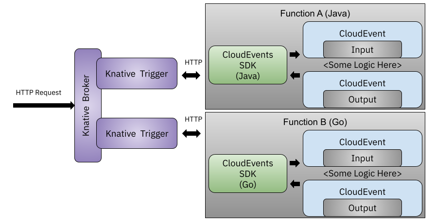
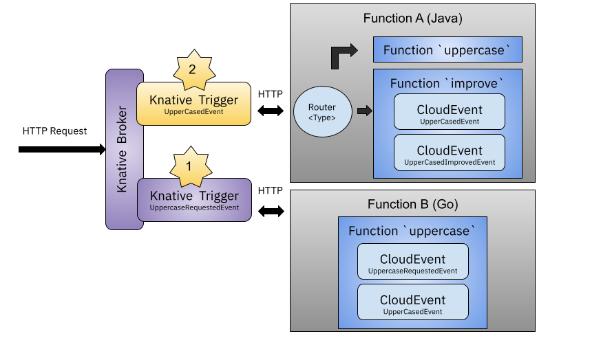

# Knative `func` - Serverless experience on top of Kubernetes

This tutorial shows how to use the `func` CLI in conjunction with Knative Serving and Eventing to build applications using a serverless approach. 
`func` remove the need from developers to worry about Docker Containers or Kubernetes itself.

## Pre requisites
- Kubernetes Cluster
- Knative Serving & Eventing installed
- `func` CLI installed
- (Optional) for OnCluster builds Tekton installed inside the cluster (check the last section of this tutorial for more information)

## Scenario
This examples builds up on top of the [CloudEvents example](https://github.com/salaboy/from-monolith-to-k8s/tree/master/cloudevents), we will be creating two functions in different languages Java and Go. We will be using Knative Eventing to route events between them by defining Knative Brokers and Triggers, as we also did in the [CloudEvents example with Knative](https://github.com/salaboy/from-monolith-to-k8s/tree/master/cloudevents#with-knative-eventing). 

This tutorial goes through the following steps to demonstrate the `func` programming model and the pieces that you need to keep in mind when building applications using functions: 
- [Creating, Running and Deploying a Java Function](#creating-running-and-deploying-a-java-function)
- [Creating, Running and Deploying a Go Function](#creating-running-and-deploying-a-go-function)
- [Gluing functions using Knative Eventing](#gluing-functions-using-knative-eventing)

### Creating, Running and Deploying a Java Function
In this section we will be using `func` to create Java Function using Spring Boot + Spring Native. 
Let's go to an empty directory and run the following command: 

```
func create fmtok8s-java-function -l springboot -t cloudevents
```

You can find the repository of the project created by running this command here: [https://github.com/salaboy/fmtok8s-java-function](https://github.com/salaboy/fmtok8s-java-function)

This command creates a new directory called `fmtok8s-java-function` which contains a Spring Boot project using [Spring Cloud Functions](https://spring.io/projects/spring-cloud-function). It also uses [Spring Native](https://docs.spring.io/spring-native/docs/0.11.2/reference/htmlsingle/) to generate a native binary that leverages GraalVM to enable Java applications to boot up faster to have shorter cold-starts. The `-t cloudevents` parameter specifies that we will use a template that contains a function that is ready to process a [CloudEvent](http://cloudevents.io). The other alternative is to choose the `http` template which exposes a REST endpoint and can consume an HTTP request without requiring a CloudEvent specifically. 

You can use your favourite IDE to open the project and check the simple function that is generated from this template and edit it to your needs. 

If you take a look at the source code generated, right from the start we can see that the programming model is different in here. 

But if you want to get things going with the example function that is generated for you, you can run `func build` to build the function and generate a container for it, that by default will be pushed to the default Docker registry which is Docker Hub. 

```
salaboy> func build
A registry for Function images is required. For example, 'docker.io/tigerteam'.
? Registry for Function images: salaboy
Note: building a Function the first time will take longer than subsequent builds
🕕 Still building
   🙌 Function image built: docker.io/salaboy/fmtok8s-java-function:latest
```

For Java, and because we are using Spring Native, the initial build process takes quite a lot of time, this is improved by buildpacks caching all the Maven downloads in subsequent builds. But don't be alarmed if the first time you run `func build` takes around 5 minutes, as this accounts for Maven downloading all the project dependencies, downloading all plugins required to build the project with Spring Native and all the docker layers with the correct builders to build Java and Maven projects and the time required to compile a native Java application that can run on top of GraalVM. 

And just like that, without worrying about having a Dockerfile, `func` uses [CNCF Buildpacks](http://buildpacks.io) to build and containarize your application. As you can see, I've provided my [Docker Hub](https://hub.docker.com/) user name (`salaboy`) to automatically push the container to the registry, so then the container can be fetched from inside the cluster. 

The next step is to just run this function inside a configured cluster. Once again, `func` will take care creating the correct [Knative Serving Service](https://knative.dev/docs/serving/) for our function to run.
```
salaboy> func deploy 
   🙌 Function image built: docker.io/salaboy/fmtok8s-java-function:latest
   Function deployed at URL: http://fmtok8s-java-function.default.X.X.X.X.sslip.io
```

There you go, the function is deployed and ready to accept requests at the following URL: `http://fmtok8s-java-function.default.X.X.X.X.sslip.io`
You can test your function by sending a CloudEvent using `curl` or `func emit`.

```
curl -v -X POST http://fmtok8s-java-function.default.X.X.X.X.sslip.io \
-H "Content-Type:application/json" \
-H "Ce-Id:1" \
-H "Ce-Subject:Uppercase" \
-H "Ce-Source:cloud-event-example" \
-H "Ce-Type:UppercaseRequestedEvent" \
-H "Ce-Specversion:1.0" \
-d "{\"input\": \"salaboy\"}"

```
If you are running `curl` with `-v` you should see the output CloudEvent and the payload: 
```
< HTTP/1.1 200 OK
< user-agent: curl/7.64.1
< ce-id: c3e78cad-aaec-4f0c-8eeb-d0a90d450e3d
< ce-subject: Convert to UpperCase
< ce-source: http://example.com/uppercase
< ce-type: UpperCasedEvent
< ce-specversion: 1.0
< uri: http://localhost:8080/
< message-type: cloudevent
< timestamp: 1645091431875
< Content-Type: application/json
< Content-Length: 75
< 
* Connection #0 to host localhost left intact
{"input":"salaboy","operation":"Uppercase","output":"SALABOY","error":null}* Closing connection 0

```
Or with `func emit`: 

@TODO: this is not working

```
func emit --type "UppercaseRequestedEvent" -d "{\"input\": \"salaboy\"}" --sink "http://localhost:8080/default/default" --verbose
```

Let's now create a function with Go following the same approach. 

## Creating, Running and Deploying a Go Function

We can follow the same process to create a Go function by using `func create` again: 

```
func create fmtok8s-go-function -l go -t cloudevents
```
You can find the repository of the project created by running this command here: [https://github.com/salaboy/fmtok8s-go-function](https://github.com/salaboy/fmtok8s-go-function)

This command creates a new directory called `fmtok8s-go-function` which contains a Go function. 

```
salaboy> func build
A registry for Function images is required. For example, 'docker.io/tigerteam'.
? Registry for Function images: salaboy
Note: building a Function the first time will take longer than subsequent builds
🕕 Still building
   🙌 Function image built: docker.io/salaboy/fmtok8s-go-function:latest

```

The next step is to just run this function inside a configured cluster. Once again, `func` will take care creating the correct Knative Serving Service for our function to run.
```
salaboy> func deploy 
   🙌 Function image built: docker.io/salaboy/fmtok8s-go-function:latest
   Function deployed at URL: http://fmtok8s-go-function.default.X.X.X.X.sslip.io
```

Now we can send a CloudEvent to our Go function using `curl`:
```
curl -v -X POST http://fmtok8s-go-function.default.X.X.X.X.sslip.io \
-H "Content-Type:application/json" \
-H "Ce-Id:1" \
-H "Ce-Subject:Uppercase" \
-H "Ce-Source:cloud-event-example" \
-H "Ce-Type:UppercaseRequestedEvent" \
-H "Ce-Specversion:1.0" \
-d "{\"input\": \"salaboy\"}"
```


# Gluing functions using Knative Eventing

**Note**: Remember that you need to have Knative Eventing installed in the target Cluster for this to work. 
First step is to make sure that we have a [Knative Broker](https://knative.dev/docs/eventing/broker/) to route events to different services. We can list brokers with `kubectl get brokers` or create a new one by running: 

```
kubectl create -f - <<EOF
apiVersion: eventing.knative.dev/v1
kind: Broker
metadata:
 name: default
 namespace: default
EOF
```
Once the broker is created and ready you will have a new URL to send CloudEvents to using HTTP requests. If you list the broker you should be able to see its URL: 
```
salaboy> kubectl get brokers
NAME      URL                                                                        AGE   READY   REASON
default   http://broker-ingress.knative-eventing.svc.cluster.local/default/default   10d   True    

```

Once we have a broker we can create (subscriptions) [Knative Triggers](https://knative.dev/docs/eventing/broker/triggers/) with filters to route events to our functions: 


```
kubectl create -f - <<EOF
apiVersion: eventing.knative.dev/v1
kind: Trigger
metadata:
  name: java-function-trigger
  namespace: default
spec:
  broker: default
  filter:
    attributes:
      type: UppercaseRequestedEvent
  subscriber:
    ref:
      apiVersion: serving.knative.dev/v1
      kind: Service
      name: fmtok8s-java-function
--- 

apiVersion: eventing.knative.dev/v1
kind: Trigger
metadata:
  name: go-function-trigger
  namespace: default
spec:
  broker: default
  filter:
    attributes:
      type: UppercaseRequestedEvent
  subscriber:
    ref:
      apiVersion: serving.knative.dev/v1
      kind: Service
      name: fmtok8s-go-function

EOF
```

These create two triggers one for each function, both filtering on CloudEvents with Type: `UppercaseRequestedEvent`. 

This will cause the Broker to deliver a copy of each CloudEvent with type `uppercase` to each function. Hence if we now send a CloudEvent to the Broker with the `UppercaseRequestedEvent` type, we should see both functions being upscaled to consume the event. 

We have created this topology:


For that we need to have access to the Broker URL from outside the cluster, we can do that by using `kubectl port-forward`: 

```
kubectl port-forward svc/broker-ingress -n knative-eventing 8080:80
```

Then to send an event to the broker, we can use `curl` (notice the `/default/default` in the URL): 

```
curl -v "http://localhost:8080/default/default" \
-H "Content-Type:application/json" \
-H "Ce-Id:1" \
-H "Ce-Subject:Uppercase" \
-H "Ce-Source:cloud-event-example" \
-H "Ce-Type: UppercaseRequestedEvent" \
-H "Ce-Specversion:1.0" \
-d "{\"input\": \"salaboy\"}"
```

This will trigger both the Java and Go functions, you can inspect the pods created for each function and the logs. 

Both functions have processed the incoming CloudEvent and produced a CloudEvent as response which is forwarded to the Broker. Because we don't have any trigger registered for the response type `UpperCasedEvent`, the events are going to be held in the broker. 

What we can do now is to update our Java function project to include another function, so we can chain functions together by creating a function that consumes the output of another function. Then we can create a new trigger to route these response events to the new function. 

```
kubectl create -f - <<EOF
apiVersion: eventing.knative.dev/v1
kind: Trigger
metadata:
  name: java-function-trigger
  namespace: default
spec:
  broker: default
  filter:
    attributes:
      type: UpperCasedEvent
  subscriber:
    ref:
      apiVersion: serving.knative.dev/v1
      kind: Service
      name: fmtok8s-java-function

EOF

```


If we add a new function and a new trigger we end up with this scenario: 


# OnCluster Builds with Tekton and `func`

(TBD)
