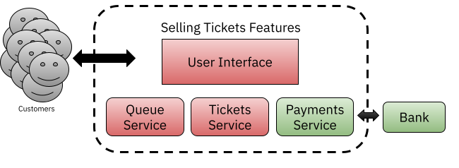
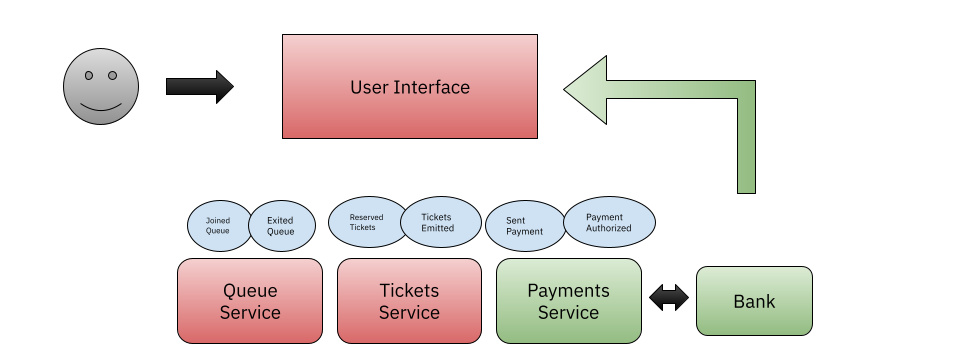
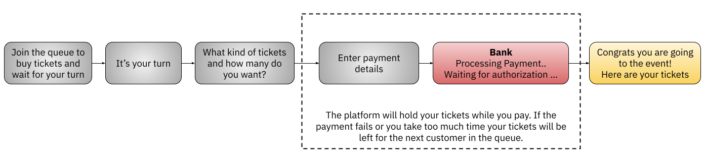

# Knative Eventing Tickets Sale Example


This tutorial install the Conference Platform application using Helm, but it also adds the services to implement the Tickets Selling flow. 





## Pre Requisites
- Install [Knative Serving](https://knative.dev/docs/install/serving/install-serving-with-yaml/) and [Knative Eventing](https://knative.dev/docs/install/eventing/install-eventing-with-yaml/).
- Patch ConfigMap to support downstream API
- Install the Conference Platform App using Helm and setting the `knativeDeploy` variable to `true`
- Create a Knative Eventing Broker, install SockEye and create a trigger to see all the events

### Creating a Knative Eventing Broker

```
kubectl create -f - <<EOF
apiVersion: eventing.knative.dev/v1
kind: broker
metadata:
 name: default
 namespace: default
EOF
```
### Patch to support Downstream API
```
kubectl patch cm config-features -n knative-serving -p '{"data":{"tag-header-based-routing":"Enabled", "kubernetes.podspec-fieldref": "Enabled"}}'
```
### Installing the base Conference Platform using Knative Resources

This is installing the base services, enabling Knative Deployment with Knative Services and also enabling events to be emitted by the services to the newly created broker. You will need to fine-tune this configuration if you are using a different broker implementation.
This is also setting some feature flags in the API Gateway Service to enable the tickets menu option and the Call for Proposals (C4P) feature. 

```
cat <<EOF | helm install app fmtok8s/fmtok8s-app --values=-
fmtok8s-api-gateway:
  knativeDeploy: true
  env:
    KNATIVE_ENABLED: "true"
    AGENDA_SERVICE: http://fmtok8s-agenda.default.svc.cluster.local
    C4P_SERVICE: http://fmtok8s-c4p.default.svc.cluster.local
    EMAIL_SERVICE: http://fmtok8s-email.default.svc.cluster.local
    EVENTS_ENABLED: "true"
    K_SINK: http://broker-ingress.knative-eventing.svc.cluster.local/default/default
    FEATURE_TICKETS_ENABLED: "true"
    FEATURE_C4P_ENABLED: "true"
fmtok8s-agenda-rest:
  knativeDeploy: true
  env:
    EVENTS_ENABLED: "true"
    K_SINK: http://broker-ingress.knative-eventing.svc.cluster.local/default/default
fmtok8s-c4p-rest:
  knativeDeploy: true
  env:
    AGENDA_SERVICE: http://fmtok8s-agenda.default.svc.cluster.local
    EMAIL_SERVICE: http://fmtok8s-email.default.svc.cluster.local
    EVENTS_ENABLED: "true"
    K_SINK: http://broker-ingress.knative-eventing.svc.cluster.local/default/default  
fmtok8s-email-rest:
  knativeDeploy: true
  env:
    EVENTS_ENABLED: "true"
    K_SINK: http://broker-ingress.knative-eventing.svc.cluster.local/default/default
EOF
```
### Installing Sockeye for monitoring events

```
kubectl apply -f https://github.com/n3wscott/sockeye/releases/download/v0.7.0/release.yaml
```

### Creating a trigger to see all the events going to the broker

```
kubectl create -f - <<EOF
apiVersion: eventing.knative.dev/v1
kind: Trigger
metadata:
  name: wildcard-trigger
  namespace: default
spec:
  broker: default
  subscriber:
    uri: http://sockeye.default.svc.cluster.local
EOF
```

## Installing the Tickets Queue Services

Then to install the remaining services you can install the following Helm chart:

```
cat <<EOF | helm install tickets-app fmtok8s/fmtok8s-tickets --values=-
fmtok8s-tickets-service:
  knativeDeploy: true
fmtok8s-payments-service:
  knativeDeploy: true
fmtok8s-queue-service:
  knativeDeploy: true

EOF
```

