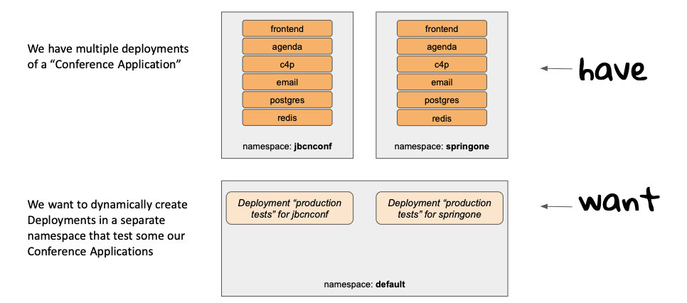
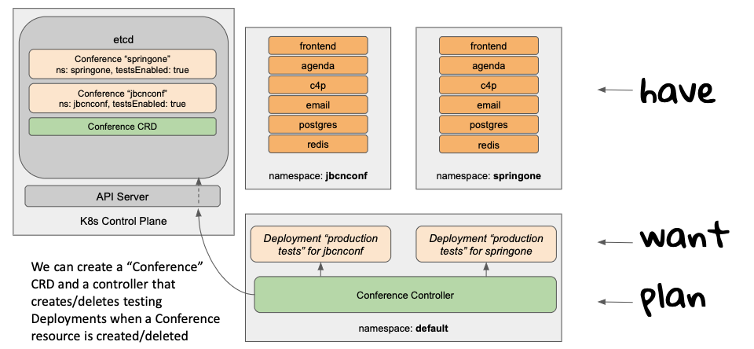
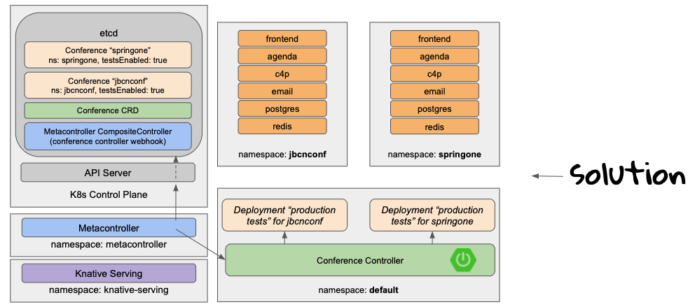

# Custom Controller using Metacontroller, Knative Serving, and Spring Cloud Function

This project demonstrates the use of [Metacontroller](https://metacontroller.github.io/metacontroller) to facilitate writing custom [Kubernetes controllers](https://kubernetes.io/docs/concepts/architecture/controller).

Additionally, it shows how controllers can be written as functions and launched on demand using [Knative Serving](https://knative.dev/docs/serving). The example in this project uses a [Spring Cloud Function](https://spring.io/projects/spring-cloud-function).

## Table of Contents
1. [Introduction](#Introduction)
2. [Example overview](#Example-overview)
3. [Instructions to run the example](#Instructions-to-run-the-example)

## Introduction

### Writing Kubernetes controllers can be challenging

A Kubernetes controller must communicate with the Kubernetes API Server to retrieve events pertaining to its resource kind(s) of interest.
These operations—as well as some necessary optimizations for performance and scale—are non-trivial.
In some programming languages, most notably Go, some of this code is encapsulated in reusable [Kubernetes client libraries](https://kubernetes.io/docs/reference/using-api/client-libraries/#officially-supported-kubernetes-client-libraries), making the task of writing custom controllers easier.
However, not all client libraries provide the same level of support for the operations and optimizations needed by controllers.
Therefore, writing Kubernetes controllers in languages other than Go can be challenging and cumbersome.

### Metacontroller to the rescue

Metacontroller solves this problem for all programming languages by decoupling boilerplate interactions with the Kubernetes API Server from the business logic of any particular custom controller.

Metacontroller provides a long-running process with a perpetual loop that interacts with the Kubernetes API Server.
You simply configure Metacontroller to select the particular resource kinds you want to track, and to forward these events to your application or function via an HTTP webhook.

This means you can write a much simpler controller "backend" application that simply receives events via HTTP, applies any custom logic you desire, and passes back to Metacontroller any resource specifications that need to be sent back to the API server.
Much easier!

### Custom controllers as functions

Since Metacontroller provides the long-running process that will perpetually poll the Kubernetes API Server, there is no need for your custom controller to run perpetually.
Rather, it can be deployed as a function that is launched on demand (whenever Metacontroller calls the webhook) and scaled to zero instances when idle.

To accomplish this, we can use Knative Serving to manage deployed custom controllers.

## ^^ THIS IS WHY KNATIVE. BUT WHY FUNCTIONS?? ... While Knative Serving does not require an application to be written as a function, we can...

## Example overview

### Use case: Run production tests against a _Conference Application_

For this example, let's assume we have multiple production deployments of an application called _Conference Application_ and that we want to run tests against it.
Specifically, we want to:
- Run the production tests from a different namespace
- Run the production tests only if the Conference Application is in a ready state
- Enable and disable the production tests 



<b>Figure 1: Conference Application on Kubernetes</b>

### Conceptual Approach: Create a custom controller to deploy production tests

We can achieve this goal by creating a custom resource called _Conference_ and a corresponding controller that checks the application state and applies (or deletes) the _production tests_ Deployment.

The custom resource could be as simple as this:

```shell
apiVersion: metacontroller.conference.salaboy.com/v1
kind: Conference
metadata:
  name: jbcnconf
spec:
  namespace: jbcnconf
  production-test-enabled: true
```

The solution could look like this:



<b>Figure 2: Conference Controller retrieves Conference events from Kubernetes API Server and creates _production tests_ Deployments</b>

However, this approach requires Conference Controller to run a non-terminating loop and interact directly with the Kubernetes API.
To avoid this unnecessary complexity, we will leverage Metacontroller, Knative Serving, and Spring Boot.

### Implementation Approach: Metacontroller, Knative Serving, and Spring Boot

Our desired implementation leverages Metacontroller to handle interactions with the Kubernetes API, and Knative Serving to automatically launch and scale our backend Conference controller Spring Boot function.

The setup is as follows:



<b>Figure 3: Metacontroller retrieves Conference events from Kubernetes API Server and calls the Conference Controller webhook. Knative Serving launches Conference Controller instance. Conference Controller creates Production Tests Deployment.</b>

## Instructions to run the example

### Pre-requisites

To run this project, you need:
- `func` CLI installed ([instructions](https://github.com/knative-sandbox/kn-plugin-func/blob/main/docs/installing_cli.md))
- `helm` (version 3.8+) installed ([instructions](https://helm.sh/docs/intro/install))
- A Kubernetes cluster with Metacontroller and Knative Serving installed (see below)
- The example _Conference Application_ deployed (see below)

##### Installing Knative Serving

You can easily create a local Kubernetes cluster with Knative Serving installed in one step by using the Knative QuickStart.
Simply run the following command:
> Note: This requires that kn CLI be installed ([instructions](https://github.com/knative/client/blob/main/docs/README.md))
```shell
kn quickstart kind --name fmtok8s-metacontroller --install-serving
```
Otherwise, if you want to install Knative Serving to an existing cluster, follow these [instructions](https://knative.dev).

##### Installing Metacontroller

Metcontroller is installed using a Helm chart.

> Note: The following code block installs Metacontroller version 4.5.4. You can get the latest metacontroller-helm version here: https://github.com/metacontroller/metacontroller/pkgs/container/metacontroller-helm

```shell
METACONTROLLER_HELM_CHART_VERSION=4.5.4
HELM_EXPERIMENTAL_OCI=1 helm pull oci://ghcr.io/metacontroller/metacontroller-helm --version=v${METACONTROLLER_HELM_CHART_VERSION}
kubectl create ns metacontroller
helm install metacontroller metacontroller-helm-v${METACONTROLLER_HELM_CHART_VERSION}.tgz --namespace metacontroller
rm metacontroller-helm-v${METACONTROLLER_HELM_CHART_VERSION}.tgz
```

##### Installing Conference Application

Conference Application is provided as a helm repository.
Add the helm repository to your Helm installation and install an instance to a namespace called _jbcnconf_.
```shell
helm repo add fmtok8s https://salaboy.github.io/helm/
helm install conference fmtok8s/fmtok8s-conference-chart --namespace conf-jbcnconf --create-namespace
```

The Conference Application comprises 4 apps, postgres db, and redis.
Use the following command to check the status of the application.
Wait until all 4 components are ready (STATUS=Running)
```
kubectl get pods -n conf-jbcnconf
```

The output should look like this:
```
$ kubectl get pods -n conf-jbcnconf
NAME                                                 READY   STATUS    RESTARTS   AGE
conference-fmtok8s-agenda-service-57576cb65c-sl27p   1/1     Running   0          42s
conference-fmtok8s-c4p-service-6c6f9449b5-j6ksv      1/1     Running   0          42s
conference-fmtok8s-email-service-6fdf958bdd-4pzww    1/1     Running   0          42s
conference-fmtok8s-frontend-5bf68cf65-zvlzq          1/1     Running   0          42s
conference-postgresql-0                              1/1     Running   0          42s
conference-redis-master-0                            1/1     Running   0          42s
conference-redis-replicas-0                          1/1     Running   0          42s
```

### Create the custom controller and register it with Metacontroller

For the following steps, make sure you are running commands from the root of this directory.
If you are at the root of the GitHub repository directory, change as follows:
```shell
cd kubernetes-controllers/metacontroller/func-conference-controller
```

##### Deploy the Controller function

Take a moment to look through the controller [source code](src/main/java/functions/CloudFunctionApplication.java).
A few things to notice:
- This controller shows how to monitor a Conference Application that is running in a separate namespace and trigger production tests only when the application is healthy.
- This function doesn't require any Kubernetes API Server access, hence it is much easier to code and deploy compared to a normal controller.
The downside, or maybe the advantage, is that we are encouraged more to interact with the data plane instead of the control plane.
- For this example, the way to check if the Conference Application's services are running is by sending HTTP requests to the endpoints, rather than checking the Kubernetes Resources directly.
- To create the Deployment that will run the production tests, we use Metacontroller children definitions.

To deploy the controller application, you will use the `func` CLI.
This will build, publish and deploy the container image as a Knative Service.

Edit the file `func.yaml` and change the image name so that it points to your Docker registry.
The line to change is `image: docker.io/salaboy/func-conference-controller:latest`.
You can use `docker login` at the command line to make sure you are logged into your Docker registry, or you can enter your Docker credentials at the prompt as part of the next step.

Deploy the controller function.
```shell
func deploy -v
```

You can verify that the function has been deployed using wither of the following two commands:

```shell
func list
```
or
```shell
kubectl get kservice func-conference-controller
```

> Note: If you are working on ARM64 architecture (e.g. Mac M1), use the file `func-arm.yaml` instead.
> You will need to rename this file as `func.yaml` and then follow the instructions above to update the registry address and deploy the function.

##### Register the Conference controller webhook with Metacontroller

With the function deployed, you now have the HTTP webhook that should be called for any events on resources of `kind: Conference`.
This means you can register the webhook with Metacontroller.
You do this using a Metacontroller CRD called CompositeController.

Take a look at the file [config/controller.yaml](config/controller.yaml).
Notice that it associates a "parentResource" of kind `Conference` with the http webhook to the function that will do the reconciliation.

Notice also that the CompositeController specifies the kinds of children the parentResource can have (in this case, Deployments).

Apply the CompositeController to the cluster:
```shell
kubectl apply -f config/controller.yaml
```

Validate that the CompositeController resource was created.
```shell
kubectl get CompositeController
```

> Note: If you did not deploy the function to the default namespace, update the url to the function in `config/controller.yaml` and re-apply.

##### Create the Controller CustomResourceDefinition (CRD)

Finally, you need to add Conference to the set of valid Kubernetes APIs.
You do this using a [CustomResourceDefinition (CRD)](https://kubernetes.io/docs/tasks/extend-kubernetes/custom-resources/custom-resource-definitions).

Take a look at the file [config/crd.yaml](config/crd.yaml) and notice that the `group` and `kind` match the `parentResource` that you specified in the CompositeController.
Metacontroller will monitor for any new events of this kind and call the function webhook.

Create the Conference CRD:
```shell
kubectl apply -f config/crd.yaml
```

Validate that the CRD was created
```shell
kubectl get crds conferences.metacontroller.conference.salaboy.com
```

### Try it out!

At this pont, you have the mechanics to support the following:
- User creates, updates or deletes a Conference resource (instance of Conference CRD)
- Metacontroller forwards event to Conference Controller using webhook
- Knative launches instance of Conference Controller to handle the event
- Conference Controller returns Deployment spec to Metacontroller
- Metacontroller forwards response to Kubernetes API
- Deployment for production tests is created

Additionally, since the Deployment is a child of the Conference resource, deleting the Conference resource will delete the production tests Deployment as well.

The following steps will guide you through a trial run.

##### Create a Conference resource

As part of the pre-requisites, you deployed a Conference Application.
Make sure it is running:
```shell
kubectl get pods -n conf-jbcnconf
```

Next, you will create a Conference resource for this instance of the Conference Application.

However, before you do that, open a second terminal window and run the following command, so that you can watch as Knative launches and then scales down the Conference Controller to handle the webhook request
```shell
kubectl get pods -w
```

Back in the first terminal window, create a Conference resource.
```shell
kubectl apply -f config/conference-jbcnconf.yaml
```

Keep an eye on the second terminal to verify that Knative Serving launches an instance of the controller function.
You should see that a pod is created (the name should be `func-conference-controller-00001-deployment-<UUID>`).
and eventually terminates it to scale back down to zero instances.
Eventually the pod will be terminated as Knative Serving scales the controller back down to zero instances.
The output may look something like this:
```shell
$ kubectl get pods -w
NAME                              READY   STATUS    RESTARTS   AGE
func-conference-controller-00001-deployment-589ffbc679-q57j8   0/2     Pending   0          0s
func-conference-controller-00001-deployment-589ffbc679-q57j8   0/2     Pending   0          0s
func-conference-controller-00001-deployment-589ffbc679-q57j8   0/2     ContainerCreating   0          0s
func-conference-controller-00001-deployment-589ffbc679-q57j8   1/2     Running             0          2s
func-conference-controller-00001-deployment-589ffbc679-q57j8   2/2     Running             0          5s
func-conference-controller-00001-deployment-589ffbc679-q57j8   2/2     Terminating         0          66s
func-conference-controller-00001-deployment-589ffbc679-q57j8   0/2     Terminating         0          98s
func-conference-controller-00001-deployment-589ffbc679-q57j8   0/2     Terminating         0          98s
func-conference-controller-00001-deployment-589ffbc679-q57j8   0/2     Terminating         0          98s
```

##### Check results

Check for a new production tests Deployment.
```shell
kubectl get deployments
```

If you see that a Deployment named `metacontroller-production-tests-jbcnconf` was created, then it worked!

##### Recap

What happened?

The metacontroller you created (CompositeController named `metacontroller-conference-controller`) detected the new Conference type resource and sent a request to the function `func-conference-controller`.
Knative launched the function to handle the request.
The function checked the status of the services in the `jbcnconf` namespace, and it created a Deployment to handle testing.

##### Try it again!

For fun, try it again for a second Conference Application.

1. Deploy a second instance of Conference Application, in a new namespace.
```shell
helm install conference fmtok8s/fmtok8s-conference-chart --namespace conf-springone --create-namespace
```
2. Make sure the Conference Application is running.
```shell
kubectl get pods -n conf-springone
```
3. Create a new Conference resource
```shell
kubectl apply -f config/conference-springone.yaml
```
3. Check for a new production tests Deployment
```shell
kubectl get deployments
```

You should see a second Deployment for production tests (`metacontroller-production-tests-springone`).

##### Clean up

Since the _production tests_ Deployments are children of the Conference resources, deleting the Conferences will cause the Deployments to be deleted, too.

Delete the Conferences.
```shell
kubectl delete conferences jbcnconf springone
```

Verify that the _production tests_ Deployments were deleted.
```shell
kubectl get deployments
```
