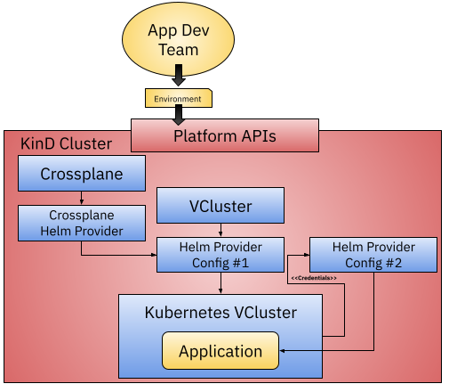
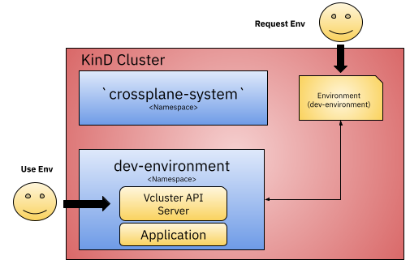

# Crossplane and VCluster

Provisioning VClusters using Crossplane.

This tutorial shows how you can provision new VClusters using a Crossplane Composition. The idea here is to show how you can, with a single Kubernetes Cluster, provide isolation to different tenants while at the same time rely on the power of Crossplane Compositions to create Virtual Clusters in the same way as you would create any other Cloud Resource. 

The advantages of using VCluster in contrast with creating a full-blown Kubernetes cluster is that we save on costs while we provide more isolation between resources and API Server calls than when we use `namespaces`. 



For more information and details about this example check this blog post [Building Platforms on top of Kubernetes using VCluster and Crossplane](https://salaboy.com/2022/08/03/building-platforms-on-top-of-kubernetes-vcluster-and-crossplane/)


## Installation on KinD

First let's create a KinD Cluster to work on:

```
kind create cluster
```


Then let's install Crossplane into it's own namespace using Helm: 


```
kubectl create ns crossplane-system

helm repo add crossplane-stable https://charts.crossplane.io/stable
helm repo update

helm install crossplane --namespace crossplane-system crossplane-stable/crossplane
```

```
kubectl crossplane install provider crossplane/provider-helm:v0.10.0
```


We need to get the correct ServiceAccount to create a new ClusterRoleBinding so the Helm Provider can install Charts on our behalf. 

```
SA=$(kubectl -n crossplane-system get sa -o name | grep provider-helm | sed -e 's|serviceaccount\/|crossplane-system:|g')
kubectl create clusterrolebinding provider-helm-admin-binding --clusterrole cluster-admin --serviceaccount="${SA}"
```

```
kubectl apply -f helm-provider-config.yaml
```

Finally, it is recommended to install the `vcluster` CLI to connect to the cluster: 

[https://www.vcluster.com/docs/getting-started/setup](https://www.vcluster.com/docs/getting-started/setup)


## Creating VClusters using Crossplane Composition

The Crossplane composition (XR) and the CRD for our `Environment` resource can be found inside the `composition` directory

These files define what needs to be provisioned when a new `Environment` resource is created.
The composition looks like this: 


Notice that we haven't installed anything VCluster specific, but the composition defines that a VCluster will be created for each Environment resource by installing the VCluster Helm chart. 


Let's apply the Crossplane Composition and the CRD into the KinD Cluster (host cluster in Vcluster terms):
```
kubectl apply -f composition/composition.yaml
kubectl apply -f composition/environment-resource-definition.yaml
```

There are 3 parameters that we are setting to the VCluster chart for this to work with Crossplane:
- We need VCluster to create a secret where the kubeconfig will be hosted so we can fetch it to connect and interact with the newly created API Server (https://github.com/salaboy/from-monolith-to-k8s/blob/main/platform/crossplane-vcluster/composition/composition.yaml#L53)
- We need the kubeconfig to point to the new API Server URL from within the cluster, by default, the generated kubeconfig points to https://localhost:8443 (https://github.com/salaboy/from-monolith-to-k8s/blob/main/platform/crossplane-vcluster/composition/composition.yaml#L62)
- We need to enable the new service address to the list of accepted hosts that the API server will accept connections to (https://github.com/salaboy/from-monolith-to-k8s/blob/main/platform/crossplane-vcluster/composition/composition.yaml#L71)

Once the composition and the CRD are available inside the cluster, we can start creating new Environment resources, but before check which VClusters are currently available by running: 

```
vcluster list
```

There shouldn't be any VClusters just yet, let's go ahead and create a new environment:

```
kubectl apply -f composition/environment-resource.yaml
```

You can now treat your created environment resource as any other Kubernetes resource, you can list them using `kubectl get environments` or even describing them to see more details. 


You can go back and check if there is now a new VCluster with:

```
vcluster list 
```

Notice the VCluster is there but it shows not Connected, the Helm Provider connected to the VCluster from inside the cluster, but as users we can use the vcluster CLI to connect and interact with our freshly created VCluster 


```
vcluster connect dev-environment --server https://localhost:8443 -- bash
```
or

```
vcluster connect dev-environment --server https://localhost:8443 -- ksh
```



Now you are interacting with the VCluster, so you can use `kubectl` as usual. Check that the application was installed in the `conference` namespace.

```
kubectl get ns
```

```
kubectl get pods -n conference
```

Enjoy VCluster + Crossplane! 
