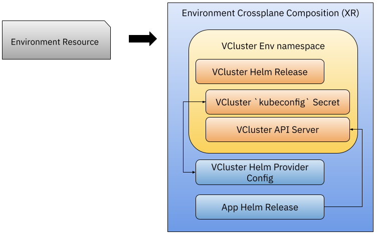

# KubeCon Keynote - Demo

In this step by step tutorial we will install a set of projects to be able to create Development Environments on demand by just creating simple Kubernetes Resources. 
The tutorial uses Crossplane, the Crossplane Helm Provider, VCluster and Knative Serving to enable developers to create and deploy functions using their language of choice

## Installation 

This section covers the installation of the following components: 
- Creating a Kubernetes Cluster
- Installing Crossplane and Crossplane Helm Provider
- Installing Knative Serving
- Installing VCluster CLI
- Installing Knative Functions CLI

First let's create a Kubernetes Cluster to work on:

```
cat <<EOF | kind create cluster --name dev --config=-
kind: Cluster
apiVersion: kind.x-k8s.io/v1alpha4
nodes:
- role: control-plane
  extraPortMappings:
  - containerPort: 31080 # expose port 31380 of the node to port 80 on the host, later to be use by kourier or contour ingress
    listenAddress: 127.0.0.1
    hostPort: 80
EOF
```bash


Then let's install Crossplane into it's own namespace using Helm: 


```bash
helm repo add crossplane-stable https://charts.crossplane.io/stable

helm repo update

helm install crossplane --namespace crossplane-system --create-namespace crossplane-stable/crossplane --wait
```

```
kubectl crossplane install provider crossplane/provider-helm:v0.10.0
```

We need to get the correct ServiceAccount to create a new ClusterRoleBinding so the Helm Provider can install Charts on our behalf. 

```
SA=$(kubectl -n crossplane-system get sa -o name | grep provider-helm | sed -e 's|serviceaccount\/|crossplane-system:|g')
kubectl create clusterrolebinding provider-helm-admin-binding --clusterrole cluster-admin --serviceaccount="${SA}"
```

```
kubectl apply -f helm-provider-config.yaml
```

Then let's install Knative Serving: 

https://knative.dev/docs/install/yaml-install/serving/install-serving-with-yaml/#prerequisites


## Only for Knative on KinD
For Knative Magic DNS to work in KinD you need to patch the following ConfigMap:

```
kubectl patch configmap -n knative-serving config-domain -p "{\"data\": {\"127.0.0.1.sslip.io\": \"\"}}"
```

and if you installed the `kourier` networking layer you need to create an ingress:

```
cat <<EOF | kubectl apply -f -
apiVersion: v1
kind: Service
metadata:
  name: kourier-ingress
  namespace: kourier-system
  labels:
    networking.knative.dev/ingress-provider: kourier
spec:
  type: NodePort
  selector:
    app: 3scale-kourier-gateway
  ports:
    - name: http2
      nodePort: 31080
      port: 80
      targetPort: 8080
EOF
```

## Installing CLIs

On the developer laptop you need to install the following CLIs:

- install the `vcluster` CLI to connect to the cluster: [https://www.vcluster.com/docs/getting-started/setup](https://www.vcluster.com/docs/getting-started/setup)
- install the Knative Functions `func` CLI: [https://github.com/knative-sandbox/kn-plugin-func/blob/main/docs/installing_cli.md](https://github.com/knative-sandbox/kn-plugin-func/blob/main/docs/installing_cli.md)


## Creating VClusters using Crossplane Composition

The Crossplane composition (XR) and the CRD for our `Environment` resource can be found inside the `composition` directory

These files define what needs to be provisioned when a new `Environment` resource is created.
The composition looks like this: 



Notice that we haven't installed anything VCluster specific, but the composition defines that a VCluster will be created for each Environment resource by installing the VCluster Helm chart. 


Let's apply the Crossplane Composition and the CRD into the KinD Cluster (host cluster in Vcluster terms):
```
kubectl apply -f composition-kubecon/composition.yaml
kubectl apply -f composition-kubecon/environment-resource-definition.yaml
```


```
vcluster list
```

There shouldn't be any VClusters just yet, let's go ahead and create a new environment:

```
kubectl apply -f composition-kubecon/environment-resource.yaml
```

You can now treat your created environment resource as any other Kubernetes resource, you can list them using `kubectl get environments` or even describing them to see more details. 


You can go back and check if there is now a new VCluster with:

```
vcluster list 
```

Notice the VCluster is there but it shows not Connected, the Helm Provider connected to the VCluster from inside the cluster, but as users we can use the vcluster CLI to connect and interact with our freshly created VCluster 


```
vcluster connect devenv --server https://localhost:8443 -- bash
```
or

```
vcluster connect devenv --server https://localhost:8443 -- ksh
```


Now you are interacting with the VCluster, so you can use `kubectl` as usual. Check that the application was installed in the `conference` namespace.

Finally let's create a function and deploy it.

## Creating a function using Knative Functions

```
mkdir kubecon/
cd kubecon/

func create -l go

func deploy -v --registry docker.io/salaboy

curl <URL>
```

