# From Monolith to K8s - Workshop 


## Installing and Configuring Keycloak
During this step-by-step you will be using **Kubernetes Cluster** and a Keycloak as SSO to secure our API Gateway and Microservices. 

### Creating a Kubernetes Cluster with KIND

```
$ cat <<EOF | kind create cluster --name dev --config=-
kind: Cluster
apiVersion: kind.x-k8s.io/v1alpha4
nodes:
- role: control-plane
  kubeadmConfigPatches:
  - |
    kind: InitConfiguration
    nodeRegistration:
      kubeletExtraArgs:
        node-labels: "ingress-ready=true"
  extraPortMappings:
  - containerPort: 80
    hostPort: 80
    protocol: TCP
  - containerPort: 443
    hostPort: 443
    protocol: TCP
- role: worker
- role: worker
- role: worker
EOF
```

Don't forget to set current cluster/context

```
$ kubectl cluster-info --context kind-dev
```

Install Ingress Controller

```
kubectl apply -f https://raw.githubusercontent.com/kubernetes/ingress-nginx/master/deploy/static/provider/kind/deploy.yaml
```

## Install the Application with SSO

```
helm repo add dev http://chartmuseum-jx.34.67.22.199.nip.io
helm repo update
helm install app-sso dev/fmtok8s-app-sso
```


### Installing Keycloak in our Kubernetes Cluster

```
$ kubectl create -f https://raw.githubusercontent.com/keycloak/keycloak-quickstarts/latest/kubernetes-examples/keycloak.yaml
```

Let's see if the keycloak pod is up and running with: 

```
$ kubectl get pods
```

After installing keycloak you need to modify the base installation to set the keycloak service to use the port 80 instead of 8080, you can do this by editting the keyclaok service with:

```
$ kubectl edit svc keycloak
```

Modify the port from:
```
 - name: http
    nodePort: 32595
    **port: 8080**
    protocol: TCP
    targetPort: 8080

```

to


```
 - name: http
    nodePort: 32595
    **port: 80**
    protocol: TCP
    targetPort: 8080

```

Once this is done, you need to edit your `/etc/hosts` files in your host machine to include the `keycloak` host for the ingress definition to work:

```
$ sudo vi /etc/hosts

127.0.0.1	localhost keycloak
```

If you are using Windows
```
Go to file C:\Windows\System32\drivers\etc\hosts and add:

127.0.0.1 keycloak
```


## Configuring Keycloak

If you already isntalled the application, an Ingress was created to route traffic to Keycloak under the `keycloak` host. Point your browser to `http://keycloak` to access the adminstration console. 


### 1 - Let's access Administration Console:


### 2 - We'll access using our credentials passed through configurations


**User**: admin
**Password**: admin

### 3 - Create your realm (fmtok8s)

<br>
<details>
  <summary>What is Keycloak's Realm?</summary>    
      A realm manages a set of users, credentials, roles, and groups. In our example, we'll create a Realm for fmtok8s application. A user belongs nd accesses one realm, a realm are isolated from one another, then if you create an user in Realm A the another Realm (B) cannot see, and if you create an user on Realm A this user cannot access Realm B.
</details>
<br>
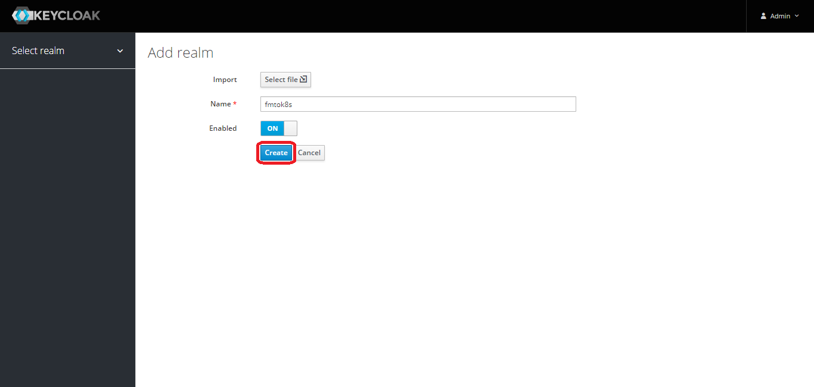
<br>

### 4 - Creating Client Scope
<br>
<details>
  <summary>What is Client Scopes?</summary>    
      "Client scopes allow you to define a common set of protocol mappers and roles. Wich are shared between multiple clients".

It will help us to mapper roles in token.
</details>
<br>


In configure section, click on Client Scopes, after click on create button, to create a Client Scope. 

You will se it:

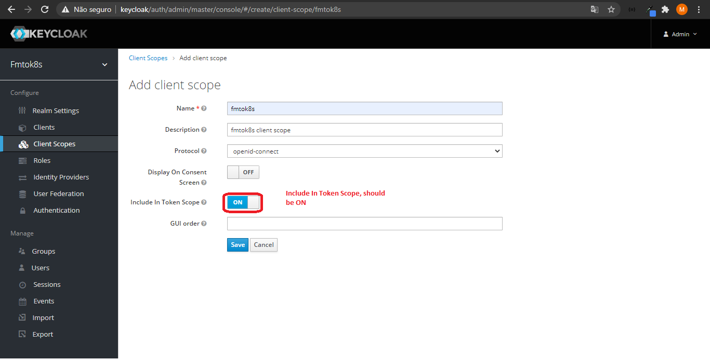

<br>

Return to Client Scopes page and click on `fmtok8s`

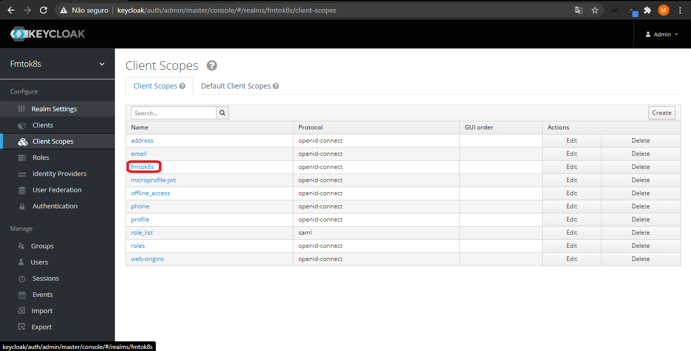

Go to Mappers tab and click on create button.

Complete Protocol Mapper form, and click on save:

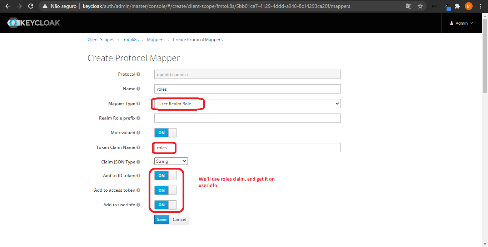


### 4 - Creating a Realm's Client

<br>
<details>
<summary>What is Keycloak's Client?</summary>
"Clients are applications and services that want to use Keycloak to secure themselves and provide a single sign-on solution". In our solution, we'll just one client API Gateway.
</details>
<br>

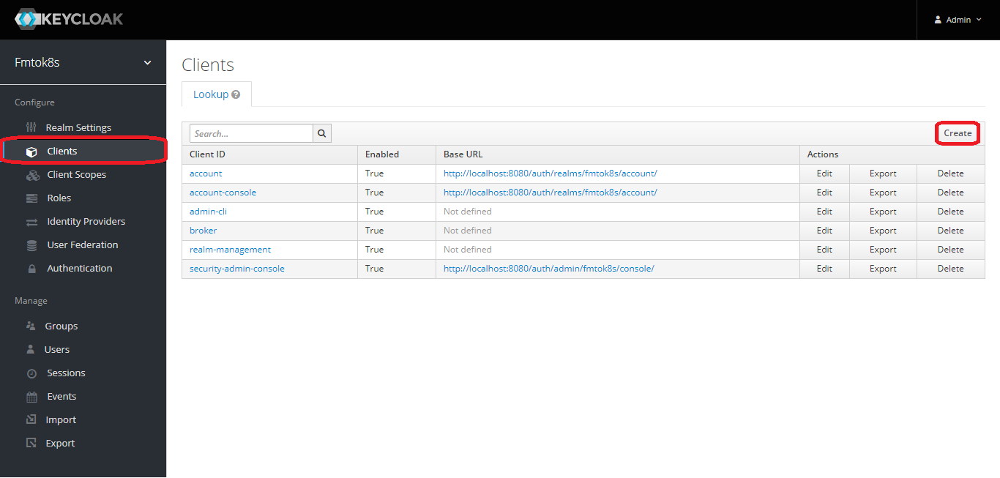


### 5 - Configuring a Client

The client configuration's page is very large, then I will divide it in two parts:

<b>OAuth2 configuration:</b>

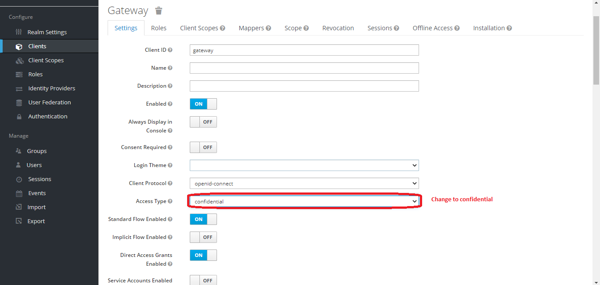

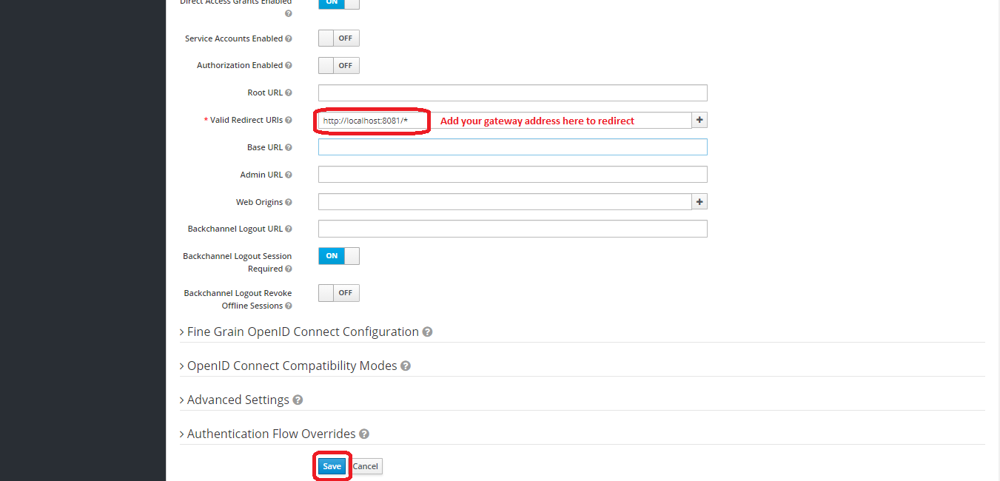

<b>Client Scope configuration:</b><br><br>
Click on Client Scopes tab, and add `fmtok8s` Client Scope 
<br>

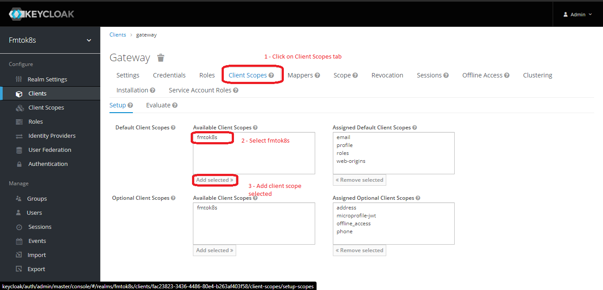


## 6 - Creating an Realm's User

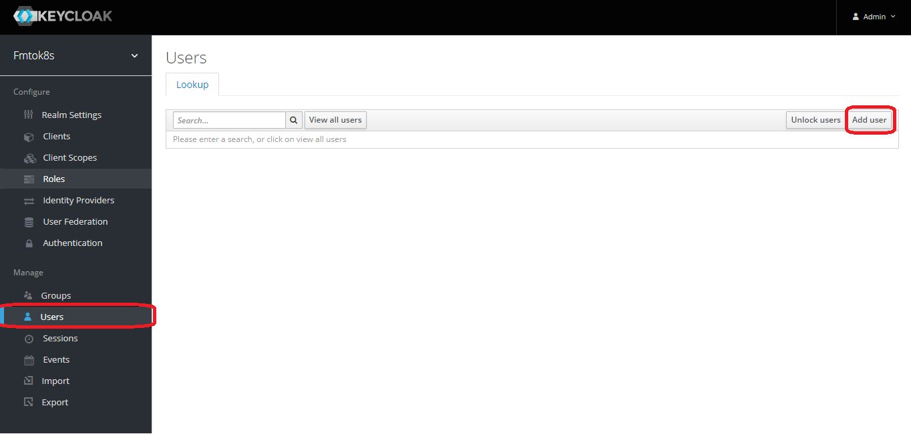

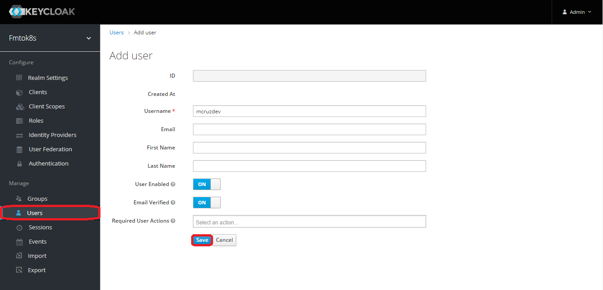

After, you should set the user's password


### 7 - Creating a Realm's Role


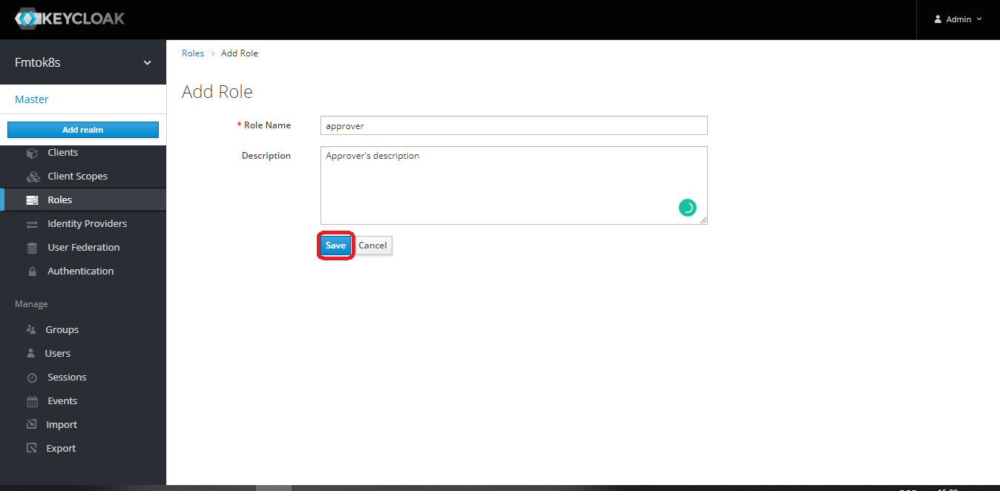

### 8 - Adding a role to user

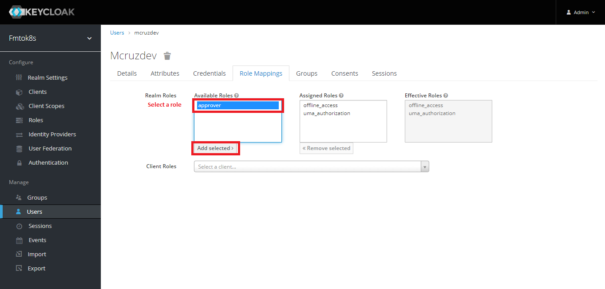


## Changing API Gateway to secure our hidden microservices

[API Gateway](https://github.com/mcruzdev/fmtok8s-api-gateway) was created with Spring Cloud Gateway. The Spring Cloud Gateway uses Spring Webflux working with reactive stack.

There is a great lib called
`org.keycloak:keycloak-spring-boot-starter` that help us to configure our application using keycloak and it runs better with Servlet applications. [See](https://keycloak.discourse.group/t/webflux-support-for-spring-boot-and-spring-security-adapters/2936)

In this workshop, you will use Spring Security OAuth2. Let's go to use it.

### Adding Spring OAuth2 dependecies in API Gateway

```
<dependency>
    <groupId>org.springframework.boot</groupId>
    <artifactId>spring-boot-starter-oauth2-client</artifactId>
</dependency>
```

### Configuring 

We should change the configuration of **API Gateway** on application.yml

```
spring:
  security:
    oauth2:
      client:
        provider:
          oidc:
            issuer-uri: http://keycloak/auth/realms/fmtok8s
        registration:
          oidc:
            client-name: keycloak
            provider: oidc
            client-id: gateway
            client-secret: <CLIENT SECRET>
            scope:
              - openid
```

Edit the API-Gateway deployment and add the following Environment Vairables:

```
$ kubectl edit deploy app-sso-fmtok8s-api-gateway
```
Look for the env section and add the following variables:


```
        - name: SPRING_PROFILES_ACTIVE
          value: prod
        - name: SPRING_SECURITY_OAUTH2_CLIENT_PROVIDER_OIDC_ISSUER_URI
          value: http://keycloak/auth/realms/conference
        - name: SPRING_SECURITY_OAUTH2_CLIENT_REGISTRATION_OIDC_CLIENT_ID
          value: gateway
        - name: SPRING_SECURITY_OAUTH2_CLIENT_REGISTRATION_OIDC_CLIENT_SECRET
          value: <CLIENT SECRET>
        - name: SPRING_SECURITY_OAUTH2_CLIENT_REGISTRATION_OIDC_SCOPE_0
          value: openid


```


The property client-secret should be filled with client-secret from keycloak, let's get our client-secret from gateway keycloak client:

**Copy gateway's secret:**


And add a filter a new filter on **API Gateway** to relay de Token to hiden services

```
spring:
  cloud:
    gateway:
      default-filters:
        - TokenRelay=
        - RemoveRequestHeader=Cookie
    
``` 

### Creating class SecurityConfig to our Gateway

```
package com.salaboy.conferences.site.security;

import org.springframework.context.annotation.Bean;
import org.springframework.security.config.annotation.web.reactive.EnableWebFluxSecurity;
import org.springframework.security.config.web.server.ServerHttpSecurity;
import org.springframework.security.core.GrantedAuthority;
import org.springframework.security.core.authority.SimpleGrantedAuthority;
import org.springframework.security.oauth2.client.oidc.userinfo.OidcReactiveOAuth2UserService;
import org.springframework.security.oauth2.client.oidc.userinfo.OidcUserRequest;
import org.springframework.security.oauth2.client.userinfo.ReactiveOAuth2UserService;
import org.springframework.security.oauth2.core.oidc.user.DefaultOidcUser;
import org.springframework.security.oauth2.core.oidc.user.OidcUser;
import org.springframework.security.oauth2.core.oidc.user.OidcUserAuthority;
import org.springframework.security.web.server.SecurityWebFilterChain;

import java.util.*;
import java.util.stream.Collectors;

@EnableWebFluxSecurity
public class SecurityConfig {

    @Bean
    public SecurityWebFilterChain springSecurityFilterChain(ServerHttpSecurity http) {
        return http.csrf().disable()
                .authorizeExchange()
                .pathMatchers("/backoffice/**").hasRole("approver")
                .anyExchange().permitAll()
                .and()
                .oauth2Login()
                .and()
                .oauth2Client()
                .and()
                .build();
    }

    @Bean
    public ReactiveOAuth2UserService<OidcUserRequest, OidcUser> oidcUserService() {
        final OidcReactiveOAuth2UserService delegate = new OidcReactiveOAuth2UserService();

        return (userRequest) -> {
            // Delegate to the default implementation for loading a user
            return delegate.loadUser(userRequest).map(user -> {
                Set<GrantedAuthority> mappedAuthorities = new HashSet<>();

                user.getAuthorities().forEach(authority -> {
                    if (authority instanceof OidcUserAuthority) {
                        OidcUserAuthority oidcUserAuthority = (OidcUserAuthority) authority;
                        mappedAuthorities.addAll(extractAuthorityFromClaims(oidcUserAuthority.getUserInfo().getClaims()));
                    }
                });

                return new DefaultOidcUser(mappedAuthorities, user.getIdToken(), user.getUserInfo());
            });
        };
    }

    public static List<GrantedAuthority> extractAuthorityFromClaims(Map<String, Object> claims) {
        return mapRolesToGrantedAuthorities(getRolesFromClaims(claims));
    }

    @SuppressWarnings("unchecked")
    private static Collection<String> getRolesFromClaims(Map<String, Object> claims) {
        return (Collection<String>) claims.getOrDefault("groups",
                claims.getOrDefault("roles", new ArrayList<>()));
    }

    private static List<GrantedAuthority> mapRolesToGrantedAuthorities(Collection<String> roles) {
        return roles.stream()
                .map("ROLE_"::concat)
                .map(SimpleGrantedAuthority::new)
                .collect(Collectors.toList());
    }
}
```


## Securing our microservices (C4P)

### We need to add some dependecies on pom.xml

```
        <dependency>
            <groupId>org.springframework.boot</groupId>
            <artifactId>spring-boot-starter-security</artifactId>
        </dependency>

        <dependency>
            <groupId>org.springframework.security</groupId>
            <artifactId>spring-security-oauth2-resource-server</artifactId>
        </dependency>

        <dependency>
            <groupId>org.springframework.security</groupId>
            <artifactId>spring-security-oauth2-jose</artifactId>
        </dependency>
```

### Configuring Spring OAuth2 Resource Server through application.properties:

```
spring.security.oauth2.resourceserver.jwt.issuer-uri=http://localhost:8080/auth/realms/fmtok8s
```

Edit the other services Deployments with the following Environment Variables: 

```
$ kubectl edit deploy app-sso-fmtok8s-c4p-rest
```
Look for the env section and add the following variables:

```
        - name: SPRING_PROFILES_ACTIVE
          value: prod
        - name: OPENTRACING_JAEGER_ENABLED
          value: "false"
        - name: SPRING_SECURITY_OAUTH2_RESOURCESERVER_JWT_ISSUER_URI
          value: http://keycloak/auth/realms/fmtok8s
```

### Create a class to configure CORS 

```
package com.salaboy.conferences.c4p.rest.configuration;

import org.springframework.context.annotation.Configuration;
import org.springframework.web.reactive.config.CorsRegistry;
import org.springframework.web.reactive.config.WebFluxConfigurer;

@Configuration
public class CORSConfig implements WebFluxConfigurer {

    @Override
    public void addCorsMappings(CorsRegistry registry) {
        registry.addMapping("/**").allowCredentials(true).allowedMethods("*");
    }
}
```

### Creating our SecurityConfig

```
package com.salaboy.conferences.c4p.rest.configuration;

import org.springframework.context.annotation.Bean;
import org.springframework.core.convert.converter.Converter;
import org.springframework.http.HttpMethod;
import org.springframework.security.authentication.AbstractAuthenticationToken;
import org.springframework.security.config.annotation.web.reactive.EnableWebFluxSecurity;
import org.springframework.security.config.web.server.ServerHttpSecurity;
import org.springframework.security.core.GrantedAuthority;
import org.springframework.security.core.authority.SimpleGrantedAuthority;
import org.springframework.security.oauth2.jwt.Jwt;
import org.springframework.security.oauth2.server.resource.authentication.JwtAuthenticationConverter;
import org.springframework.security.oauth2.server.resource.authentication.ReactiveJwtAuthenticationConverterAdapter;
import org.springframework.security.web.server.SecurityWebFilterChain;
import reactor.core.publisher.Mono;

import java.util.Collection;
import java.util.Collections;
import java.util.List;
import java.util.stream.Collectors;

@EnableWebFluxSecurity
public class SecurityConfig {

    @Bean
    public SecurityWebFilterChain securityWebFilterChain(ServerHttpSecurity http) {

        http
        .csrf().disable()
        .authorizeExchange(exchanges ->
                exchanges
                        .pathMatchers(HttpMethod.POST, "/**").hasAnyAuthority("organizer")
                        .pathMatchers(HttpMethod.DELETE, "/**").hasAnyAuthority("organizer")
                        .anyExchange().permitAll())
        .oauth2ResourceServer(oauth2 ->
                oauth2.jwt(jwt -> jwt.jwtAuthenticationConverter(grantedAuthoritiesExtractor())));

        return http.build();
    }

    Converter<Jwt, Mono<AbstractAuthenticationToken>> grantedAuthoritiesExtractor() {
        JwtAuthenticationConverter jwtAuthenticationConverter =
                new JwtAuthenticationConverter();

        jwtAuthenticationConverter.setJwtGrantedAuthoritiesConverter(new GrantedAuthoritiesExtractor());

        return new ReactiveJwtAuthenticationConverterAdapter(jwtAuthenticationConverter);
    }

    static class GrantedAuthoritiesExtractor implements Converter<Jwt, Collection<GrantedAuthority>> {

        @Override
        public Collection<GrantedAuthority> convert(Jwt jwt) {

            @SuppressWarnings("unchecked")
            var roles = (List<String>) jwt.getClaims().getOrDefault("groups", Collections.emptyList());

            return roles.stream()
                    .map(SimpleGrantedAuthority::new)
                    .collect(Collectors.toList());
        }
    }
}

```


# Theory

## OAuth2 Concepts

Before you start, I want to speak a bit about OAuth2 concepts:

### OAuth2 Roles


OAuth2 defines four roles:

- Resource Owner

    It is an user that have some resource protected, like your facebook account, Github repositories, Instagram images etc.

    **In our case a Resource Owner is the admin user that approves or rejects a proposal**

- Resource Server

    Provides a protected resource and permits the access through valid access tokens. Examples of Resource Server: Facebook, Github, Instagram etc.

    **In our case a Resource Server will be C4P Service, Email Service and Agenda Service**

- Authorization Server

    Authorization Server provides an API used to autenticates an user and generates an **access token**. Examples of Authorizaton Server: Spring Authorization Server, Okta, Google Identity etc.

    **In our case, Keycloak is our Authorization Server**

- Client

    It is an application, web, SPA, Desktop or mobile, that want to access the resources from **Resource Owner**. A Client needs to be registred on Authorization Server, being identified by a **client id** and a **client secret**.

    **In our case a Client is the API Gateway**


### OAuth2 Grant Types:

A Grant Type is a way that a Client use to give an **access token**, OAuth2 is very flexible and provides four grant types for us:

- Password

    Used when there is a strong relationship from Client and Authorization Server. The user provides your credentials (username and password) directly to Client, that forward (with his client id and client secret) the user's credentials to Authorization Server.

- Client Credentials

    Used when there is not an user involved, it is used when there is a sytem called a protected system, just client's credentials are provides to Authorization Server.

- Authorization Code

    Used when third applications want to access data from a protected resource without the Client see the user's credentials. By example: 
    When an user (Resource Owner) permits that the Travis CI (Client) access your repositories from Github (Authorization Server and Resource Owner). 

- Implicit

    Is mostly used on Single Page Applications and Mobile Apps.
    The user is redirected to Authorization Server's login page, but the redirect is made directly to user-agent (A browser, by example) with access token. With this way, the SPA or Mobile application knows directly the access token.
    

It is a brief explanation about OAuth2, to more details [look here](https://oauth.net/2/)

In this workshop we'll use **Authorization Code Grant Types**

**Authorization Server:** *Keycloak*

**Client:** *API Gateway*

**Resourse Owner:** *Admin*

**Resource Server:** *C4P Service, Agenda Service, Email Service*
