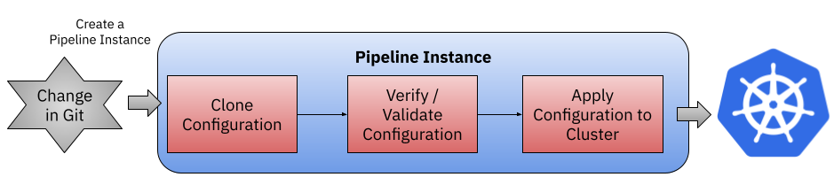

# Pipelines

This document explains how to run a Service and an Environment Pipeline using Tekton. 

## Installing Tekton

Follow the next steps in order to install and setup Tekton in your Kubernetes Cluster.

1. **Install Tekton Pipelines**

```
kubectl apply -f https://storage.googleapis.com/tekton-releases/pipeline/latest/release.yaml
```
2. **Install Tekton Triggers**

```
kubectl apply -f https://storage.googleapis.com/tekton-releases/triggers/latest/release.yaml
kubectl apply -f https://storage.googleapis.com/tekton-releases/triggers/latest/interceptors.yaml
```
3. **Install Tekton Dashboard (optional)**

```
kubectl apply -f https://github.com/tektoncd/dashboard/releases/download/v0.17.0/tekton-dashboard-release.yaml
```
You can access the dashboard by port-forwarding using `kubectl`:

```
kubectl port-forward svc/tekton-dashboard  -n tekton-pipelines 9097:9097
```


Then you can access pointing your browser to [http://localhost:9097](http://localhost:9097)


4. **Install Tekton Dashboard (optional)**:

You can also install [Tekton `tkn` CLI tool](https://github.com/tektoncd/cli)

### Configure Tekton Pipeline

The Tekton pipeline uses some alpha features (Tekton Bundles) which needs to
be enabled in the config. The `feature-flags` config map in the `tekton-pipelines` namespace
should look like:

```yaml
apiVersion: v1
data:
  enable-api-fields: alpha # <------- 
  disable-affinity-assistant: "false"
  disable-creds-init: "false"
  disable-home-env-overwrite: "true"
  disable-working-directory-overwrite: "true"
  enable-custom-tasks: "false"
  enable-tekton-oci-bundles: "false"
  require-git-ssh-secret-known-hosts: "false"
  running-in-environment-with-injected-sidecars: "true"
kind: ConfigMap
(...)
```

## RBAC

If the pipeline is going to push docker images to DockerHub you need the following steps: 

Create Docker Hub secret: 

```
kubectl create secret docker-registry regcred --docker-server=https://index.docker.io/v1/ --docker-username=DOCKER_USERNAME --docker-password=DOCKER_PASSWORD --docker-email DOCKER_EMAIL
```

To create this, in my Mac OSX laptop I need to access the `Keychain Access` app and then look at my `Docker Credentials`. This are generated when doing `docker login`. The DOCKER_PASSWORD is this hash, instead of my textual password for Docker Hub.

Then apply all the RBAC configurations and the pipelines: 

```
kubectl apply -f tekton/resources/
```

## Service Pipeline

The Service Pipeline definition described in [`resources/service-pipeline.yaml`](resources/service-pipeline.yaml) implements the following tasks:


You can start this Service Pipeline by running the following command:

```
tkn pipeline start api-gateway-service-pipeline -s dockerconfig -w name=sources,volumeClaimTemplateFile=workspace-template.yaml -w name=dockerconfig,secret=regcred -w name=maven-settings,emptyDir=
```

## Environment Pipeline

The environment pipeline definition described in [`resources/envionment-pipeline.yaml`](resources/envionment-pipeline.yaml) implements the following tasks:




You can start this Environment Pipeline by running the following command:

```
tkn pipeline start stating-environment-pipeline 
```

The environment pipeline is using [`helmfile`](https://github.com/roboll/helmfile) to describe the stating environment. 


# References
- Why [JX uses Helmfile](https://jenkins-x.io/v3/develop/faq/general/#why-does-jenkins-x-use-helmfile-template)?

