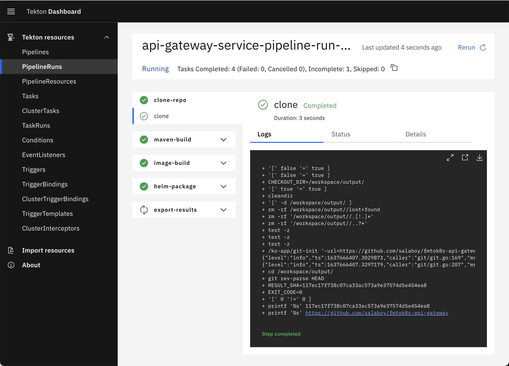
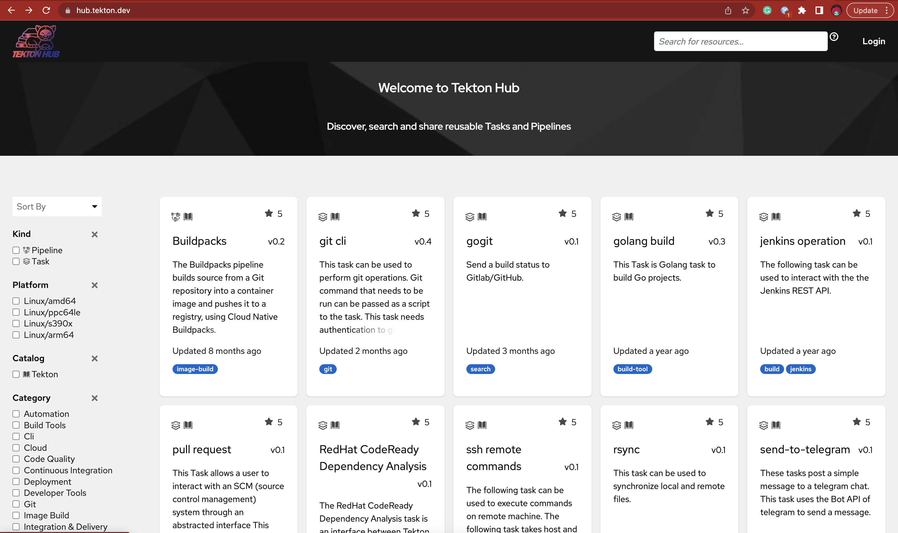
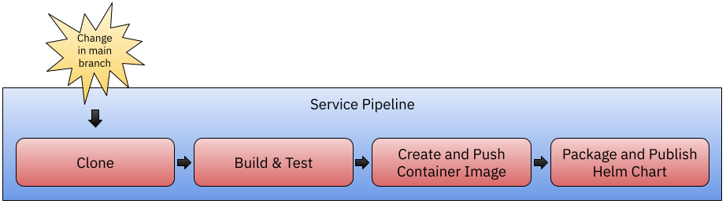

# Pipelines

This short tutorial covers how to install Tekton and how to create a very simple Task and Pipeline. 

[Tekton](https://tekton.dev) is a non-opinionated Pipeline Engine built for the Cloud (specifically for Kubernetes). You can build any kind of pipelines that you want as the engine doesn't impose any restrictions on the kind of Tasks that it can execute. This makes it perfect for building Service Pipelines where you might need to have special requirements that cannot be met by a managed service.  

After running our first Tekton Pipeline this tutorial also includes a links to more complex Service Pipelines used to build the Conference Application Services. 


## Installing Tekton

Follow the next steps in order to install and setup Tekton in your Kubernetes Cluster.
You can follow this steps in your local KinD cluster. 

1. **Install Tekton Pipelines**

```
  kubectl apply -f https://storage.googleapis.com/tekton-releases/pipeline/previous/v0.45.0/release.yaml
```

1. **Install Tekton Dashboard (optional)**

```
kubectl apply -f https://github.com/tektoncd/dashboard/releases/download/v0.33.0/release.yaml
```
You can access the dashboard by port-forwarding using `kubectl`:

```
kubectl port-forward svc/tekton-dashboard  -n tekton-pipelines 9097:9097
```



Then you can access pointing your browser to [http://localhost:9097](http://localhost:9097)


1. **Install Tekton CLI (optional)**:

You can also install [Tekton `tkn` CLI tool](https://github.com/tektoncd/cli). 
If you are in Mac OSX you can run: 

```
brew install tektoncd-cli
```


## Getting started with Tekton Tasks

This section aims to get you started creating Tasks and a Simple Pipeline, so you can then look into the Service Pipelines used to build the artifacts for the Conference Application. 

With Tekton we can define what our tasks do by create Tekton Task definitions. The following is the most simple example of a task: 

```
apiVersion: tekton.dev/v1
kind: Task
metadata:
  name: hello-world-task
spec:
  params:
  - name: name
    type: string
    description: who do you want to welcome?
    default: tekton user
  steps:
    - name: echo
      image: ubuntu
      command:
        - echo
      args:
        - "Hello World: $(params.name)" 
```

This Tekton `Task` uses the `ubuntu` image and the `echo` command located inside that image. This `Task` also accept a parameter called `name` that will be used to print a message. Let's apply this `Task` definition to our cluster by running: 

```
kubectl apply -f resources/hello-world-task.yaml
```

When we apply this resource to Kubernertes we are not executing the task, we are only making the Task definition available for other to use. This task can now be referenced in multiple pipelines or being executed independently by different users. 

You can now list the available tasks in the cluster by running: 
```
> kubectl get tasks
NAME               AGE
hello-world-task   88s
```

Now let's run our Task. We do this by creating a `TaskRun` resource, which represent a single run for our task. Notice that this concrete run will have a fixed resource name (`hello-world-task-run-1`) and a concrete value for the task parameter called `name`. 

```
apiVersion: tekton.dev/v1
kind: TaskRun
metadata:
  name: hello-world-task-run-1
spec:
  params: 
  - name: name
    value: "Building Platforms on top of Kubernetes reader!"
  taskRef:
    name: hello-world-task
```

Let's apply this `TaskRun` resource to our cluster to create our first Task Run (execution):
```
kubectl apply -f task-run.yaml
taskrun.tekton.dev/hello-world-task-run-1 created
```

As soon as the `TaskRun` is created, the Tekton Pipeline Engine is in charge of scheduling the tasks and create the Kubernetes Pod needed to execute it. If you list the pods in the default namespace you should see something like this: 

```
kubectl get pods
NAME                         READY   STATUS     RESTARTS   AGE
hello-world-task-run-1-pod   0/1     Init:0/1   0          2s
```

You can also list `TaskRun`s to check for status: 

```
kubectl get taskrun
NAME                     SUCCEEDED   REASON      STARTTIME   COMPLETIONTIME
hello-world-task-run-1   True        Succeeded   66s         7s
```

Finally, because we were executing a single task you can see the logs of the TaskRun execition by tailing the logs of the pod that was created:

```
kubectl logs -f hello-world-task-run-1-pod 
Defaulted container "step-echo" out of: step-echo, prepare (init)
Hello World: Building Platforms on top of Kubernetes reader!
```

Let's now look into how to sequence multiple tasks together using a Tekton Pipeline.

## Getting Started with Tekton Pipelines

Now we can use Pipelines to coordinate multiple tasks like the one that we defined before. We can also reuse Task definitions created by the Tekton community from the [Tekton Hub](https://hub.tekton.dev/).




Before creating the Pipeline we will install the `curl` Tekton task from the Tekton Hub by running: 

```
kubectl apply -f https://raw.githubusercontent.com/tektoncd/catalog/main/task/wget/0.1/wget.yaml
```

You should see: 

```
task.tekton.dev/wget created
```

Now let's use our `Hello World` task and the `wget` task that we just installed together into a simple pipeline. 

We will be creating this simple Pipeline Definition, that fetch a file, read its content and then uses the previously defined `Hello World` Task.


Let's create the following pipeline definition:

```
apiVersion: tekton.dev/v1
kind: Pipeline
metadata:
  name: hello-world-pipeline
  annotations:
    description: |
      Fetch resource from internet, cat content and then say hello
spec:
  results: 
  - name: message
    type: string
    value: $(tasks.cat.results.messageFromFile)
  params:
  - name: url
    description: resource that we want to fetch
    type: string
    default: ""
  workspaces:
  - name: files
  tasks:
  - name: wget
    taskRef:
      name: wget
    params:
    - name: url
      value: "$(params.url)"
    - name: diroptions
      value:
        - "-P"  
    workspaces:
    - name: wget-workspace
      workspace: files
  - name: cat
    runAfter: [wget]
    workspaces:
    - name: wget-workspace
      workspace: files
    taskSpec: 
      workspaces:
      - name: wget-workspace
      results: 
        - name: messageFromFile
          description: the message obtained from the file
      steps:
      - name: cat
        image: bash:latest
        script: |
          #!/usr/bin/env bash
          cat $(workspaces.wget-workspace.path)/welcome.md | tee /tekton/results/messageFromFile
  - name: hello-world
    runAfter: [cat]
    taskRef:
      name: hello-world-task
    params:
      - name: name
        value: "$(tasks.cat.results.messageFromFile)"
```

It end up not being that easy to fetch a file, read its content and then use our previously defined hello-world taks to print the content of the file that we have fetched. 
With pipelines we have the flexiblity to add new tasks if needed to do transformations or further processing of the inputs and outputs of each individual tasks. 

For this example, we are using the `wget` Task that we installed from the Tekton Hub, a task that is defined inline called `cat` that basically fetch the content of the downloaded file and store it into a Tekton Result that can be referenced later into our `hello-world-task`. 

Go ahead and install this pipeline definition by running: 

```
kubectl apply -f resources/hello-world-pipeline.yaml
```

Then we can create a new `PipelineRun` everytime that we want to execute this pipeline:

```
apiVersion: tekton.dev/v1
kind: PipelineRun
metadata:
  name: hello-world-pipeline-run-1
spec:
  workspaces:
    - name: files
      volumeClaimTemplate: 
        spec:
          accessModes:
          - ReadWriteOnce
          resources:
            requests:
              storage: 1M 
  params:
  - name: url
    value: "https://raw.githubusercontent.com/salaboy/salaboy/main/welcome.md"
  pipelineRef:
    name: hello-world-pipeline
  
```

Because our tasks needs to download and store files in the filesystem, we are using Tekton workspaces as abstractions to provide storage for our `PipelineRun`s. As we did before with our `TaskRun` we can also provide parameters for the `PipelineRun` allowing us to parameterize each run to use different configurations, or in this case different files. 

Both with `PipelineRuns` and `TaskRuns` you will need to generate a new resource name for each run. As if you try to reapply the same resource twice, the Kubernetes API server will not allow you to mutate the existing resource with the same name. 

Run this pipeline by running: 

```
kubectl apply -f pipeline-run.yaml
```

Check the pods that are created: 

```
> kubectl get pods
NAME                                         READY   STATUS        RESTARTS   AGE
affinity-assistant-ca1de9eb35-0              1/1     Terminating   0          19s
hello-world-pipeline-run-1-cat-pod           0/1     Completed     0          11s
hello-world-pipeline-run-1-hello-world-pod   0/1     Completed     0          5s
hello-world-pipeline-run-1-wget-pod          0/1     Completed     0          19s
```

Notice that there is one Pod per Task and a pod called `affinity-assistant-ca1de9eb35-0` which is making sure that the Pods are created in the correct node (where the volume was bound).

Check the TaskRuns too: 

```
> kubectl get taskrun
NAME                                     SUCCEEDED   REASON      STARTTIME   COMPLETIONTIME
hello-world-pipeline-run-1-cat           True        Succeeded   109s        104s
hello-world-pipeline-run-1-hello-world   True        Succeeded   103s        98s
hello-world-pipeline-run-1-wget          True        Succeeded   117s        109s

```

And of course, if all the tasks are successful, the PipelineRun will be too: 

```
kubectl get pipelinerun
NAME                         SUCCEEDED   REASON      STARTTIME   COMPLETIONTIME
hello-world-pipeline-run-1   True        Succeeded   2m13s       114s
```


Make sure you check the pipeline and task executions in the Tekton Dashboard if you installed it.


## Tekton for Service Pipelines

Service Pipelines in real life are much more complex that the previous simple examples. This is mostly because the pipeline tasks will need to have special configurations and credentials to access external systems. 

The Service Pipeline definition for each of the Conference Application services can be found in the Service repository. But they all implement the following steps:





You can find the Service Pipeline definitions in the following links:
- [Agenda Service - Service Pipeline](https://github.com/salaboy/fmtok8s-agenda-service/blob/main/tekton/README.md)
- [C4p Service - Service Pipeline](https://github.com/salaboy/fmtok8s-c4p-service/blob/main/tekton/README.md)
- [Email Service - Service Pipeline](https://github.com/salaboy/fmtok8s-email-service/blob/main/tekton/README.md)
- [Frontend - Service Pipeline](https://github.com/salaboy/fmtok8s-frontend/blob/main/tekton/README.md)

To be able to run these pipelines you will need the following credentials to be configured:
- A workpsace with enough space to host the application source code and all the dependencies that will be downloaded
- Container Registry credentials to be used by the Kaniko Task that builds and push the container to a registry
- Credentials for the Helm Chart Repository where the Charts will be hosted
- Credentials (tokens) from GitHub to connect and trigger pipelines using webhooks

**Note**: These pipelines are just examples to illustrate the work required to configure Tekton to build Services.


