# From Monolith to K8s - Workshop 

During this workshop you will deploy a Cloud-Native application, inspect it and change its configuration to use different services. Plus you'll play around with some Kubernetes and Cloud-Native tools that can help you to be more effective on your cloud journey. 

During this workshop you will be using GKE (Managed Kubernetes Engine inside Google Cloud) to deploy a complex application composed of multiple services. But none of the applications or tools used are tied in any way to Google infrastructure, meaning that you can run these steps in any Kubernetes provider, as well as in an On-Prem Kubernetes installation. 

The main goal is to guide you, step-by-step, to work with an application that will run on a real infrastructure (in contrast to running software on your own laptops). Due the time constraints, the workshop is focused on getting things up and running, but it opens the door for a lot of extensions and experimentation, which we encourage. You can find more instructions to step through under the sections labelled with **Extras**. For beginers and people who want to finish the workshop on time, we recommend leaving the extras for later. We highly encourage you to check the [Next Steps](#next-steps) section at the end of this document if you are interested in going deeper into how this application works, how different tools are being used under the hood and other possible tools that can be integrated.

This workshop is divided into the following sections:
- [Creating accounts and Clusters](#creating-accounts-and-clusters) to run our applications
- [Setting up the Clusters and installing Knative](#checking-kubernetes-cluster-and-installing-knative)
- [Deploying Version 1](#version-1-cloud-native-app) of your Cloud-Native application
- [Deploying Version 2](#version-2-visualize) of your Cloud-Native application, which uses CloudEvents, Knative Eventing and Camunda Cloud for visualization
- [Deploying Version 3](#version-3-workflow-orchestration) of your Cloud-Native application, which uses all of the above but with a focus on orchestration
- [Next Steps](#next-steps)

# Creating accounts and Clusters
During this workshop you will be using a **Kubernetes Cluster** and a **Camunda Cloud Zeebe Cluster** for Microservices orchestration. You need to setup these accounts and create these clusters early on, so they are ready for the remainder of the workshop. 

**Important requisites**
- You need  a Gmail account to be able to participate in the workshop. You will not be using your account for the Google Cloud Platform (GCP), but you need the account to access a free GCP account for QCon.
- You need **Google Chrome** installed on your laptop. We recommend Google Chrome because we've tested this workshop with it and you'll need Incognito Mode too. 
- [Download this ZIP file with resources](https://github.com/salaboy/from-monolith-to-k8s-assets/archive/1.0.0.zip) and Unzip somewhere that you can find it again (like your Desktop)


## Google Cloud account

[Login to Google Cloud by clicking into this link](http://console.cloud.google.com) (if you are a QCon Plus attendee, we will provide you with one, if not you can find other [Kubernetes providers free credits list](https://github.com/learnk8s/free-kubernetes))

### Creating a Kubernetes Cluster

We recommend to use an **Incognito Window** in **Chrome** (File -> New Incognito Window) to run the following steps, as with that you will avoid having issues with your personal **Google Account**

Once you are logged in, you will be asked to accept the terms and continue: 

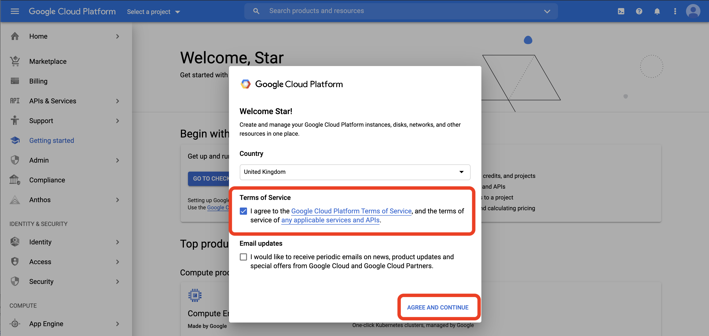

Once the terms are accepted, it is **extremely important** that you select the correct project to work on. On the top bar, there is a project dropdown that opens the project list. You need to click into the **QCon SF 2020 ...** project to select it.

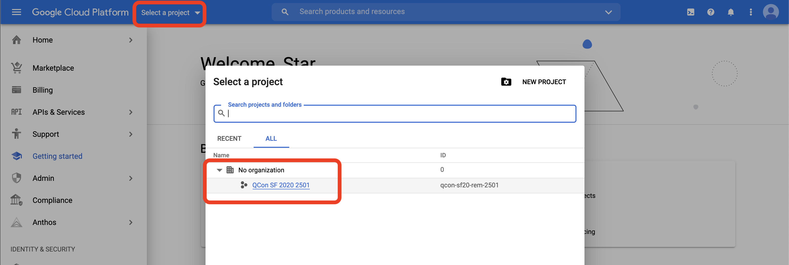

With the project selected, you can now open **Cloud Shell**

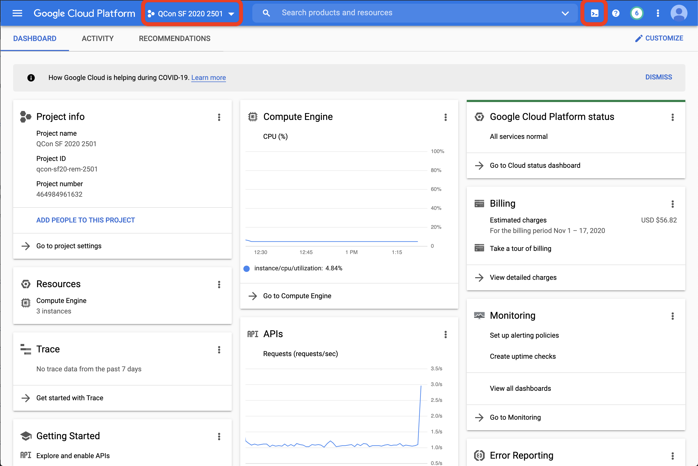

You should see **Cloud Shell** at the bottom half of the screen, notice that you can resize it to make it bigger:

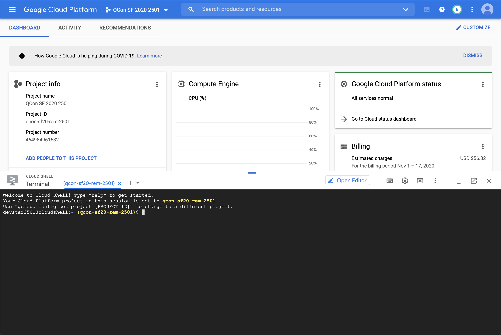

The first step is to create a cluster to work with. You will create a Kubernetes cluster using **Google Kubernetes Engine**.

Everything on GCP is operated with API (even from the console!). Enable the Google Cloud Platform APIs so that you can create a Kubernetes cluster. 

``` bash
gcloud services enable compute.googleapis.com \
    container.googleapis.com \
    containerregistry.googleapis.com

```

Set the default region and zone for your cluster:

``` bash
gcloud config set compute/zone us-central1-c
gcloud config set compute/region us-central1
```

You can now create a Kubernetes cluster in GCP! Use the Kubernetes Engine to create a cluster:

```
gcloud container clusters create workshop \
      --cluster-version 1.16 \
      --machine-type n2-standard-4 \
      --num-nodes 3 \
      --scopes cloud-platform
```

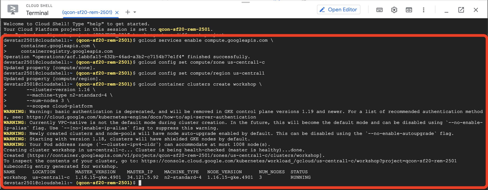

This can take a few minutes, so leave the Tab and move forward to **Camunda Cloud Account and Cluster** while the Kubernetes cluster is being created.
  
**Extras**

<details>
  <summary>Finding your Kubernetes Cluster in GCP (Click to Expand)</summary>

If for some reason, you close the browser or you want to see where your Kubernetes clusters are inside GCP you can use the left-hand side menu:


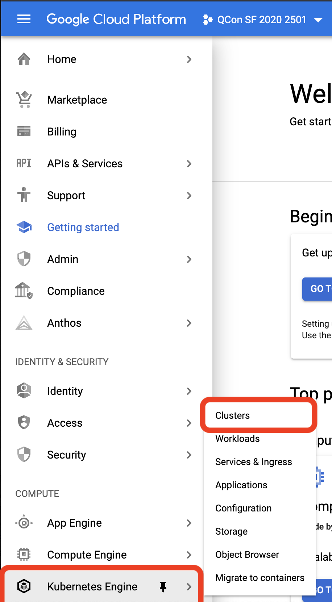

Then use the **Connect** button in the cluster to open the Cluster Details

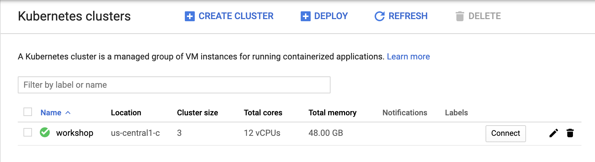

Then use the **Run in Cloud Shell** button to connect

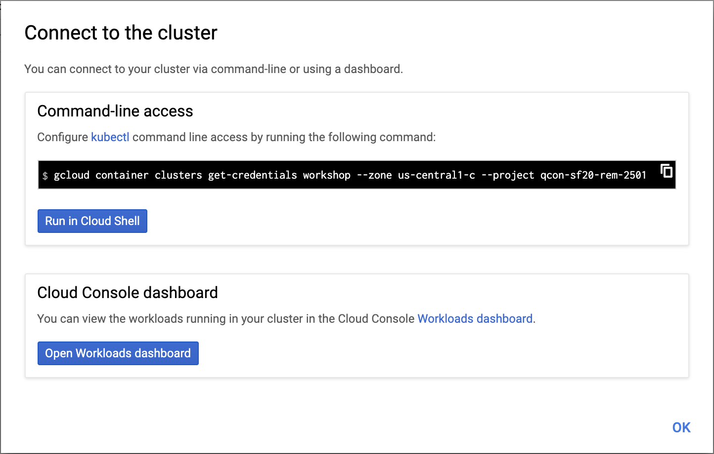
  
</details>  


## Camunda Cloud account

[Create a Camunda Cloud Account and Cluster](https://accounts.cloud.camunda.io/signup?campaign=workshop) <- You must to use this link, even if you have another Camunda Cloud Account.

**Fill the form** to create a new account - you will need to use your email to confirm your account creation. You will be using Camunda Cloud for **Microservices Orchestration** ;)  
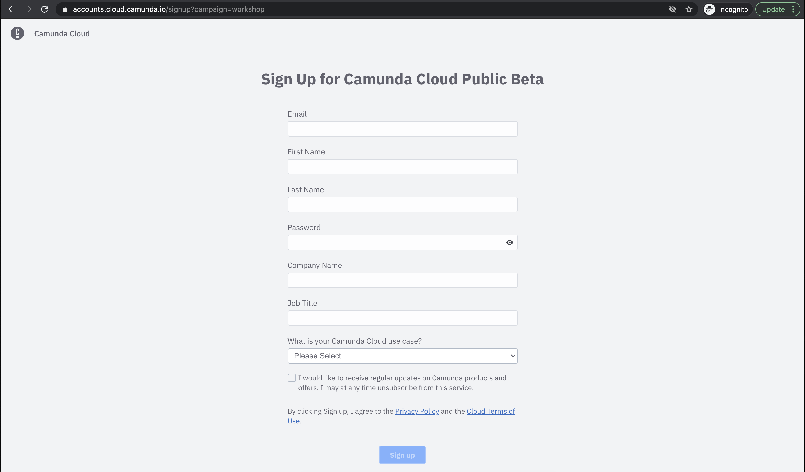

Check your inbox to **activate your account** and follow the links to login, after confirmation:

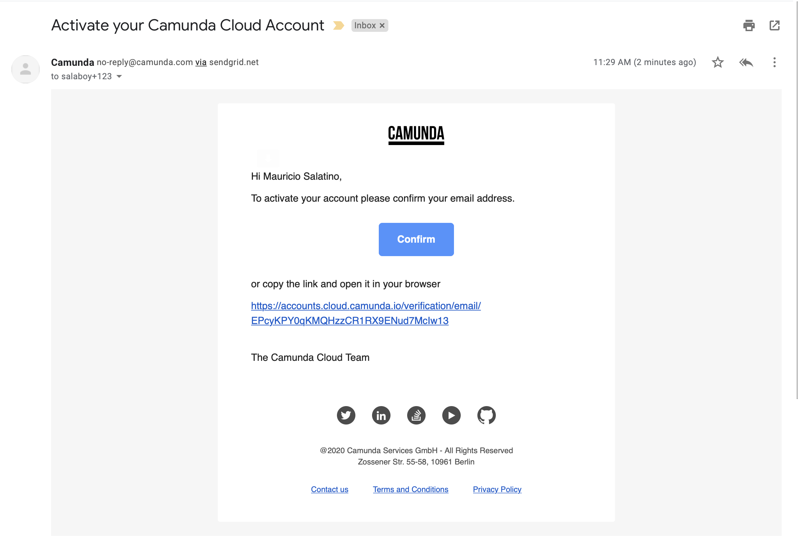

**Once activated, login with your credentials** and let's create a new **Zeebe cluster**, you will be using this cluster later on in the workshop, but it is better to set it up early on. 

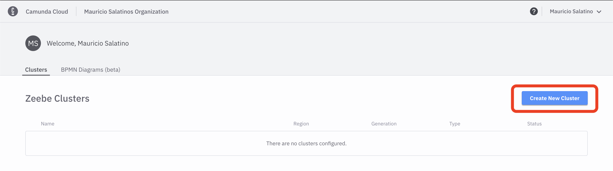

**Create a new cluster** called `my-cluster`:

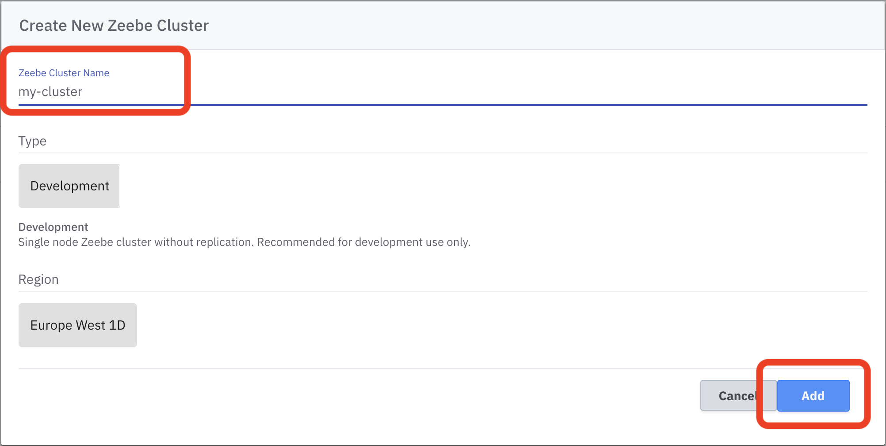

Disregard and close this popup if you see it:

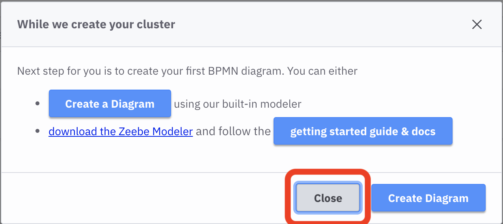

Your cluster is now being created:


Make sure that you have followed the steps in [Setting up your Google Cloud account](#google-cloud-account) and [Setting up your Camunda Cloud account](#camunda-cloud-account), as both of these accounts needs to be ready to proceed to the next section.

**Let's switch back to Google Cloud to setup your Kubernetes cluster, to start deploying your Cloud-Native Applications!** :rocket:

# Checking your Kubernetes cluster and installing Knative

During this workshop, you will be using **Cloud Shell** to interact with your Kubernetes cluster. This avoids setting up tools in your local environment and provides quick access to the cluster resources.  

**Cloud Shell** comes with pre-installed tools like: `kubectl` and `helm`. 

Because you will be using the `kubectl` and `helm` commands a lot during the next couple of hours we recommend you create the following aliases:

``` bash
alias k=kubectl
alias h=helm
```
Now instead of typing `kubectl` or `helm` you can just type `k` and `h` respectivily. 

You can now type inside Cloud Shell: 
``` bash
k get nodes
```

You should see something like this: 

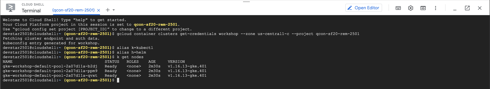


Next step you will install **Knative Serving** and **Knative Eventing**. 


The Cloud-Native applications that you will deploy in later steps were built having Knative in mind. 

**Extras**

<details>
  <summary>What and Why Knative?</summary>

[Knative](https://knative.dev/) is a project that provides higher-level abstractions to build robust Cloud-Native applications. Knative is currently split into two main components:
- [Knative Serving](https://knative.dev/docs/serving/): it focuses in simplifying and managing the whole lifecycle of your workloads. This includes routing traffic to your services, handling multiple revisions/versions of your services and how traffic will be routed between these revisions and scaling in a serverless fashion 0 to N replicas with a [Knative Pod Autoscaler](https://knative.dev/docs/serving/autoscaling/). 
- [Knative Eventing](https://knative.dev/docs/eventing/): it provides the primitives to build systems based on producers and consumers of events, allowing late-binding between your components. This means that the abstractions provided by Knative Eventing help us to build decoupled services that can be wired up together for different use cases or to work on different tech stacks and cloud providers. 
    
In general, by using Knative abstractions, you will be able to focus more on building your applications and less dealing with Kubernetes primitives. Knative will help you to rely on abstractions instead of implementations or cloud provider details (as these abstractions supports different implementations). 
For this workshop, I choose to use Knative because it provides a cloud provider agnostic set of abstractions that can be easily installed in any Kubernetes cluster, allowing us to run the applications described here wherever you have a Kubernetes Cluster.
    
</details>

### Installing Knative Serving

If you have the previous aliases set up, you can copy the entire block and paste it into Cloud Shell

``` bash
k apply --filename https://github.com/knative/serving/releases/download/v0.18.0/serving-crds.yaml
k apply --filename https://github.com/knative/serving/releases/download/v0.18.0/serving-core.yaml
k apply --filename https://github.com/knative/net-kourier/releases/download/v0.18.0/kourier.yaml
k patch configmap/config-network \
  --namespace knative-serving \
  --type merge \
  --patch '{"data":{"ingress.class":"kourier.ingress.networking.knative.dev"}}'
k apply --filename https://github.com/knative/serving/releases/download/v0.18.0/serving-default-domain.yaml

```

You can check that the installation worked out correctly by checking that all the Knative Serving pods are running:
```bash
k get pods -n knative-serving
```

You should see something like this:

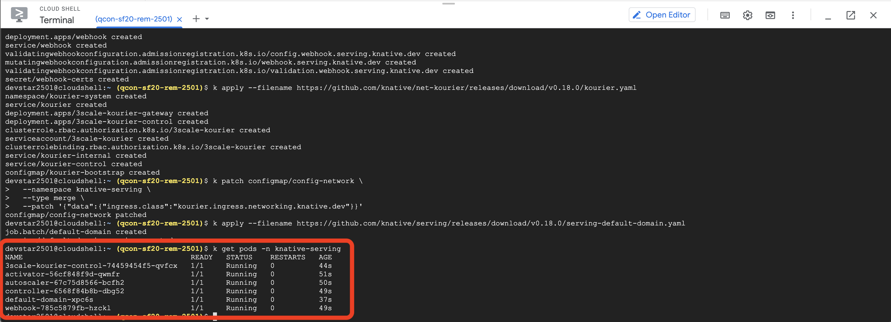

### Installing Knative Eventing

Copy the entire block and paste it into Cloud Shell:

``` bash
k apply --filename https://github.com/knative/eventing/releases/download/v0.18.0/eventing-crds.yaml
k apply --filename https://github.com/knative/eventing/releases/download/v0.18.0/eventing-core.yaml
k apply --filename https://github.com/knative/eventing/releases/download/v0.18.0/in-memory-channel.yaml
k apply --filename https://github.com/knative/eventing/releases/download/v0.18.0/mt-channel-broker.yaml
k create -f - <<EOF
apiVersion: eventing.knative.dev/v1
kind: Broker
metadata:
 name: default
 namespace: default
EOF

```

You can check that the installation worked out correctly by checking that all the Knative Eventing pods are running:
``` bash
k get pods -n knative-eventing
```

You should see something like this: 

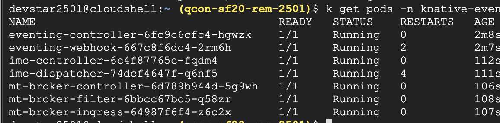

**Important**: if you see Error in the `imc-dispatcher***` pod, try copy & pasting the previous `k apply..` commands again, and check again. 

Now, **you have everything ready to deploy your Cloud-Native applications to Kubernetes**. :tada: :tada:

# Version 1: Cloud-Native App

In this section you will be deploying a Conference Cloud-Native application composed of 4 simple services. 

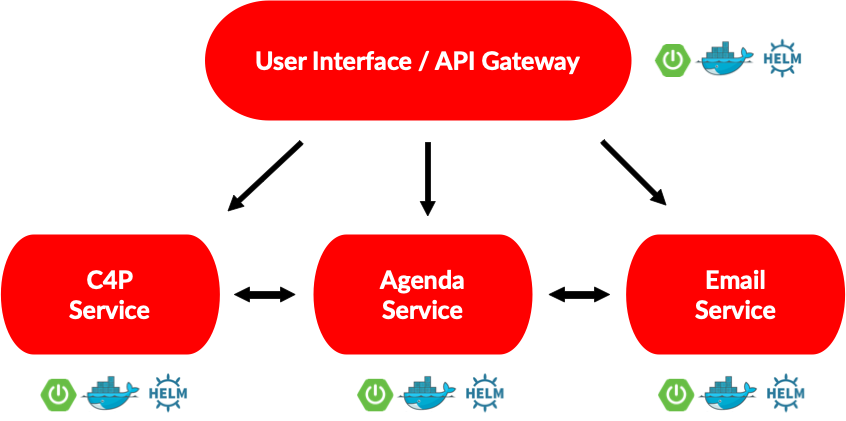

These services communicate between each other using REST calls.

With Knative installed, you can proceed to install the first version of the application. Do this by using [**Helm**](http://helm.sh) a Kuberenetes Package Manager. As with every package manager, you need to add a new `Helm Repository` where the **Helm packages/charts** for the workshop are stored.  

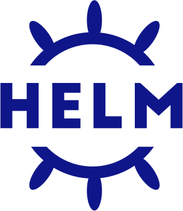

You can do this by running the following commands: 

``` bash
h repo add workshop http://chartmuseum-jx.35.222.17.41.nip.io
h repo update

```

Now you are ready to install the application by simply running the following command:
``` bash
h install fmtok8s workshop/fmtok8s-app

```
You should see something like this (ignore the warnings!):

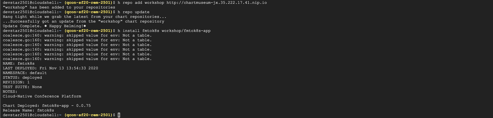

The application [Helm Chart source code can be found here](https://github.com/salaboy/fmtok8s-app/).

You can check that the application is running with the following two commands:

- Check the pods of the running services with: 
``` bash
k get pods
```

- You can also check the Knative Services with: 
```
k get ksvc
```

You should see that pods are being created or they are running and the Knative Services were created and have an URL:

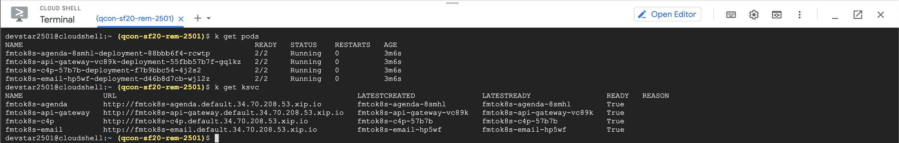

As soon all the pods are running and the services are ready you can copy and paste the `fmtok8s-api-gateway` URL into a different tab in your browser to access the application `http://fmtok8s-api-gateway.default.XXX.xip.io`

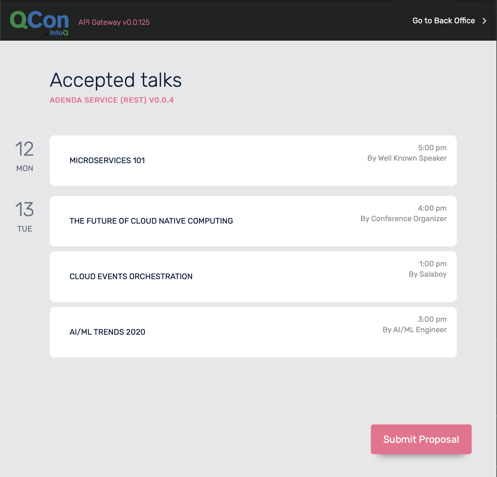

Now you can go ahead and:
1) Submit a proposal by clicking the Submit Proposal button in the main page

2) Go to the back office (top right link) and Approve or Reject the proposal

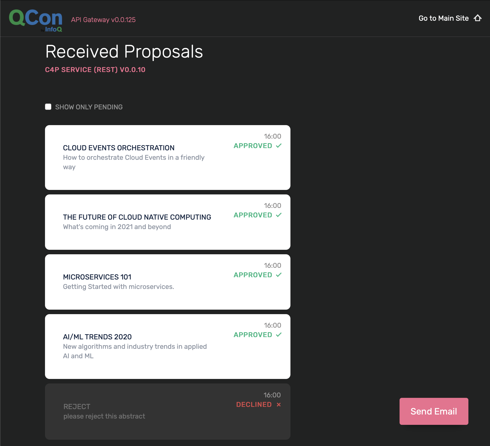

3) Check the email service to see the notification email sent to the potential speaker, this can be done with: 
``` bash
k get pods
```
Where you should see the Email Service pod:

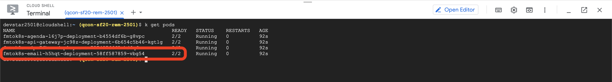

And then you can tail the logs by running:

``` bash
k logs -f fmtok8s-email-<YOUR POD ID> user-container
```
You should see the service logs being tailed and you can exit/stop taling the logs with `CTRL+C`.

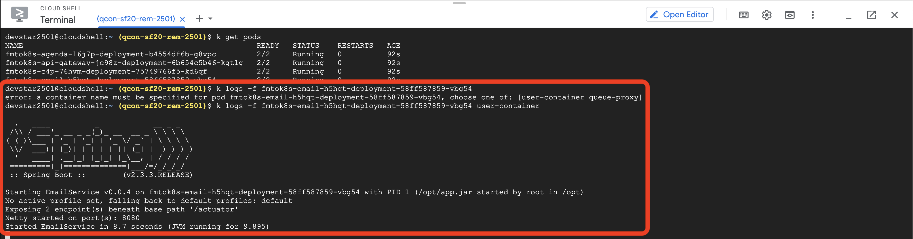

And if you **approved** the submitted proposal, you should also see something like this:  

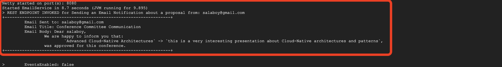

4) If you approved the proposal, it should pop up in the Agenda (main page) of the conference. 

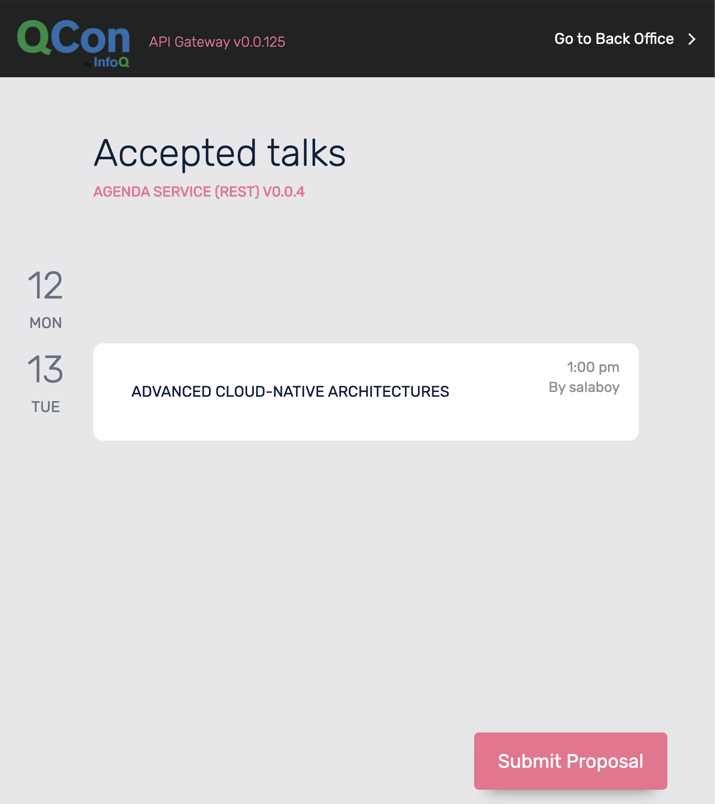

If you made it this far, **you now have a Cloud-Native application running in a Kubernetes Managed service running in the Cloud!** :tada: :tada:

Let's take a closer look at what you just did in this section.  

## Understanding your application

In the previous section, you installed an application using `Helm`. 

For this example, there is a parent **Helm Chart** that contains the configuration for each of the services that compose the application. 
You can find each service that is going to be deployed inside the `requirements.yaml` file defined [inside the chart here](https://github.com/salaboy/fmtok8s-app/blob/master/charts/fmtok8s-app/requirements.yaml).

This can be extended to add more components if needed, for example adding application infrastructure components such as Databases, Message Brokers, ElasticSearch, etc. (Example: [ElasticSearch](https://github.com/elastic/helm-charts), [MongoDB](https://artifacthub.io/packages/helm/bitnami/mongodb), [MySQL](https://artifacthub.io/packages/helm/bitnami/mysql) and [Kafka](https://artifacthub.io/packages/helm/bitnami/kafka) charts). 

The configuration for all these services can be found in the [`value.yaml` file here](https://github.com/salaboy/fmtok8s-app/blob/master/charts/fmtok8s-app/values.yaml). This `values.yaml` file can be overriden, as well as any of the settings from each specific service when installing the chart, allowing the chart to be flexible enough to install with different setups.  

There are a couple of configurations to highlight for this version, which are:
- [Knative Deployments are enabled](https://github.com/salaboy/fmtok8s-app/blob/master/charts/fmtok8s-app/values.yaml#L6), each service Helm Chart enable us to define if we want to use a Knative Service or a Deployment + Service + Ingress type of deployment. Because we have Knative installed, and you will be using Knative Eventing later on, we enabled configuration the Knative Deployment. 
- Because we are using Knative Services, a second container (`queue-proxy`) is boostrapped as a side-car to your main container, which is hosting the service. This is the reason why you see `2/2` in the `READY` column when you list your pods. This is also the reason why you need to specify `user-container` when you run `k logs POD`, as the logs command needs to know which container inside the pod you want to tail the logs.  
- Both the [`C4P` service](https://github.com/salaboy/fmtok8s-app/blob/master/charts/fmtok8s-app/values.yaml#L16) and the [`API Gateway` service](https://github.com/salaboy/fmtok8s-app/blob/master/charts/fmtok8s-app/values.yaml#L7) need to know where the other services are to be able to send requests. If you are using **Kubernetes Services** instead of **Knative Services**, the naming for the services changes a bit. Notice that here for **Knative** we are using `<Service Name>.default.svc.cluster.local`. In this first version of the application `fmtok8s-app` all the interactions between the services happen via REST calls. This pushes the caller to know the other services names. 


You can open different tabs in **Cloud Shell** to inspect the logs of each service when you are using the application (submitting and approving/rejecting proposals). Remember that you can do that by listing the pods with `k get pods` and then `k logs -f <POD ID> user-container`


## Challenges
This section covers some of the challenges that you might face when working with these kind of applications inside Kubernetes. This section is not needed to continue with the workshop, but it highlights the need for some other tools to be used in conjuction with the application. 

Among some of the challenges that you might face are the following big topics:
- **Flow buried in code and poor visibility for non-technical users**: for this scenario the `C4P` service is hosting the core business logic on how to handle new proposals ([receiving a new proposal](https://github.com/salaboy/fmtok8s-c4p-rest/blob/main/src/main/java/com/salaboy/conferences/c4p/rest/C4PController.java#L59) and [making a decision on a given proposal](https://github.com/salaboy/fmtok8s-c4p-rest/blob/main/src/main/java/com/salaboy/conferences/c4p/rest/C4PController.java#L115)). If you need to explain the flow to non-technical people, you will need to dig into the code to be 100% sure about what the application is doing. Non-technical users will never be sure about how their applications are working, as they can only get limited visibility of what is going on. How would you solve the visibility challenge? 
- **Edge Cases and errors**: this simple example shows what is usually called the **happy path**, where all things run as expected. In real-life implementations, the amount of steps that occur to deal with complex scenarios grows. If you want visibility on all possible edge cases, and cover on how the organization deals with logical errors that might happen in real-life situations, it is key to document and expose this information to all users. How would you document and keep track of every possible edge case and errors that can happen in your distributed applications? How would you do that for a monolith application? From a technical perspective, if any of these REST call fail, the application might end up in an inconsistent state. [Example REST call](https://github.com/salaboy/fmtok8s-c4p-rest/blob/main/src/main/java/com/salaboy/conferences/c4p/rest/services/AgendaService.java#L30)
- **Dealing with changes**: for an organization, being able to understand how their applications are working today, compared to how they were working yesterday, is vital for communication, in some cases for compliance and, of course, to make sure that different deparments are in sync. The faster that you want to go with microservices, the more you need to look outside the development departments to apply changes into the production environments. You will need tools to make sure that everyone is on the same page when changes are introduced. How do you deal with changes today in your applications? How do you expose non-technical users to the differences between the current version of your application that is running in production compared with the new one that you want to promote?
- **Implementing time-based actions/notifications**: I dare to say that about 99% of applications require some kind of notification mechanism that needs to deal with scheduled actions at some point in the future, or to be triggered every X amount of time. This is painful when working with distributed system, as you will need a distributed scheduler to guarantee that things scheduled to trigger are actually triggered. How would you implement these time-based behaviours? If you are thinking about **Kubernetes Cron Jobs** that is definitely a wrong answer! 
- **Reporting and analytics**: if you look at how the services of applications are storing data, you will find that the structures used are not optimized for reporting or doing analytics. A common approach is to push the infomration that is relevant to create reports, or to do analytics with [ElasticSearch](https://www.elastic.co/elastic-stack), where data can be indexed and structured for efficient querying. Are you using ElasticSearch or a similar solution for building reports or running analytics? 

In version 2 of the application you will be working to make your application's internals more visibile to non-technical users. 

You will now undeploy version 1 of the application to deploy version 2. You only need to undeploy version 1 to save resources.
In order to undeploy version 1 of the application you can run:

``` bash
h delete fmtok8s --no-hooks
```
## Questions
This section includes a set of questions for you to experiment and try to answer, we recommend doing this after the live workshop. 

- What happens if you kill a pod from the following services: `fmtok8s-agenda` and/or `fmtok8s-c4p`? how do you solve this problem? 
- What are the main two functionalities provided by the component called `API Gateway`? Why is so important? 
- How and where would you add Single Sign On? 
- How would you test these services? Have you heard about **Consumer Driven Contract Testing**? 

# Version 2: Visualize 

Version 2 of the application is configured to emit [CloudEvents](http://cloudevents.io), whenever something relevant happens in any of the services. 

For this example, you are interested in the following events: 
- `Proposal Received`
- `Proposal Decision Made`
- `Email Sent`
- In the case of the proposal being approved `Agenda Item Created` 

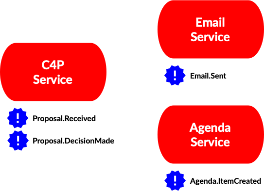


The main goal for Version 2 is to visualize what is happening inside your Cloud-Native appliction from a **Business Perspective**. 
You will achieve that by emitting relevant **CloudEvents** from the backend services to a **Knative Eventing Broker**, which you installed in Version 1, that can be used as a router to redirect events to **Camunda Cloud** (an external service that you will use to correlated and monitor these events).

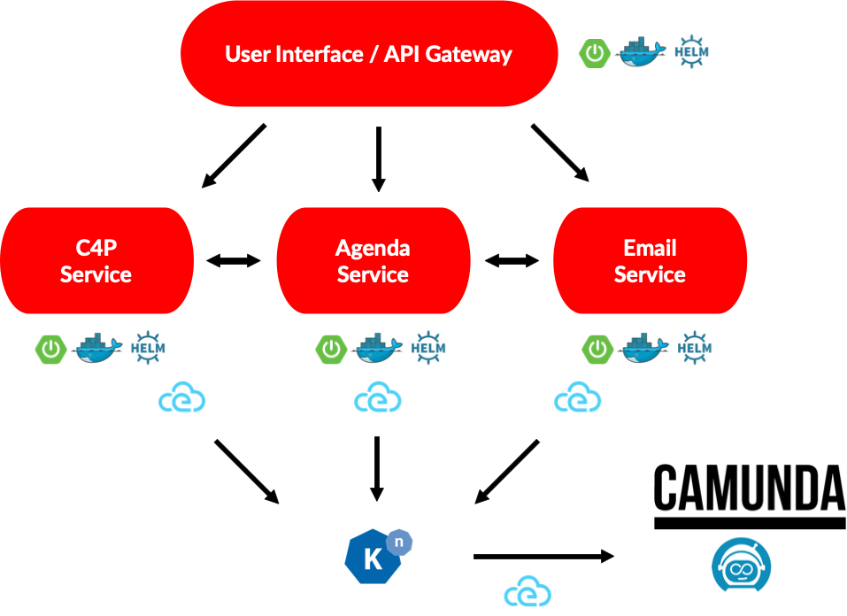

Version 2 of the application still uses the same version of the services found in Version 1, but these services are configured to emit events to a **Knative Broker** that was created when you installed Knative. This Knative Broker receives events and routes them to whoever is interested in them. In order to register interest in certain events, Knative allows you to create **Triggers** (which are like subscriptions with filters) for these events and specify where events should be sent. 

For Version 2, you will use the **Zeebe Workflow Engine** provisioned in your **Camunda Cloud** account to capture and visualize these meaninful events.
In order to route these **CloudEvents** from the Knative Broker to **Camunda Cloud** a new component is introduced along your Application services. This new component is called **Zeebe CloudEvents Router** and serves as the bridge between Knative and Camunda Cloud, using CloudEvents as the standardized communication protocol. 

As you can imagine, in order for the **Zeebe CloudEvents Router** to connect with your **Camunda Cloud Zeebe Cluster** you need to create a new **Client**, a set of credentials which allows these components to connect and communicate. 

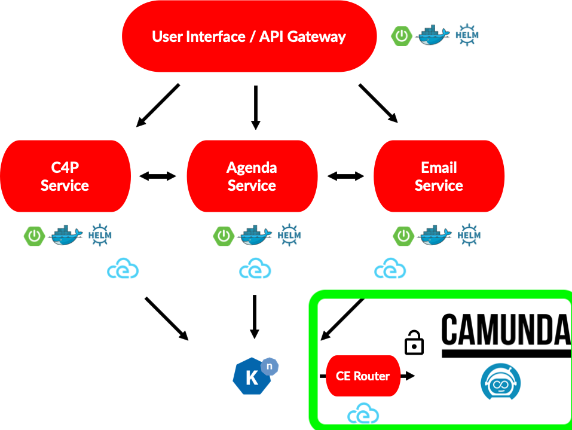

Go to the **Camunda Cloud** console, click on your cluster to see your cluster details:

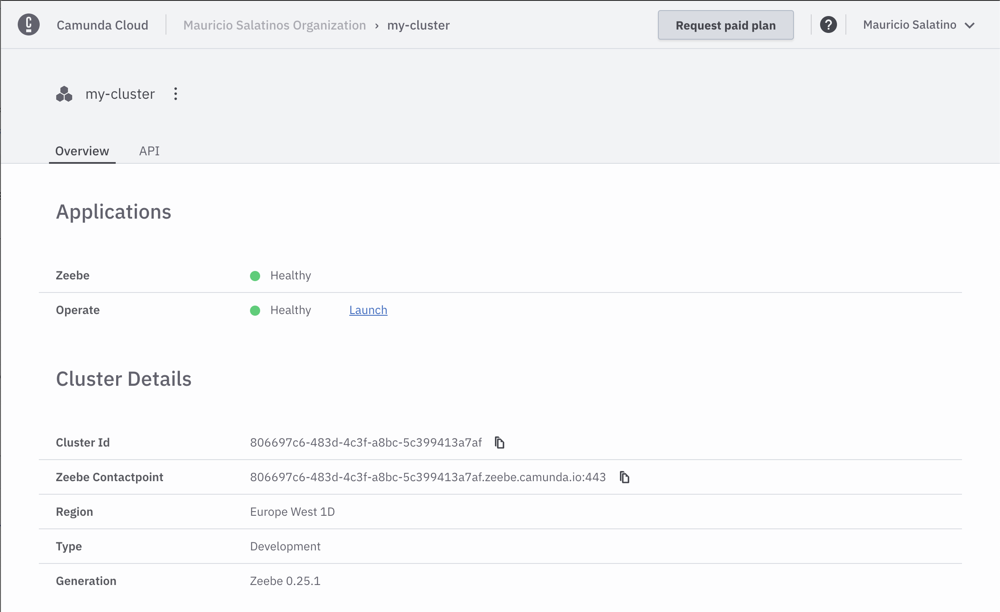

Go to the **Clients** tab and then **Create a New Client**:

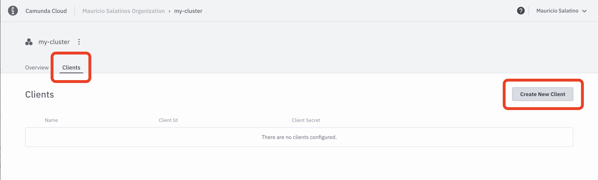

Call it `my-client` and click **Add**:

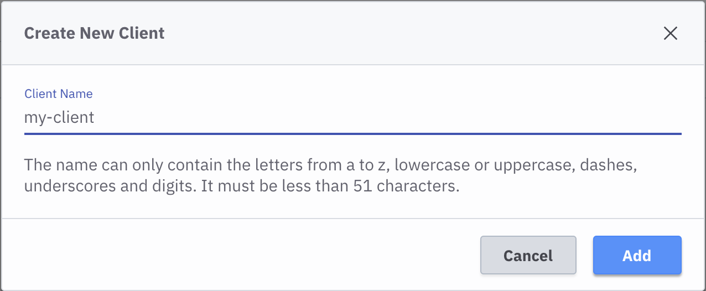

The new client called `my-client` will be created: 

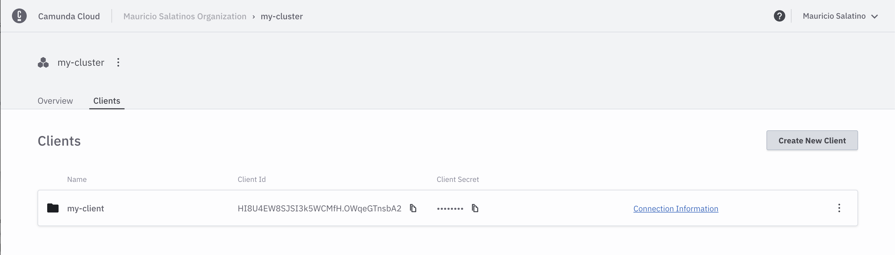

Now you can access the **Connection Information**:

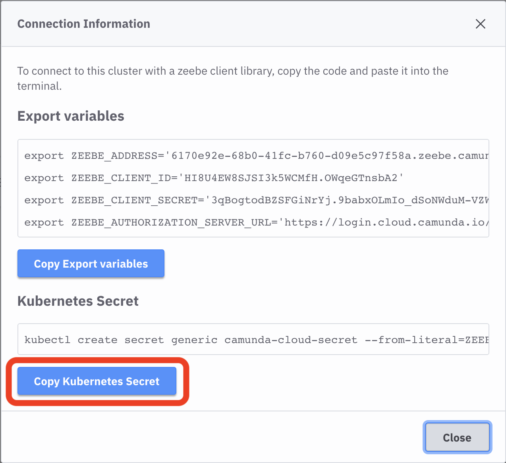

By clicking the button **Copy Kubernetes Secret** the command will be copied into your clipboard and you can paste it inside **Cloud Shell** inside Google Cloud.

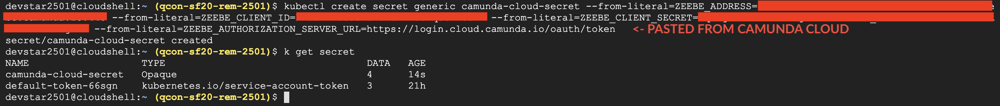

By running the previous command, you have created a new `Kubernetes Secret` that hosts the credentials for our applications to talk to Camunda Cloud. As shown, in the previous screenshot you can check that the `Kubernetes Secret` was created with: 

``` bash
k get secret
```

Now you are ready to install Version 2 of the application by running (again ignore the warnings):

``` bash 
h install fmtok8s-v2 workshop/fmtok8s-app-v2
```

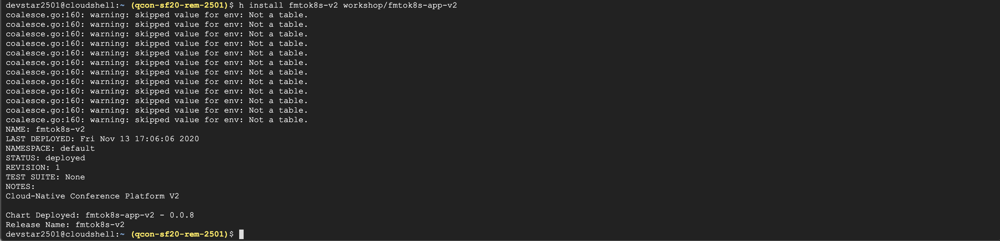

You can check that all the services are up and running with the same two commands as before:

``` bash
k get pods
```

and

``` bash
k get ksvc
```

You should see something like this:

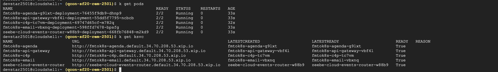

Notice that now the **Zeebe CloudEvents Router** is running alongside the application services and is configured to use the Kubernetes Secret that was previously created to connect to **Camunda Cloud**.

But there is still one missing piece to route the **CloudEvents** generated by your application services to the **Zeebe CloudEvents Router**: the Knative Triggers (subscriptions to route the events from the broker to wherever you want).

These Knative Triggers are defined in YAML and can be packaged inside the Application Version 2 Helm Chart, which means that they are installed as part of the application. You can find the [Triggers' definitions here](https://github.com/salaboy/fmtok8s-app-v2/blob/main/charts/fmtok8s-app-v2/templates/ktriggers.yaml).

You can list these Knative Triggers by running the following command:
``` bash
k get triggers
```

You should see an output like this: 

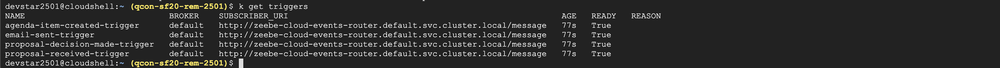

Finally, even when **CloudEvents** are being routed to Camunda Cloud, you need to create a model that will consume the events that are coming from the application, so they can be correlated and visualized. 

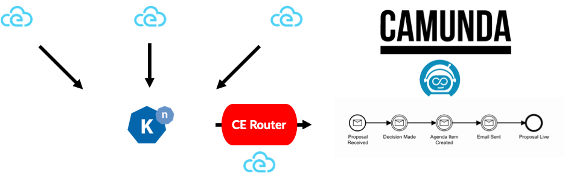

You can download the models that you will be using in [the next steps from here](https://github.com/salaboy/from-monolith-to-k8s-assets/archive/1.0.0.zip).

Once you've downloaded the models, extract the ZIP file to a place that you can quickly locate, to upload these files in the next steps.  

Now, go back to your **Camunda Cloud Zeebe Cluster** list (you can do this by clicking in the top breadcrumb with the name of your organization):

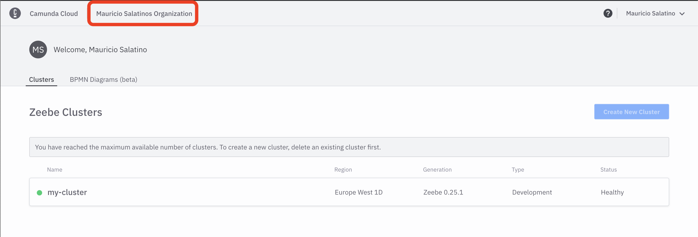

Next, click on the **BPMN Diagrams(beta)** Tab, then click **Create New Diagram**:

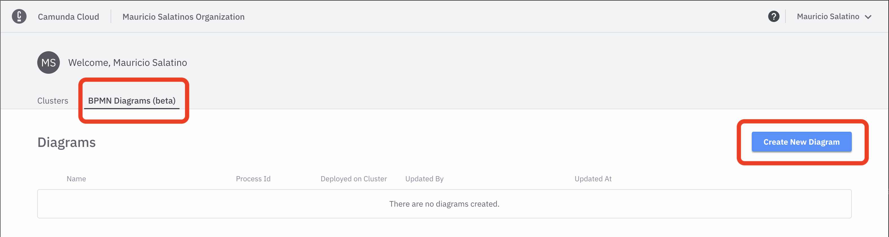

With the Diagram editor opened, first enter the name **visualize** into the diagram name box and then click the **Import Diagram** button:

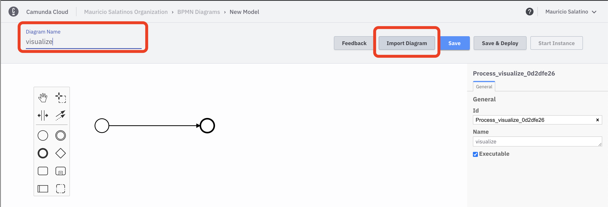

Now choose **c4p-visualize.bpmn** from your filesystem: 

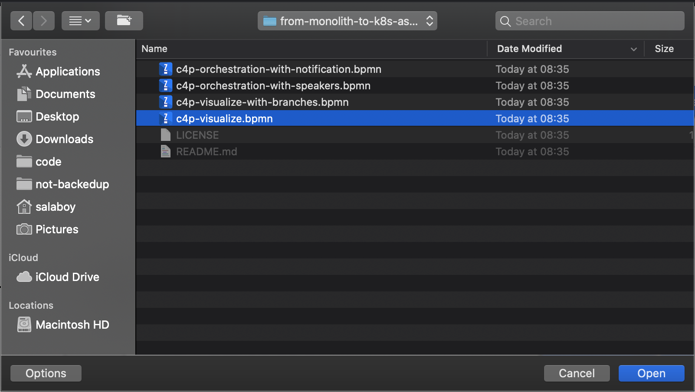

The diagram shoud look like:

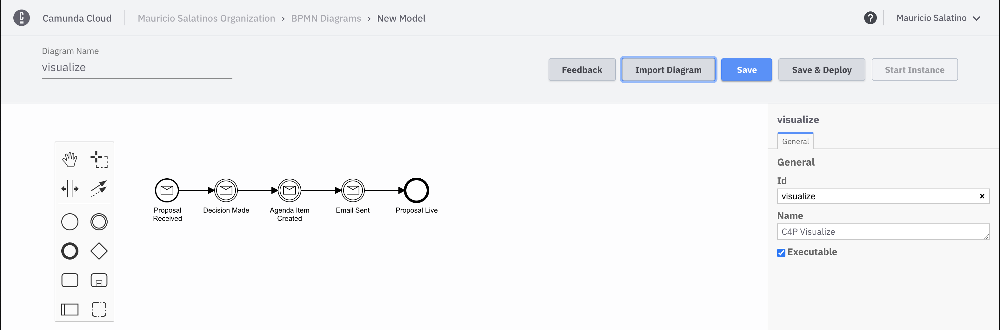

With the Diagram ready, you can hit **Save and Deploy**:

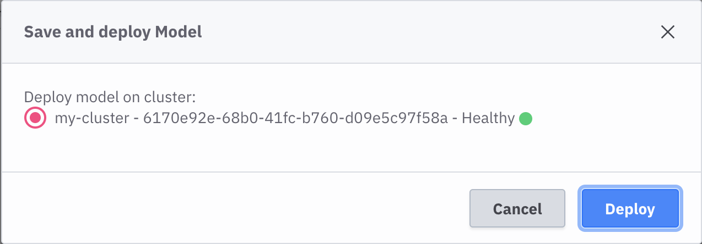

Next, **close/disregard** the popup suggesting to start a new instance:

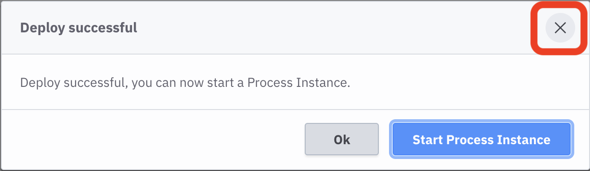

Well done! You made it! Now everything is set up for routing and fowarding events from our application to Knative Eventing, to the Zeebe CloudEvents Router to Camunda Cloud.

In order to see how this is actually working you can use **Camunda Operate**, a dashboard included inside **Camunda Cloud** which allows you to understand how these models are being executed, where things are at a given time and to troubleshoot errors that might arise from your applications' daily operations.

You can access **Camunda Operate** from your cluster details, inside the **Overview Tab**, clicking in the **View in Operate** link:


You should see the **Camunda Operate** main screen, where you can click in the **C4P Visualize** section highlighted in the screenshot below:

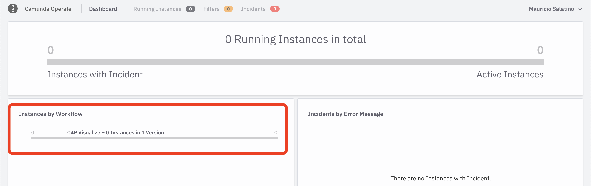

This opens the runtime data associated with our workflow models, now you should see this:

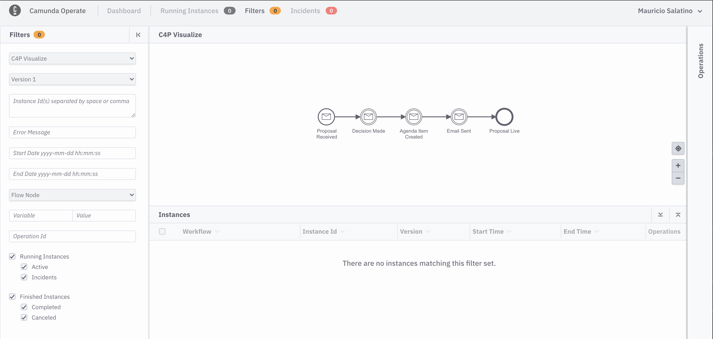

Now go back to the Conference Application. Remember, listing all the Knative Services will show the URL for the API Gateway Service that is hosting the User Interface. When you are in the application, submit a new proposal and then refresh **Camunda Operate**:

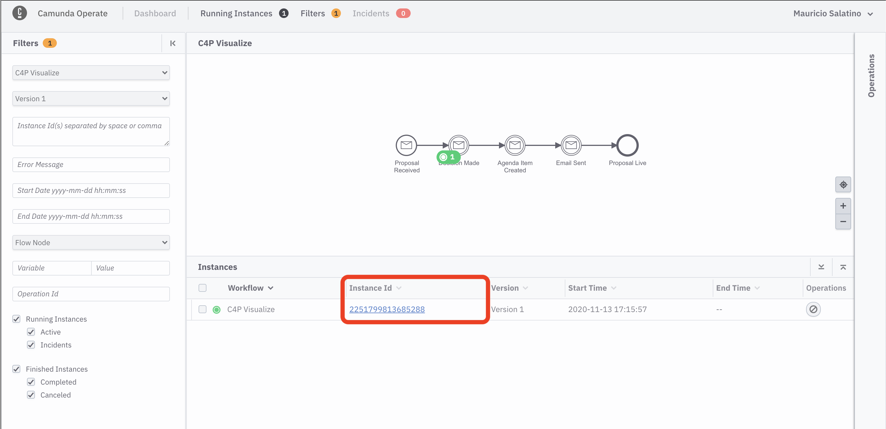

If you click into the Instance ID link, highligted above, you can see the details of that specific instance:

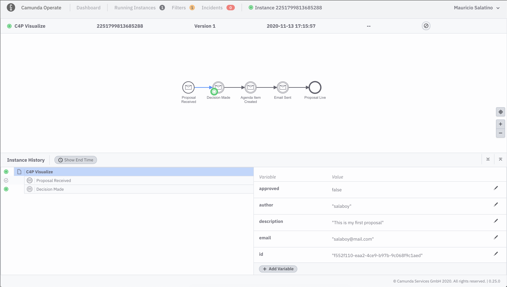

If you go ahead to the **Back Office** of the application and **approve** the proposal that you just submitted, you should see in **Camunda Operate** that the instance is completed:

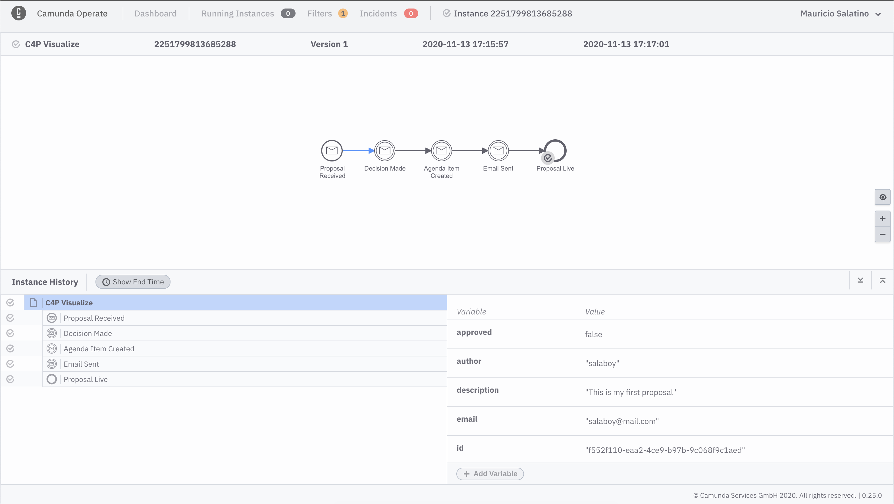

**Extras**

<details>
  <summary>Understanding different branches (Click to Expand)</summary>
As you might notice, the previous workflow model will only work if you approve proposals, as the `Agenda Item Created` event is only emitted if the proposal is accepted. In order to also cover the case when you reject a proposal, you can deploy Version 2 of the workflow model, that describes these two branches for approving and rejecting proposals.
    
In order to deploy the second version of the workflow model you follow the same steps as before  
  
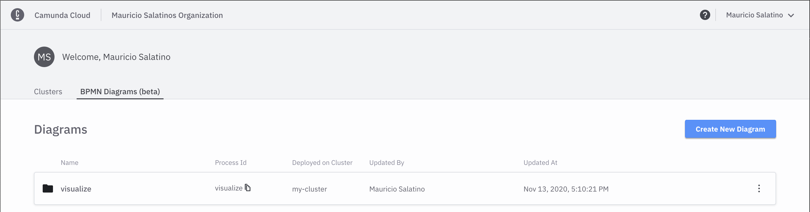

Click into your previously saved diagram called **visualize**, then **Import Diagram** and then select **cp4-visualize-with-branches.bpmn**:

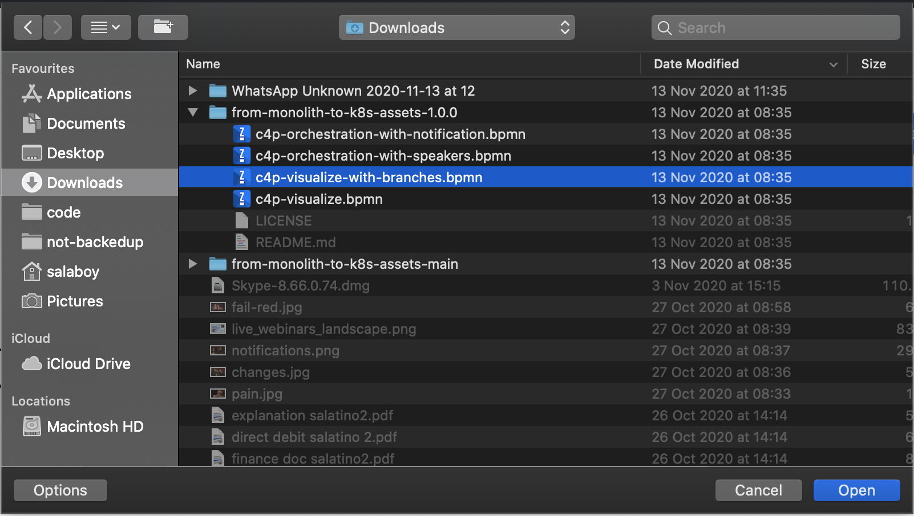

The new diagram should like this:

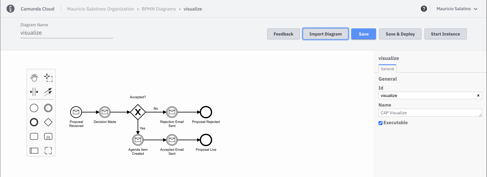

Now you are ready to **Save and Deploy** the new version:

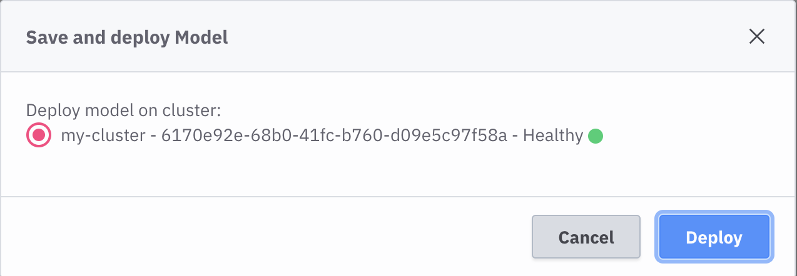

If you switch back to **Camunda Operate** you will now see two versions of the **C4P Visualize** workflow:

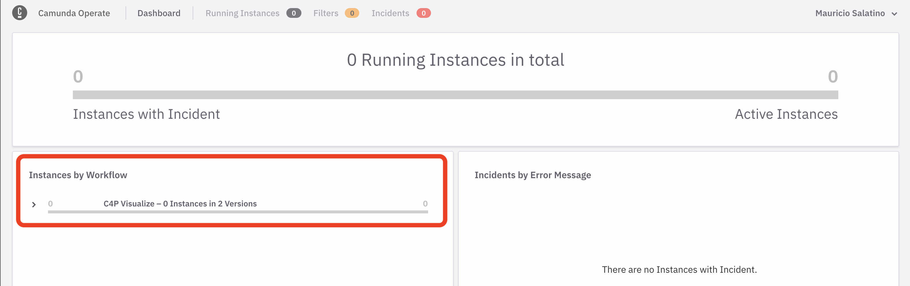

Click to drill down into the runtime data for the new version of the workflow:

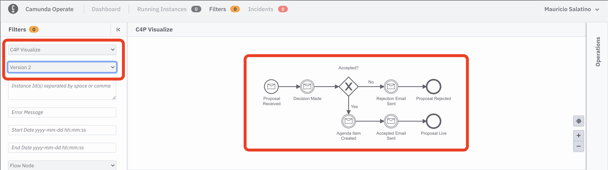

If you now go back to the application and submit two proposals - reject one and approve one - you should now see both instances completed:

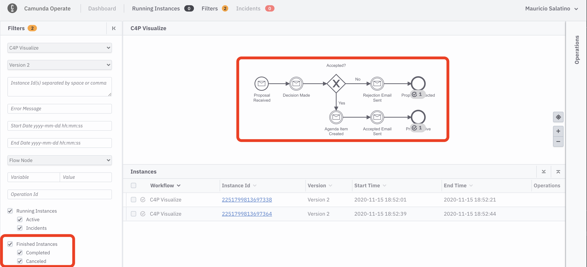

Remember that you can click in any instance to find more details about the execution, such as the audit logs to understand exactly when things happened:

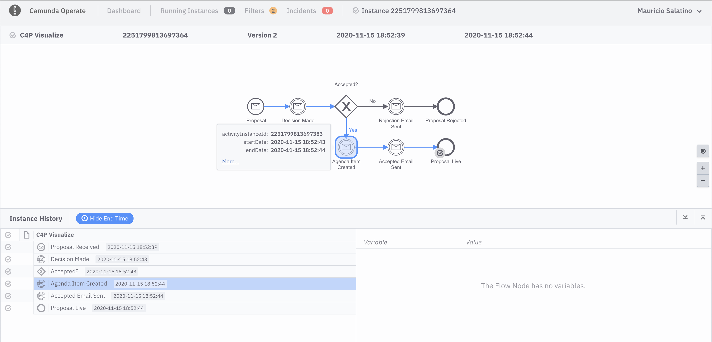

</details>

If you made it this far, **you can now observe your Cloud-Native applications by emitting CloudEvents from your services and consuming them from Camunda Cloud**. :tada: :tada:

Let's undeploy Version 2 to make some space for Version 3.  

```
h delete fmtok8s-v2 --no-hooks
```

## Questions

This section includes a set of questions for you to experiment and try to answer, we recommend doing this after the live workshop. 

- Would you rather run the workflow engine On-Prem (meaning, inside your Kubernetes Cluster)? what are the pros and cons of doing that? How would you install it? 
- What is Knative Eventing using for moving events around? What is the transport used? Can it be swapped? 
- What changes would be required to Version 1 and Version 2 of these applications to run on Azure AKS, or Amazon EKS? 


# Version 3: Workflow Orchestration

In Version 3, you will orchestrate the services interactions using the workflow engine. 

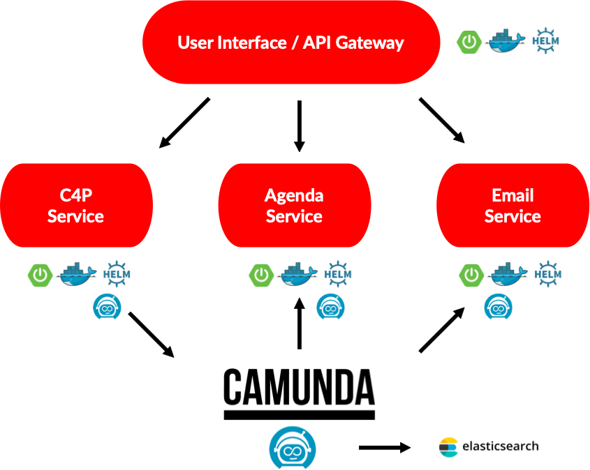

You can now install Version 3 running:

``` bash
h install fmtok8s-v3 workshop/fmtok8s-app-v3
```
The ouput for this command should look familiar at this stage:

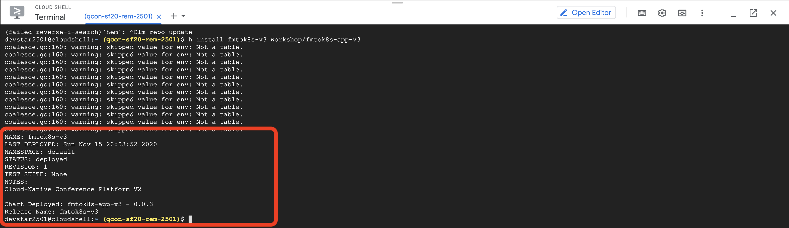

Check that the Kubernetes Pods and the Knative Services are ready:

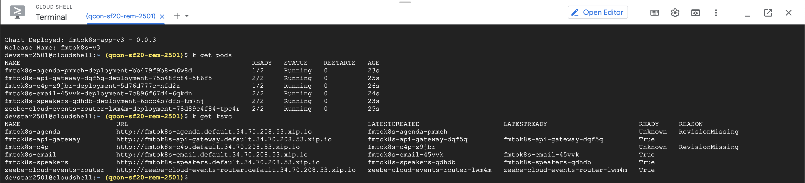

When all the pods are ready (2/2) you can now access to the application. 

As you might have noticed, there is a new Knative Service and pod called **fmtok8s-speakers**. You will use that service later on in one of the **Extras**. 

An important change in Version 3 is that it doesn't use a REST-based communication between services. This version lets the **[Zeebe](http://zeebe.io)** workflow engine inside **Camunda Cloud** define the sequence and orchestrate the services interactions. **[Zeebe](http://zeebe.io)** uses a Pub/Sub mechanism to communicate with each service, which introduces automatic retries in case of failure and reporting incidents when there are service failures. 

**Extras**
<details>
  <summary>Changes required to let Zeebe communicate with our existing services (Click to Expand)</summary>
Zeebe, it is not interacting with your services REST endpoints, it is using its own [GRPC](https://grpc.io) based Pub/Sub mechanism to orchestrate these services. This requires your services to understand how to interchange messages with Zeebe which is hosted inside **Camunda Cloud** . Here are some links of the changes that were made between Version 1 of the services and Version 3. 

- [Zeebe Client Dependency](https://github.com/salaboy/fmtok8s-email/blob/8f009fc5f1dda36bb61eb565704d196363124233/pom.xml#L35): As you might have expected, a client is added to your services to interact with Camunda Cloud. There are multiple clients for all major programing languages. Here beacuse the service is Spring Boot based, there is a Spring Boot specific integration. 

- [Zeebe Worker](https://github.com/salaboy/fmtok8s-email/blob/master/src/main/java/com/salaboy/conferences/email/EmailService.java#L125): A **Zeebe Worker** is a client side consumer for a specific kind of task inside your workflow models. You can see that the worker `glue` code can be defined with a Java Annotation and it will usually just wrap around exisiting functionality. For this example, you can see that the Worker it is calling the same method that your REST endpoint. By using the concept of **Zeebe Workers** you get automatic retries if the code inside the worker fails for some reason. 
    
Usually, you will update your services to use the mechanism of **Zeebe Workers** if you have control over these services, meaning that you are allowed to change them. An alternative approach, can be using **CloudEvents** and the **Zeebe CloudEvents Router** to integrate with your existing services without modifying them. Check the [CloudEvents Orchestration](https://github.com/salaboy/orchestrating-cloud-events) project and [Knative Meetup for CloudEvents Orchestration](https://salaboy.com/2020/10/15/knative-meetup-cloudevents-orchestration/) for more information about this approach.   
    
</details>

Another important change is that the **C4P Service** now automatically deploys the workflow model used for the orchestration to happen.  
This means that when the **fmtok8s-c4p** Knative Service is up and ready, you should have a new workflow model already deployed in **Camunda Cloud**:

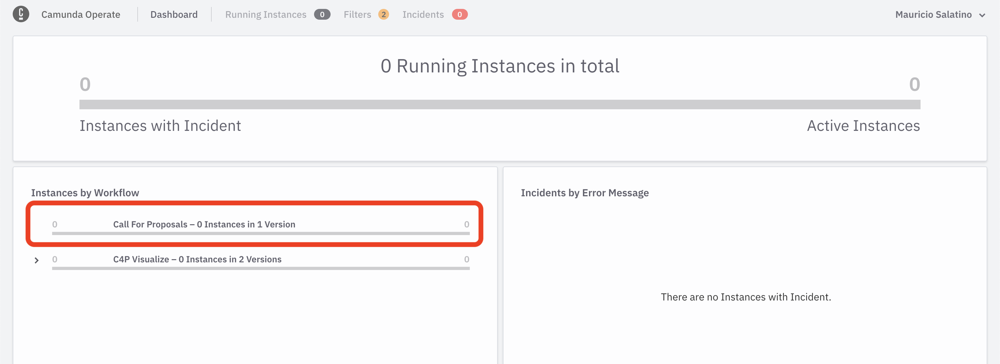

If you now click into the new workflow model, you can see what it looks like: 

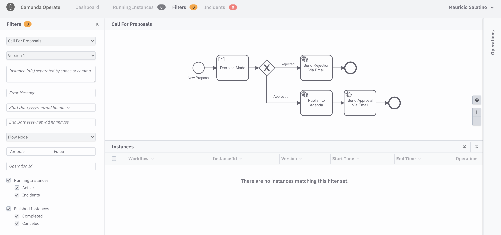

If you submit a **new proposal** from the application user interface, this new workflow model is in charge of defining the order in which services are invoked. 
From the end user point of view, nothing has changed, besides the fact that they can now use **Camunda Operate** to understand in which step each proposal is at a given time. From the code perspective, the business logic required to define the steps is now delegated to the workflow engine, which enables non-technical people to gather valuable data about how the organization is working, where the bottlenecks are and how your Cloud-Native applications are working.  

Having the state of all proposals in a single place can help organizers to prioritize other work, or just make decisions to move things forward.

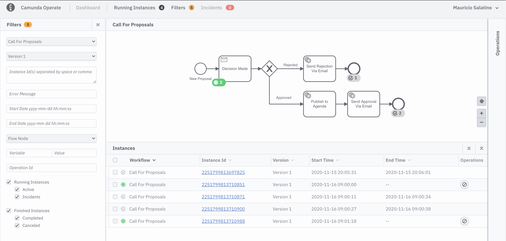

In the screenshot above, it is clear that 2 proposals are still waiting for a decision, 2 proposals were approved and 1 was rejected. 
Remember that you can drill down into each individual workflow instance for more details, for example, how much time a proposal has been waiting for a decision:

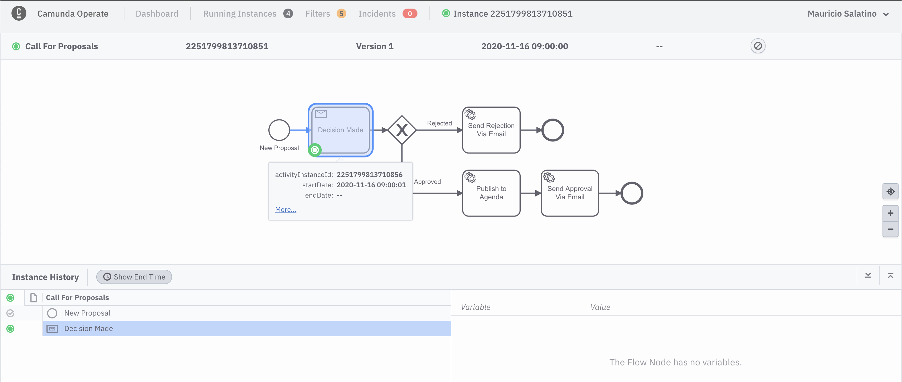

Based on the data that the workflow engine is collecting from the workflow's executions, you can understand better where the bottlenecks are or if there are simple things that can be done to improve how the organization is dealing with proposals. For this example, you can say that this workflow model represents 100% of the steps required to accept or reject a proposal. In some ways, this explains to non-technical people the steps that the application is executing under the hood. 

Becuase the workflow model is now in charge of the sequence of interactions, you are free to change and adapt the workflow model to better suit your organization's needs.  

If you made it this far, **Well Done!!! You have now orchestrated your microservices interactions using a workflow engine!** :tada: :tada:

**Extras**

Here are some extras that you might be interested in to expand what you have learnt so far:

<details>
  <summary>Update the workflow model to use the newly introduced **Speakers Service** (Click to Expand)</summary>

Imagine the situation where the organizers of the conference want to change the flow of actions required to approve an incoming proposal. They want to make sure that before publishing any session to the agenda, speakers confirm and commit to their participation in the event, to avoid confusion. This change requires sending an email to the approved proposal's author with a link to confirm that they are committed to participate in the event. Only after receiving this confirmation can the proposal be published into the live agenda. 
    
You can now go ahead and update the workflow model created by the `C4P Service` in Version 3 of the application. This can be done by uploading a new model from the **Camunda Cloud** BPMN Diagrams tab, as you did for Version 2. 

Create a new Diagram and name it `c4p`, then hit **Import Diagram**:
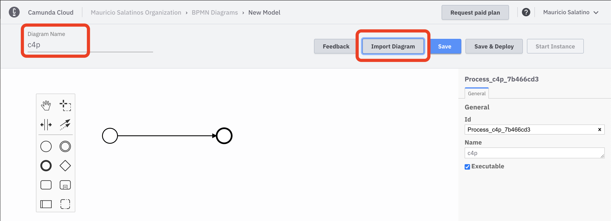

Select the file called `c4p-orchestration-with-speakers.bpmn` and click **Open**
The new diagram should look like this: 

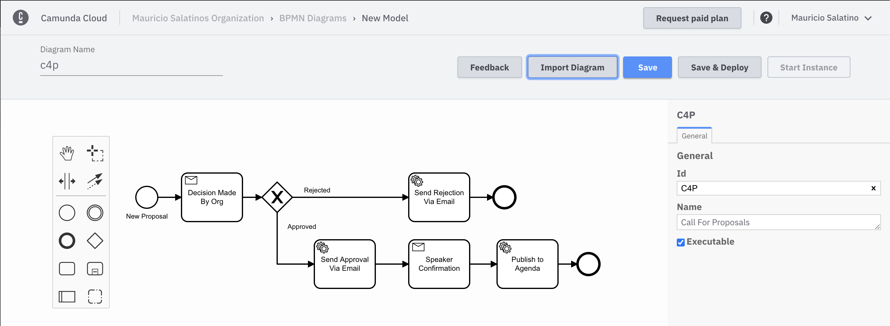

Now you can hit **Save and Deploy** to generate a new version in **Camunda Operate**:

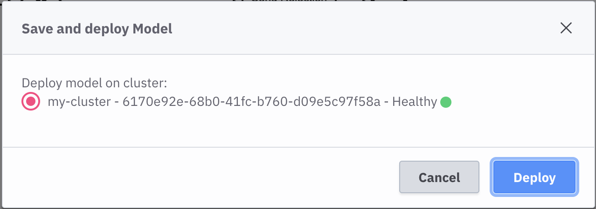

In **Camunda Operate** you can now see Version 2 of the `Call for Proposals` workflow model

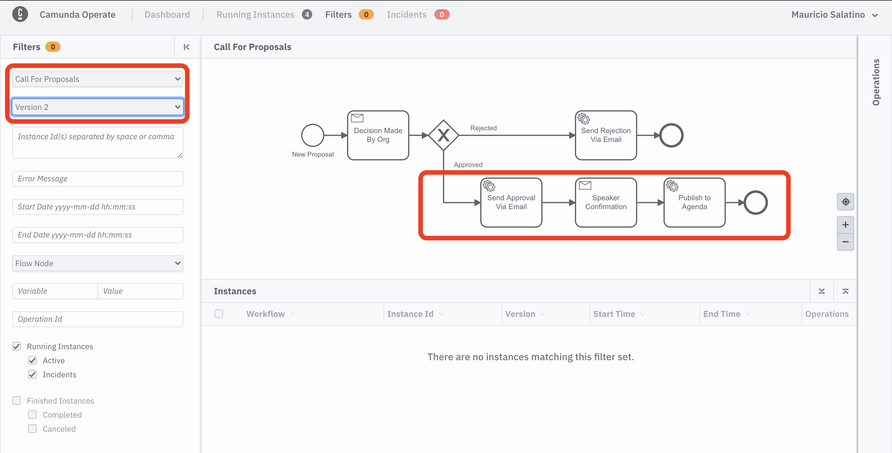

Now, if you submit and approve a proposal, the new workflow model will wait for the confirmation coming from the speaker. 


If you tail the logs from the `Email Service` as you did before (`k get pods` and `k logs -f fmtok8s-email-<POD ID>`) you will see the the following email has been sent: 

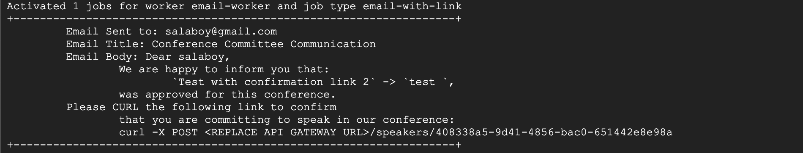

You can manually submit the speaker confirmation by copying the `curl` command to Cloud Shell. Notice that you need to replace the `API Gateway Service` URL, that you can find by running `k get ksvc` and look for the fmtok8s-api-gateway **Knative Service** URL. 

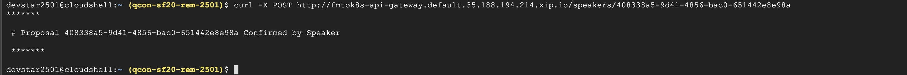

If you made it this far, **you have changed the steps to approve and publish a new proposal to the agenda.** :tada: :tada:
You applied the change and it is clear, for technical and non-technical users, how the application was working with Version 1 of the workflow model and how it is working now with Version 2. 

More advanced setups, can include choosing between different version of these models. There is no restriction on always using the latest available version. 


</details>

<details>
  <summary>Update the workflow model to send notifications if a proposal is waiting for a decision for too long (Click to Expand)</summary>

Imagine that the organizers want to provide some kind of service level agreement to your potential speakers. Organizers want to make sure that proposals are reviewed in the first 3 days after they arrive. If these proposals are not reviewed by day 2, an email needs to be sent to the group in charge of reviewing the proposals as a reminder. 

Because these requirements are extremely common in every application, workflow engines provide out-of-the-box time-related triggers. 
Once again, you will override our `C4P` workflow model. Go to **Camunda Cloud BPMN Diagrams Tab** and if you already have a model called `c4p` open it; if not, create a new one.

Once it is open, click `Import Diagram` and choose from the resources a file called `c4p-orchestration-with-notification.bpmn`, 

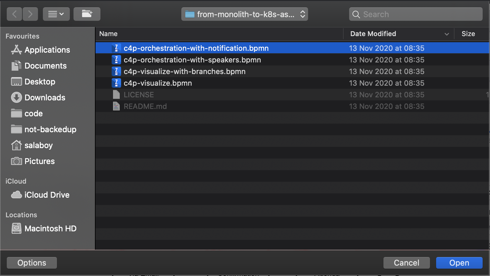

The imported diagram should look like this:

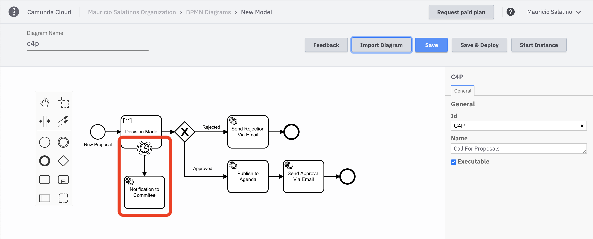

As you might notice, the highlighted section shows a Timer Event attached to the `Decision Made` activity. This timer event will trigger based on a configured period and it will be only activated when the workflow model arrives to the `Decision Made` activity. Once the Timer Event is triggered, the `Notification to Committee` step will be executed. 

Next, **Save and Deploy**


Once the model is deployed you can switch to **Camunda Operate** and you will find a new version for the `Call for Proposals` workflow model:

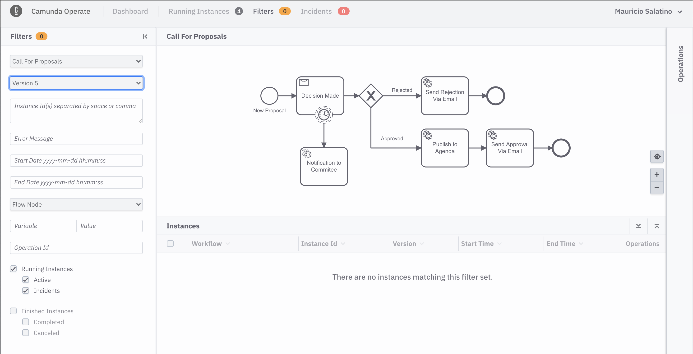

If you submit a new proposal via the application user interface and once again tail the `Email Service` logs (with `k get pods` and `k logs -f fmtok8s-email-<POD ID>`) you should see the following output:

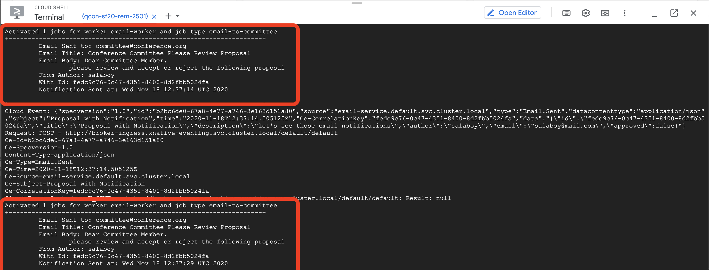

As you can see, the reminders are set to trigger every 15 seconds. This was set up for a very short period for you to see the logs, but it can be obviously changed to be days, months or years if needed. 

It is important to understand that as soon as the proposal is approved or rejected, the timer is no longer needed, and because the timer was attached to `Decision Made` activity in the workflow model, it will be stopped and garbage collected automaticailly. 

These contextual timer events ([boundary events](https://docs.camunda.io/docs/product-manuals/zeebe/bpmn-workflows/call-activities/call-activities/#boundary-events), in the BPMN spec) are extremely powerful to easily describe situations where reminders or time based actions needs to be scheduled and triggered in the future. 

In the next screenshot you can see the workflow model instance audit log, where multiple notifications were sent:

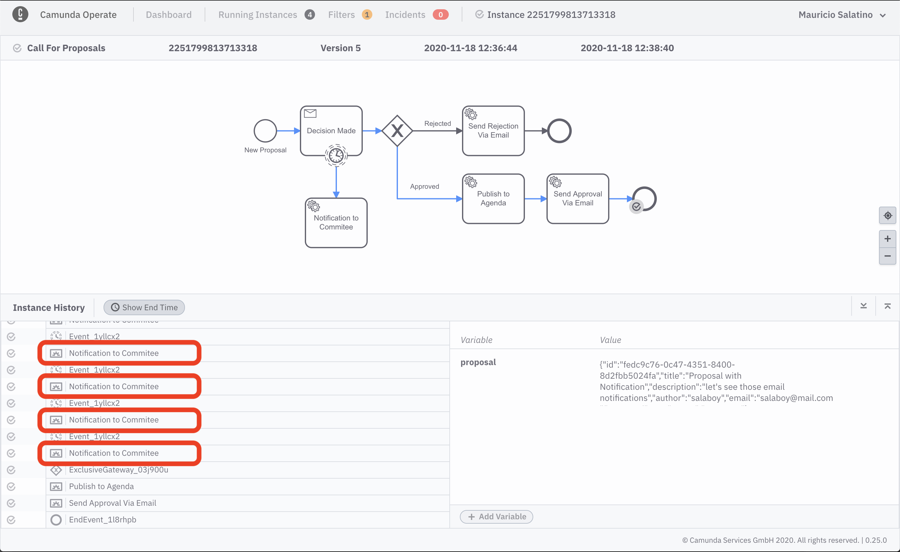

Remember that because all this data is already stored in ElasticSearch, reporting and analytics on the average number of times that these notifications are sent can help stakeholders to better plan. In this case, maybe they might need to hire more reviewers if approving/rejecting proposals under 3 days is core for their organization. 

If you made it this far, **you managed to schedule a distributed timer, that is highly available and it will be autmatically garbage collected when it is not needed anymore by just setting it up in your workflow model.** :rocket: 

</details>
<details>
  <summary>Make the application fail to see how incidents are reported into Camunda Operate (Click to Expand)</summary>

When things go wrong, you want to find out as soon as possible. In Version 2 of the application, when you were observing the events emitted by the application, if something went wrong, events might never arrive, but in Version 3, because you are orchestrating the interactions, if something goes wrong with a service, the workflow engine can quickly notify you so technical and non-technical people alike are aware of the problem. 

In this short section, you will make the `Agenda Service` fail by sending a payload that you know that will generate an exception.

In the application, submit a proposal with the following values:

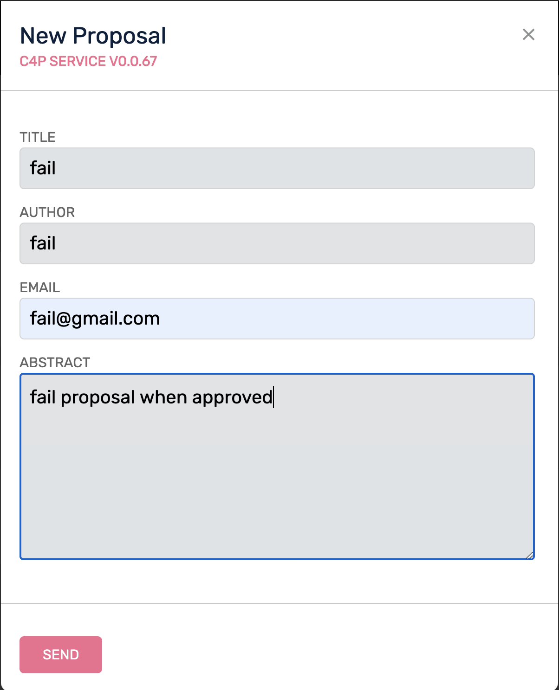

Then in the Back Office, approve the proposal:

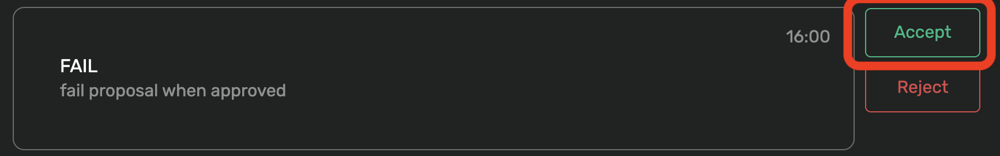

Go to **Camunda Operate** and make sure that the `Call for Proposal` workflow is selected on the left-hand side menu. You should see a new incident:

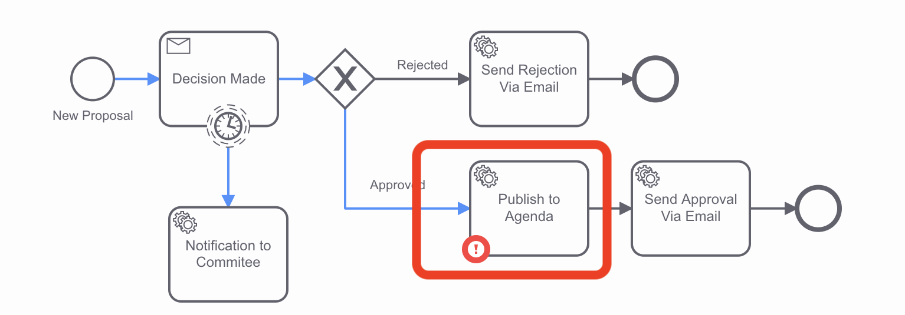

If you drill-down to the instance that is reporting the incident, you will find out some interesting details: 

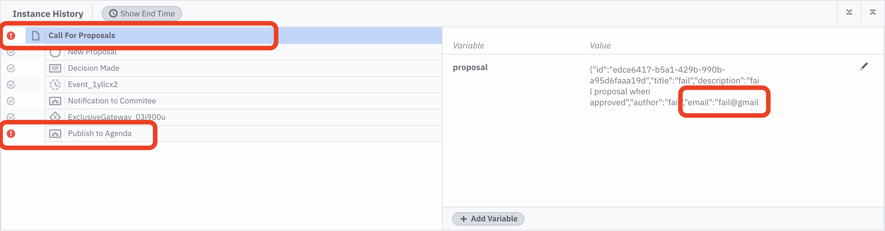

You can see that the whole instance is marked as having a problem, in addition to the `Publish to Agenda` task. On the right-hand panel, you can also see the data that the workflow model had when it failed, which can help non-technical users to at least get in touch with the potential speaker to notify them about the ongoing issue.  

On the top of the screen you can expand the incident report to find more about what is going on:

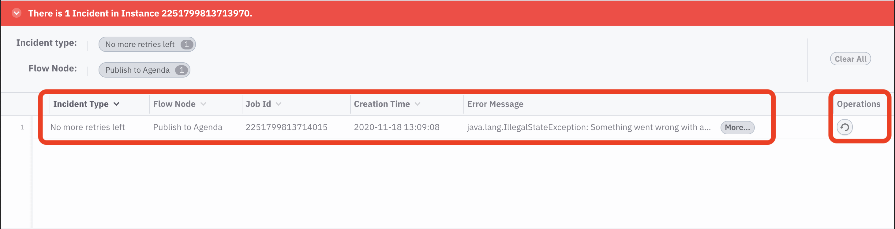

From here, you can drill-down to see the actual technical problem that is happening. This can help non-technical users to communicate the error to technical teams. As you can see there is also a retry button in the `Operations` column that can be used to solve issues when automatic retries had been exhausted, but after fixing a technical problem, the operation can be retried.

Incidents are a way to bubble up technical errors that are happening inside your workflows to non-technical users who need to understand how these issues are affecting the business and the organization. 

If you made it this far, **you are now aware how important is to report low level incidents to other departments as soon as possible and how collaboration can help to quickly remidiate these kinds of situations** :dancer: :dancer:

</details>

You can uninstall Version 3 with:

```
h delete fmtok8s-v3 --no-hooks
```

## Questions

This section includes a set of questions for you to experiment with and try to answer. We recommend doing this after the live workshop. 

- Would it make sense to produce **CloudEvents** from the workflow models? Why?
- How and what would you evaluate when looking at orchestration tools (for example AWS Step Functions, Netflix Conductor, etc.)?
- Would it be a good idea to add/represent explicitely User (Human) interactions into the workflow models? Why? What special charastericts and requirements do Human interactions usually involve? 
- For the Time-Based actions (check the Extras), where would you look for how often the scheduled timer is scheduled to happen? 

# Next Steps

There are tons of options and challenges to solve in the Cloud-Native space. You can use this workshop and the applications you've built as a playground to test new projects before adopting them for your applications. That is exactly the reason why these apps were built in this way.

Here are some recommendations for futher exploring, improvements that can lead to contributions to these repositories for future workshops or just to serve as examples for the entire Kubernetes community:

- **Adding New Services** (Easy): How would you go about adding a new service to this applications? What tools would you need in order to be efficient? Try defining the main steps that you will need in order to add a new service. 

- **Adding Tracing and Centralized Logging** (Easy): Even if you can see your applications by exposing relevant events, you need to have Tracing and Centralized logging to understand how your services are working on the technical side and to debug things at the infrastructure level. 

- Use [Octant](https://github.com/vmware-tanzu/octant) Dashboard to visualize your Kubernetes Resources (Easy): Understanding what running inside of your clusters and how Kubernetes Resources are linked together is not an easy task. Try to use Octant to inspect your workloads. 

- [Jenkins X](http://jenkins-x.io) &  [Tekton](http://tekton.dev) (Intermediate): These applications and services were built using Jenkins X which provides CI/CD for Kubernetes and it uses [Tekton](http://tekton.dev) as the underlying pipeline engine. Both of these projects implement their own tools in a Kubernetes Native way (meaning that they follow Kubernetes best practices and tap into the Kubernetes ecosystem to design and implement their own components). I strongly recommend you to check out both of these projects, if you are planning to build, maintain and deploy multiple services in Kubernetes.

- [External Secrets](https://github.com/external-secrets/kubernetes-external-secrets) (Intermediate): External Secrets, created by GoDaddy, provides a set of abstractions similar to Knative that allow you to deal with Secrets Management in a Cloud Agnostic way. Configuring the Camunda Cloud Secrets directly in Google Cloud Secrets Manager would be a cleaner and more real solution. You can explore how External Secrets work and how adding External Secrets to these projects would work. 

- **Kafka as Knative Eventing Channel Provider** (Intermediate): Leveraging the power of the Knative Eventing abstractions, you can swap the Eventing Channel provider to Kafka for a more realistic and robust tech stack and the application will just work. Notice that the application as it is configured here uses an InMemory provider, which is good only for development purposes. For installing Kafka you might want to use the [Helm Chart located here](https://bitnami.com/stack/kafka/helm) to follow the same approach that we are using for the application itself. 

- **Google Pub/Sub as Knative Eventing Channel Provider** (Intermediate): If you are running in Google Cloud, why maintain a Kafka installation if you can leverage the power of Google Pub/Sub? In theory, you should be able to just replace the Channel implementation, in the same way as you did with Kafka, and your application should work without any changes. 

- **Adding Single Sign-On and Identity Management**(Advanced): Looking at projects like [Dex](https://github.com/dexidp/dex), how would you deal with SSO and **identity management** for your applications? What changes do you need to implement in each service? How would you configure the API Gateway to redirect requests that require authentication? This tends to be such a common requirement that adding Single Sign On to this example might be an excellent contribution for someone who wants to learn in the process. 

- [CloudEvents Orchestration](https://github.com/salaboy/orchestrating-cloud-events) (Advanced): This is an extension to this workshop, using a different application. It goes further into Orchestrating Cloud Events with the Zeebe Workflow Engine. In this example, you can explore how the Workflow Engine can also produce Cloud Events, which allows you to keep your Services and Applications from knowing anything about the fact that they are being orchestrated since no dependencies will be added to your services, they will just emit and consume CloudEvents. This example also covers the use of WebSockets to forward CloudEvents to the Client Side (browser).

- [RSocket for Streams](https://rsocket.io) (Advanced): Notifications and reactive user interfaces require so kind of push mechanism or bi-directional communication with the backends. RSocket comes to solve this problem. Introducing RSocket to work with the application and demostrate how this can be scaled is an interesting experiment that can be added to this applications. 


# Sum Up

If you made it this far, you are a **Cloud Warrior**! :suspect: :godmode: :feelsgood:

It has been said before, "practice makes perfect" and I hope that you managed to get your hands dirty with **Kubernetes** and `kubectl`, **Helm**, **Knative** and **Camunda Cloud**. I know that there are tons of other things that you can do with these applications, and I hope that with some community collaboration we all can keep evolving this application to serve as a playground to explore new technologies in the Cloud-Native ecosystem. 

Feedback is highly appreciated, feel free to drop me a [DM in Twitter](http://twitter.com/salaboy) or create an issue in this repository if you have comments, suggestions or if you want to contribute to make these examples better for everyone. I encourage people to give this workshop to their teams. If you do so, please leave a comment or send a PR with a link to where you used it. 

Thank you all, but especially to those people who helped with feedback, code and suggestions. :blue_heart: :purple_heart: :heart:


# Thanks to all contributors
- [Matheus Cruz](http://twitter.com/MCruzDev1) for being awesome and refactoring the services to use databases, add tests and helping everywhere by testing this workshop steps
- [Ray Tsang](http://twitter.com/saturnism) for being awesome and facilitating GCP accounts and helping me to set up 60+ clusters! 
- [Charley Mann](http://twitter.com/charley_mann) for being awesome and providing loads of corrections and suggestions
- [Mary Thengvall](https://twitter.com/mary_grace) for being awesome and providing loads of corrections and suggestions

# Sources and References

Here you can find the repositories which host the source code for each service as well as some links to tools and projects that you might find useful:

- **Services Source Code**
  - [API Gateway](https://github.com/salaboy/fmtok8s-api-gateway)
  - REST Services (For Version 1 and Version 2) 
    - [C4P Service REST](https://github.com/salaboy/fmtok8s-c4p-rest)
    - [Agenda Service REST](https://github.com/salaboy/fmtok8s-agenda-rest)
    - [Email Service REST](https://github.com/salaboy/fmtok8s-email-rest)
  - Using Zeebe Pub/Sub
    - [C4P Service](https://github.com/salaboy/fmtok8s-c4p)
    - [Agenda Service](https://github.com/salaboy/fmtok8s-agenda)
    - [Email Service](https://github.com/salaboy/fmtok8s-email)
    - [Speakers Service](https://github.com/salaboy/fmtok8s-speakers)
- **Helm Charts for Applications**
  - [Version 1](https://github.com/salaboy/fmtok8s-app)
  - [Version 2](https://github.com/salaboy/fmtok8s-app-v2)
  - [Version 3](https://github.com/salaboy/fmtok8s-app-v3)
- **Frameworks and Tools**
 - [Zeebe](http://zeebe.io)
 - [CloudEvents](http://cloudevents.io)
 - [Spring Cloud Gateway](https://spring.io/projects/spring-cloud-gateway)
 - [Spring Cloud Contract](https://spring.io/projects/spring-cloud-contract)
 - [Helm](http://helm.sh)
 - [Knative](http://knative.dev)
 - [Jenkins X](http://jenkins-x.io)

