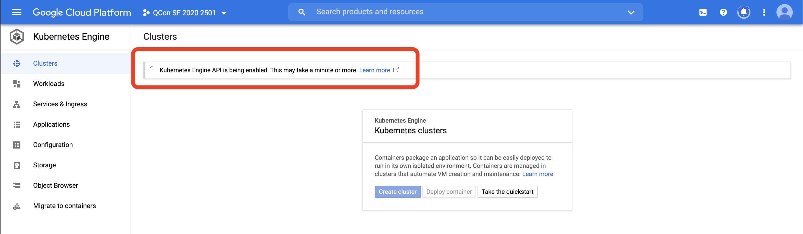
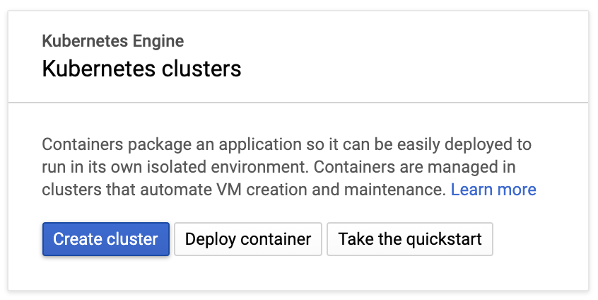
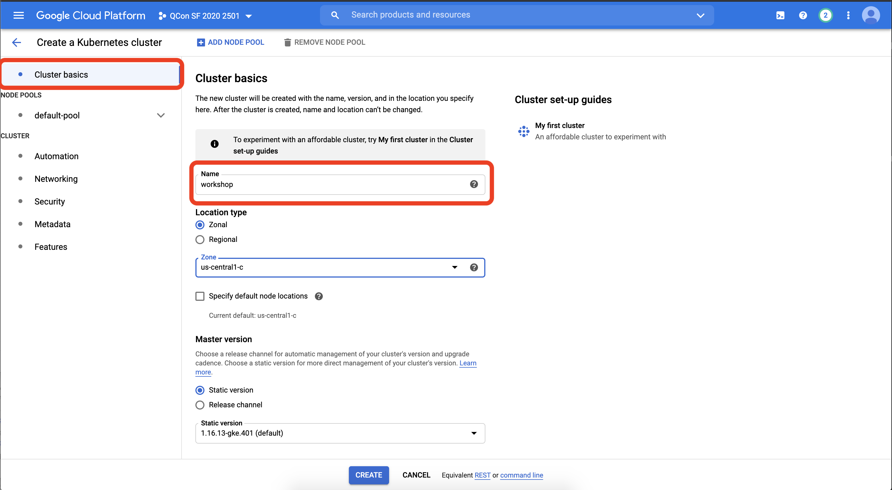
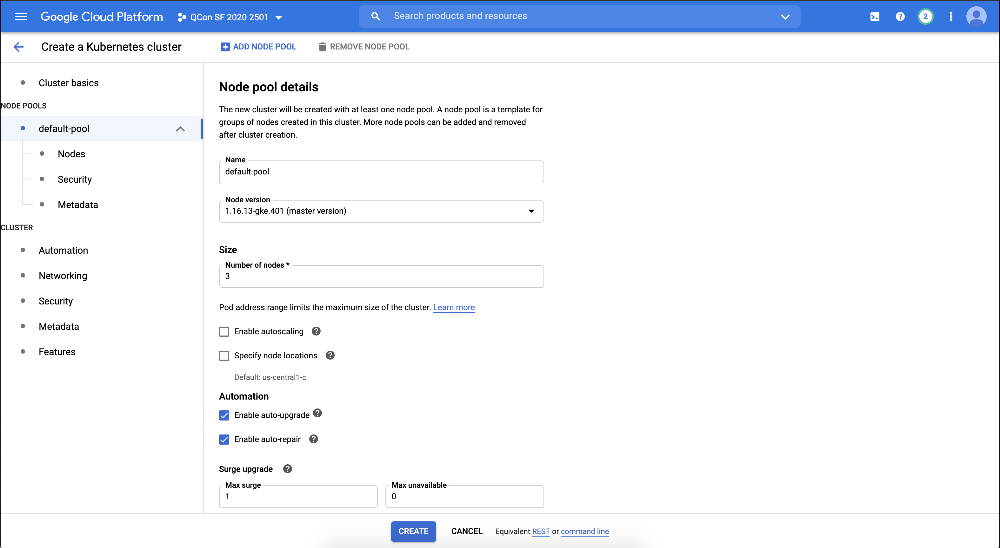
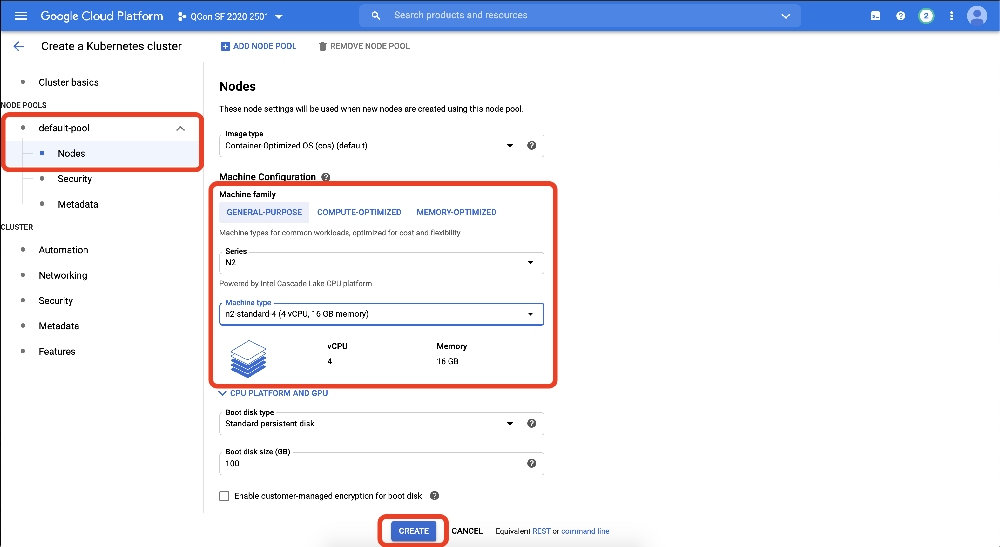
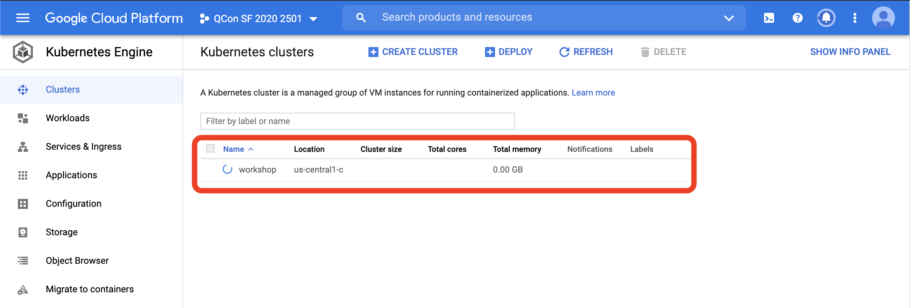
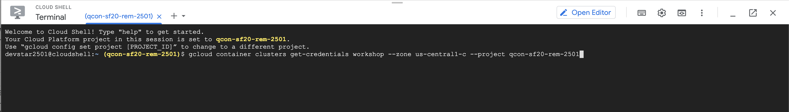

# Workshop 

During this workshop you will deploy a Cloud-Native application, inspect it, change its configuration to use different services and 
play around with it to get familiar with Kubernetes and Cloud-Native tools that can help you to be more effective in your cloud journey. 

During this workshop you will be using GKE (Managed Kubernetes Engine inside Google Cloud) to deploy a complex application composed by multiple services. But none of the applications or tools used are tied in any way to Google infrastructure, meaning that you can run these steps in any other Kubernetes provider, as well as in an On-Prem Kubernetes installation. 

The main goal of the workshop is to guide you step by step to work with an application that you don't know but that will run on a real infrastructure (in contrast to run software in your own laptops). Due the time constraints, the workshop is focused on getting things up and running, but it opens the door for a lot of extensions and experimentation, that we encourage. 

# Creating accounts and Clusters
During this workshop you will be using a **Kubernetes Cluster** and a **Camunda Cloud Zeebe Cluster** for Microservices orchestration. You need to setup these accounts and create these clusters early on, so they are ready for you to work for the reminder of the workshop. 

**Notice: you can click in the images to expand them**

1) [Login here to Google Cloud](http://console.cloud.google.com) (if you are a QCon Plus attendee, we will provide you with one)
<details>
  <summary>Creating a Kubernetes Cluster (Click to Expand)</summary>

We recommend to use an **Incognito Window** in **Chrome** (File -> New Incognito Window) to run the following steps, as with that you will avoid having issues with your personal **Google Account**

Once you are logged in, you will be asked to accept the terms and continue: 


Once the terms are accepted, it is **extremely important** that you select the correct project to work on. On the top bar, there is a project dropdown that opens the project list. You need to click into the **QCon SF 2020 ...** project to select it.


Once the project is selected, you can create new **Kubernetes Clusters* by switching to the **Kubernetes Engine** section from the left hand side menu:


Once in the **Kubernetes Engine** section you will notice that Google Cloud will initialize the **Kubernetes APIs** for us, you need to wait for this to finish:



Once the Kubernetes APIs are enabled, you will be able to create a new Kubernetes Cluster by hitting the create button, that now should be enabled:



You will be creating a **3 Nodes (n2-standard-4)** Cluster. The first step is to name your cluster, use the name **workshop**



In the **Node Pools -> Default pool** section (on the left hand side menu) check that the **Kubernetes Master** version is **1.16+** (which should be the default) and that the number of nodes is **3**:



Finally, you need to define which kind of computers will be provisioned for your cluster, for doing this switch to the **Node** section in the left hand side menu and select **N2** in the **Series** dropdown and **n2-standard-4** in the **Machine Type** dropdown:



Finally, hit **Create** at the bottom of the screen. This triggers the provisioning of the machines required for your cluster and the setup process required by Kubernetes. 

This creation process takes several minutes, you will see the loading icon right beside your cluster name:


This will take some minutes, so you can move forward to **Camunda Cloud Account and Cluster** while the Kubernetes Cluster is being created.
  
</details>  
  
2) [Create a Camunda Cloud Account and Cluster](https://accounts.cloud.camunda.io/signup?campaign=workshop) 
<details>
  <summary>Login into your account and create a Cluster (Click to Expand)</summary>

**Fill the form** to create a new account, you will need to use your email to confirm your account creation. You will be using Camunda Cloud for **Microservices Orchestration** ;)  


Check your inbox to **Activate your account** and follow the links to login, after confirmation:


**Once activated, Login with your credentials** and let's create a new **Zeebe Cluster**, you will be using this cluster later on in the workshop, but it is better to set it up early on. 


**Create a new cluster** called `my-cluster`:


Disregard, creating a model if you are asked to and just close the popup:


**Your cluster is now being created:**


</details>  

Let's switch back to Google Cloud to setup your Kubernetes Cluster to start deploying our Cloud-Native Applications!

# Connecting to your Kubernetes Cluster and installing Knative

During this workshop, you will be using Cloud Shell to interact with your Kubernetes Cluster, this avoids you setting up tools in your local environment and it provides quick access to the cluster resources. 


Once the Kubernetes cluster is created and "green", you will connect and iteract with it using **Cloud Shell**, a terminal that runs inside a Debian machine which comes with pre-installed tools like: `kubectl` and `helm`. 

Click the **Connect** button 


Then find the **Run in Cloud Shell** button, which will provision a new instance of Cloud Shell for you to use:


Once **Cloud Shell** is provisioned, notice that you will need to hit **Enter** to actually connect with the **workshop** cluster:



Because you will be using the `kubectl` and `helm` commands a lot during the next couple of hours we recommend you to create the following aliases:

``` bash
alias k=kubectl
alias h=helm
```
Now instead of typing `kubectl` or `helm` you can just type `k` and `h` respectivily. 

You can now type inside Cloud Shell: 
``` bash
k get nodes
```

You should see something like this: 


Next step you will install Knative Serving and Knative Eventing. The Cloud-Native applications that you will deploy in later steps were built having Knative in mind. 

- Knative Serving

If you have the previous aliases set up, you can copy the entire block and paste it Cloud Shell

``` bash
k apply --filename https://github.com/knative/serving/releases/download/v0.18.0/serving-crds.yaml
k apply --filename https://github.com/knative/serving/releases/download/v0.18.0/serving-core.yaml
k apply --filename https://github.com/knative/net-kourier/releases/download/v0.18.0/kourier.yaml
k patch configmap/config-network \
  --namespace knative-serving \
  --type merge \
  --patch '{"data":{"ingress.class":"kourier.ingress.networking.knative.dev"}}'
k apply --filename https://github.com/knative/serving/releases/download/v0.18.0/serving-default-domain.yaml

```

You can check that the installation worked out correctly by checking that all the Knative Serving pods are running:
```bash
k get pods -n knative-serving
```

You should see something like this:


- Knative Eventing

``` bash
k apply --filename https://github.com/knative/eventing/releases/download/v0.18.0/eventing-crds.yaml
k apply --filename https://github.com/knative/eventing/releases/download/v0.18.0/eventing-core.yaml
k apply --filename https://github.com/knative/eventing/releases/download/v0.18.0/in-memory-channel.yaml
k apply --filename https://github.com/knative/eventing/releases/download/v0.18.0/mt-channel-broker.yaml
k create -f - <<EOF
apiVersion: eventing.knative.dev/v1
kind: Broker
metadata:
 name: default
 namespace: default
EOF

```

You can check that the installation worked out correctly by checking that all the Knative Eventing pods are running:
``` bash
k get pods -n knative-eventing
```

You should see something like this: 


Now, you have everything ready to deploy your Cloud-Native applications to Kubernetes. 

# Deploying a Cloud-Native Application

In this section you will be deploying a Conference Cloud-Native application composed by 4 simple services. 

With Knative installed you can proceed to install the first version of the application. You will do this by using [**Helm**](http://helm.sh) a Kuberenetes Package Manager. As with every package manager you need to add a new `Helm Repository` where the **Helm packages/charts** for the workshop are stored. 

You can do this by runnig the following commands: 

``` bash
h repo add workshop http://chartmuseum-jx.35.222.17.41.nip.io
h repo update

```

Now you are ready to install the application by just running the following command:
``` bash
h install fmtok8s workshop/fmtok8s-app

```
You should see something like this (ignore the warnings):


The application [Helm Chart source code can be found here](https://github.com/salaboy/fmtok8s-app/).

You can check that the application running with the following two commands:

- Check the pods of the running services with: 
``` bash
k get pods
```

- You can also check the Knative Services with: 
```
k get ksvc
```

You should see that pods are being created or they are running and that the Knative Services were created, ready and have an URL:


As soon all the pods are running and the services are ready you can copy and paste the `fmtok8s-api-gateway` URL into a different tab in your browser to access the application `http://fmtok8s-api-gateway.default.XXX.xip.io`


Now you can go ahead and:
1) Submit a proposal by clicking the Submit Proposal button in the main page

2) Go to the back office (top right link) and Approve or Reject the proposal


3) Check the email service to see the notification email sent to the potential speaker, this can be done with 
``` bash
k get pods
```
Where you should see the Email Service pod:
``` bash
NAME                                                   READY   STATUS    RESTARTS   AGE
fmtok8s-agenda-h2kp8-deployment-54b8dcd9d-7c4mz        2/2     Running   0          30m
fmtok8s-api-gateway-s5lr5-deployment-6447fc94f-4smj4   2/2     Running   0          30m
fmtok8s-c4p-tgjvw-deployment-6796d99bd7-xh6cm          2/2     Running   0          30m
fmtok8s-email-hdfvf-deployment-xxxxxxxxxx-mnfkd        2/2     Running   0          30m <<< this one!!
```
And then you can tail the logs by running:
``` bash
k logs -f fmtok8s-email-<YOUR POD ID> user-container
```
You should see the service logs being tailed, you can exit/stop taling the logs with `CTRL+C`.

``` bash

  .   ____          _            __ _ _
 /\\ / ___'_ __ _ _(_)_ __  __ _ \ \ \ \
( ( )\___ | '_ | '_| | '_ \/ _` | \ \ \ \
 \\/  ___)| |_)| | | | | || (_| |  ) ) ) )
  '  |____| .__|_| |_|_| |_\__, | / / / /
 =========|_|==============|___/=/_/_/_/
 :: Spring Boot ::        (v2.3.3.RELEASE)
Starting EmailService v0.0.3 on fmtok8s-email-hdfvf-deployment-848b9bcc78-mnfkd with PID 1 (/opt/app.jar started by root in /opt)
No active profile set, falling back to default profiles: default
Exposing 2 endpoint(s) beneath base path '/actuator'
Netty started on port(s): 8080
Started EmailService in 9.394 seconds (JVM running for 10.967)
```

And if you **approved** the submitted proposal you should also see something like this: 
``` bash 
+-------------------------------------------------------------------+
         Email Sent to: test@gmail.com
         Email Title: Conference Committee Communication
         Email Body: Dear test,
                 We are happy to inform you that:
                         `test` -> `test`,
                 was approved for this conference.
+-------------------------------------------------------------------+
```

4) If you approved the proposal, the proposal should pop up in the Agenda (main page) of the conference. 

Let's take a deeper look on what you just did in this section. 

# Understanding your application

In the previous section you installed an application using `Helm`. 

For this example, there is a parent **Helm Chart** that contains the configuration for each of the services that compose the application. 
You can find each service that is going to be deployed inside the `requirements.yaml` file defined [inside the chart here](https://github.com/salaboy/fmtok8s-app/blob/master/charts/fmtok8s-app/requirements.yaml).

This can be extended to add more components if needed, like for example adding application infrastructure components such as Databases, Message Brokers, ElasticSearch, etc. (Example: ElasticSearchm, MongoDB and MySQL charts). 

The configuration for all these services can be found in the [`value.yaml` file here](https://github.com/salaboy/fmtok8s-app/blob/master/charts/fmtok8s-app/values.yaml). This `values.yaml` file can be overriden as well as any of the settings from each specific service when installing the chart, allowing the chart to be flexible enough to be installed with different setups. 

There are a couple of configurations to highlight for this version which are:
- [Knative Deployments are enabled](https://github.com/salaboy/fmtok8s-app/blob/master/charts/fmtok8s-app/values.yaml#L6), each service Helm Chart enable us to define if we want to use a Knative Service or a Deployment + Service + Ingress type of deployment. Because we have Knative installed, and you want to leverage Knative 
- Both the [`C4P` service](https://github.com/salaboy/fmtok8s-app/blob/master/charts/fmtok8s-app/values.yaml#L16) and the [`API Gateway` service](https://github.com/salaboy/fmtok8s-app/blob/master/charts/fmtok8s-app/values.yaml#L7) need to know where the other services are to be able to send requests. 

In this first version of the application `fmtok8s-app` all the interactions between the services happen via REST calls. This push the caller 

You can open different tabs in Cloud Shell to inspect the logs of each service when you are using the application (submitting and approving/rejecting proposals). 


## Challenges
This section covers some of the challenges that you might face when working with these kind of applications inside Kubernetes. This section is not needed to continue with the workshop, but it highlight the need for some other tools to be used in conjuction with the application. 
 
<details>
  <summary>To see more details about the challenges Click to Expand</summary>

Among some of the challenges that you might face are the following big topics:
- Flow buried in code: for this scenario the `C4P` service is hosting the core business logic on how to handle new proposals. If you need to explain to non-technical people how the flow goes, you will need to dig in the code to be 100% sure about what the application is doing
- Edge Cases and Errors: 
- Dealing with changes: 
- ....

</details> 

You will now undeploy version 1 of the application to deploy version 2. You only need to undeploy version 1 to save resources.
In order to undeploy version 1 of the application you can run:
``` bash
h delete fmtok8s --no-hooks
```


## Knative, Cloud Events and Camunda Cloud - Version 2

Version 2 of the application is configured to emit [Cloud Events](http://cloudevents.io), whenever something relevant happens in any of the services. For this example, you are interested in the following events: 
- `Proposal Received`
- `Proposal Decision Made`
- `Email Sent`
- In the case of the proposal being approved `Agenda Item Created` 

Version 2 of the application still uses the same version of the services found in Version 1, but these services are configured to emit events to a Knative Broker that was created when you installed Knative. This Knative Broker, receive events and routed them to whoever is interested in them. In order to register interest in certain events, Knative allows you to create Triggers (which are like subscriptions with filters) for this events and specify where these events should be sent. 

For Version 2, you will use the **Zeebe Workflow Engine** provisioned in your **Camunda Cloud** account to capture and visualize these meaninful events.
In order to route these **Cloud Events** from the Knative Broker to **Camunda Cloud** a new component is introduced along your Application services. This new component is called **Zeebe Cloud Events Router** and serves as the bridge between Knative and Camunda Cloud, using Cloud Events as the standardize communication protocol. 

As you can imagine, in order for the **Zeebe Cloud Events Router** to connect with your **Camunda Cloud Zeebe Cluster** you need to create a new **Client**, a set of credentials which allows these components to connect and communicate. 

Go to the **Camunda Cloud** console, click on your cluster to see your cluster details:


Go to the **Clients** tab and then **Create a New Client**:


Call it `my-client` and click **Add**:


The new client called `my-client` will be created: 


Now you can access the **Connection Information**:


By clicking the button **Copy Kubernetes Secret** the command will be copied into your clipboard and you can paste it inside **Cloud Shell** inside Google Cloud.

``` bash
k create secret generic camunda-cloud-secret --from-literal=ZEEBE_ADDRESS=...
```

By running the previous command, you have created a new `Kubernetes Secret` that host the credentials for our applications to talk to Camunda Cloud. 
Now you are ready to install version 2 of the application by running (again ignore the warnings): 

``` bash 
h install fmtok8s-v2 workshop/fmtok8s-app-v2
```


You can check that all the services are up and running with the same two commands as before:

``` bash
k get pods
```

and

``` bash
k get ksvc
```

You should see something like this:


Notice that now the **Zeebe Cloud Events Router** is running along side the application services, and it is configured to use the Kubernetes Secret that was previously created to connect to **Camunda Cloud**.

But here is still one missing piece to route the **Cloud Events** generated by your application services to the **Zeebe Cloud Events Router** and those are the Knative Triggers (Subscriptions to route the events from the broker to wherever you want). 

These Knative Triggers are defined in YAML and can be packaged inside the Application V2 Helm Chart, which means that they are installed as part of the application. 

You can list these Knative Triggers by running the following command:
``` bash
k get triggers
```

You should see an output like this: 


Finally, even when Cloud Events are being routed to Camunda Cloud, you need to create a model that will consume the events that are coming from the application, so they can be correlated and visualized. 

You can download the models that you will be using in [the next steps from here](https://github.com/salaboy/from-monolith-to-k8s-assets/archive/1.0.0.zip).

Once you downloaded the models, extract the ZIP file a place that you can quickly locate to upload these files in the next steps. 

Now, go back to your **Camunda Cloud Zeebe Cluster** list (you can do this by clicking in the top breadcrum with the name of your Organization):


Next, click on the **BPMN Diagrams(beta)** Tab, then click **Create New Diagram**:


With the Diagram editor opened, first enter the name **visualize** into the diagram name box and then click the **Import Diagram** button:


Now choose **c4p-visualize.bpmn** from your filesystem: 


The diagram shoud look like:


With the Diagram ready, you can now hit **Save and Deploy**:


Next, **close/disregard** the popup suggesting to start a new instance:


Well Done! you made it, now everything is setup for routing and fowarding events from our application, to Knative Eventing, to the Zeebe Cloud Events Router to Camunda Cloud. 


In order to see how this is actually working you can use **Camunda Operate**, a dashboard included inside **Camunda Cloud** which allows you to understand how these models are being executed, where things are at a giving time and to troubleshoot errors that might arise from your applications daily operations.

You can access **Camunda Operate** from your cluster details, inside the **Overview Tab**, at the bottom, clicking in the **View in Operate** link:


You should see the **Camunda Operate** main screen, where you can click in the **C4P Visualize** section highlighted in the screenshot below:


This opens the runtime data associated with our workflow models, now you should see this:


Now go back to the Conference Application, remember, listing all the Knative Services will show the URL for the API Gateway Service that is hosting the User Interface, when you are in the application, submit a new proposal and then refresh **Camunda Operate**:


If you click into the Instance ID link, highligted above, you can see the details of that specific instance:


If you go ahead to the **Back Office** of the application and **approve** the proposal that you just submitted, you should see in **Camunda Operate** that the instance is completed:


# Workflow Orchestration with Camunda Cloud

``` bash
h install fmtok8s-v3 workshop/fmtok8s-app-v3
```


